## Welcome to the A-Frame Meetup NYC
You can find here an archive of slides, presentations and workshop materials that are shared in our events.

## About the Meetup
[Intro](https://roland-dubois.github.io/aframe-meetup-nyc/presentations/meetup_intro.pdf)

## Event Log
### Tuesday, February 27, 2018

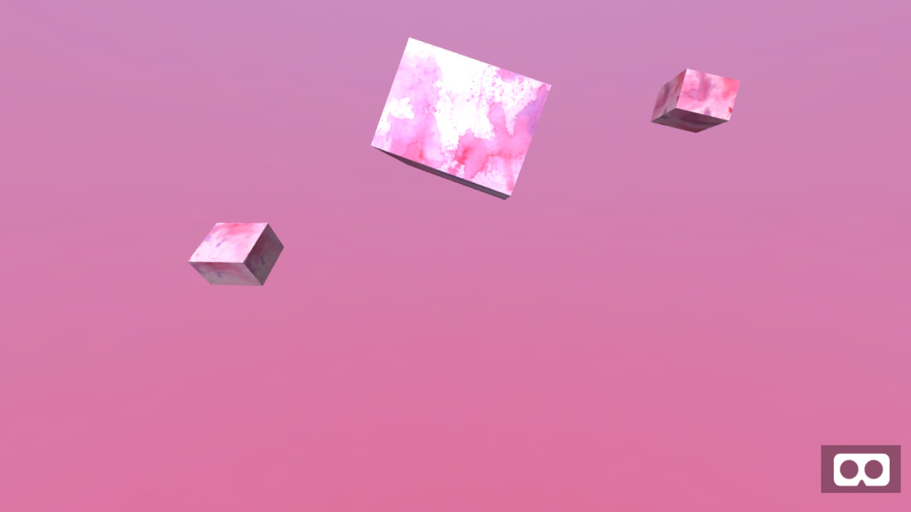
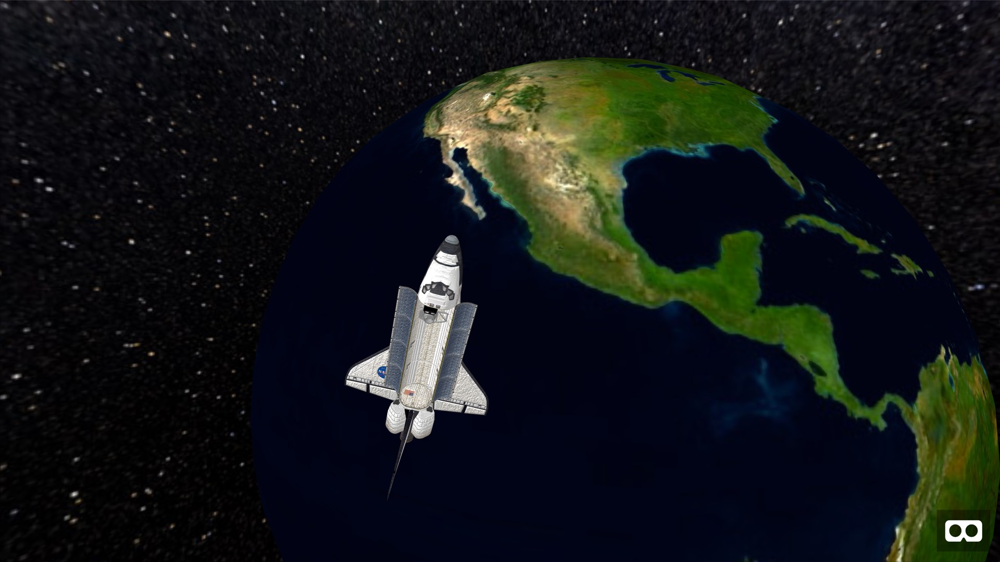
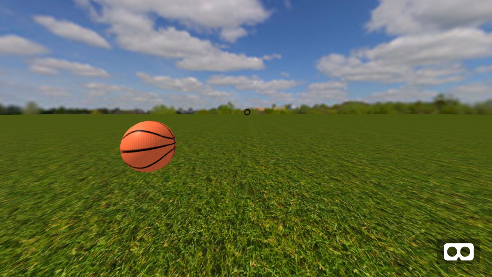

[Kickoff of the A-Frame NYC Meetup](https://roland-dubois.github.io/aframe-meetup-nyc/presentations/meetup_kickoff_02-27-2018.pdf) 
* Compare: [ThreeJS Photosphere](https://roland-dubois.github.io/aframe-meetup-nyc/demos/01_ThreeJS_photosphere.html) & [A-Frame Photosphere](https://roland-dubois.github.io/aframe-meetup-nyc/demos/02_A-Frame_photosphere.html)
* Build: [Watercolor Box 1](https://roland-dubois.github.io/aframe-meetup-nyc/demos/03_A-Frame_watercolor_1.html), [Watercolor Box 2](https://roland-dubois.github.io/aframe-meetup-nyc/demos/04_A-Frame_watercolor_2.html), [Watercolor Box 3](https://roland-dubois.github.io/aframe-meetup-nyc/demos/05_A-Frame_watercolor_3.html)
* Build: [Space Walk](https://roland-dubois.github.io/aframe-meetup-nyc/demos/06_A-Frame_obj_space.html), [Gaze Game](https://roland-dubois.github.io/aframe-meetup-nyc/demos/07_A-Frame_gaze.html)
* [Glitch](https://glitch.com/edit/#!/aframe-nyc)
* Additional Resource: [Space Walk enhanced as PWA](https://rdub80.github.io/aframe-sPaceWAlk/)

---

### Friday, March 16, 2018

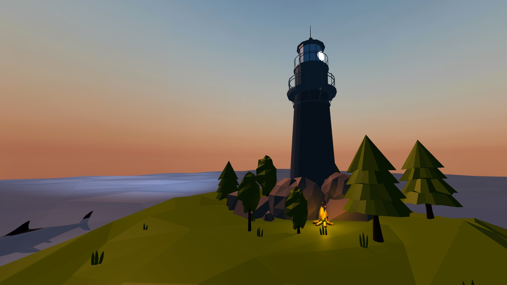

[Recap and Overview A-Frame 101](https://roland-dubois.github.io/aframe-meetup-nyc/presentations/meetup_aframe101_03-16-2018.pdf)
* Setup: [Gulp Tutorial](https://css-tricks.com/gulp-for-beginners/) & [Git Repo](https://github.com/zellwk/gulp-starter-csstricks)
* Build: [Interactive Island](https://roland-dubois.github.io/aframe-meetup-nyc/demos/08_A-Frame_island/app/)
* Assets: [Island](https://poly.google.com/view/dQrzT31sLPE), [Trees](https://poly.google.com/view/aAIOBNEaD5M), [Lighthouse](https://poly.google.com/view/3gEvVZoTN7e), [Shark](https://poly.google.com/view/8Ke5qCnWxsZ), [Campfire](https://poly.google.com/view/0vzzmM-t8CP)

### Wednesday, April 18, 2018
#### Workshop at Parsons School of Design
Creating Components and playing with Physics
* Build: [NYC Bowling Game](https://roland-dubois.github.io/aframe-meetup-nyc/demos/09_A-Frame_NYC_Bowling/app/)
* Assets: [Lady Liberty](https://poly.google.com/view/ef9Yd09Doxh)

---

### Thursday, May 05, 2018

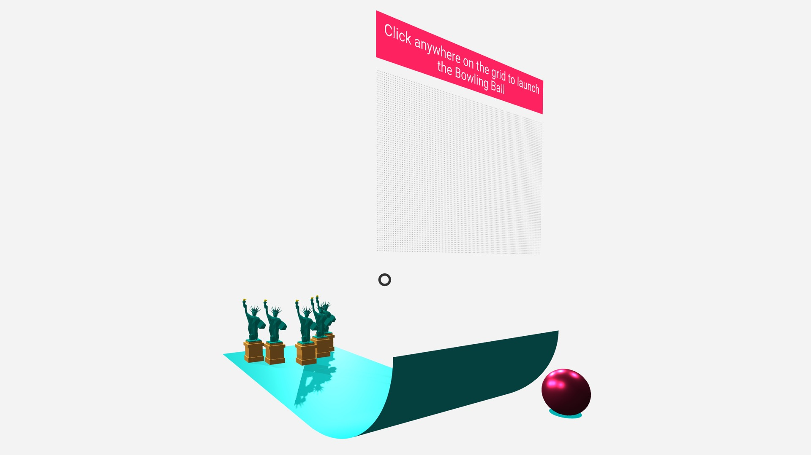

[Recap of the Parsons Workshop and Overview A-Frame 102](https://roland-dubois.github.io/aframe-meetup-nyc/presentations/meetup_aframe102_05-03-2018.pdf)
* Setup: [Gulp Tutorial](https://css-tricks.com/gulp-for-beginners/) & [Git Repo](https://github.com/zellwk/gulp-starter-csstricks)
* Build: [NYC Bowling Game](https://roland-dubois.github.io/aframe-meetup-nyc/demos/09_A-Frame_NYC_Bowling/app/)
* Assets: [Lady Liberty](https://poly.google.com/view/ef9Yd09Doxh)
* Additional Resource: [Similar Physics VR Project on hacks.mozilla](https://hacks.mozilla.org/2017/05/having-fun-with-physics-and-a-frame/)

---

### Thursday, May 31, 2018

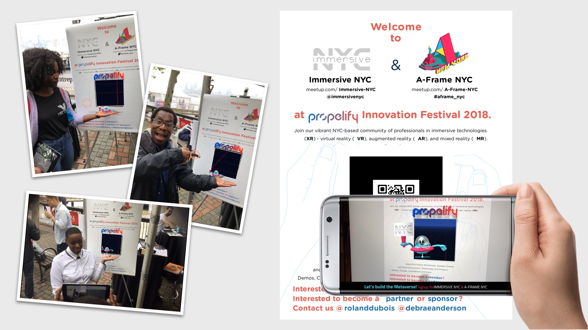

[Overview A-Frame 103 & Presentation](https://roland-dubois.github.io/aframe-meetup-nyc/presentations/meetup_aframe103_05-31-2018.pdf)
* Setup: [Gulp Tutorial](https://css-tricks.com/gulp-for-beginners/) & [Git Repo](https://github.com/zellwk/gulp-starter-csstricks)
* Build: [Propelify AR](https://roland-dubois.github.io/aframe-meetup-nyc/demos/10_A-Frame_Propelify_AR/app/)
* Assets: [Poster with Marker](https://github.com/roland-dubois/aframe-meetup-nyc/blob/master/demos/10_A-Frame_Propelify_AR/res/Propelify_poster.pdf)
* Additional Resource: [Creating Augmented Reality with AR.js and A-Frame](https://aframe.io/blog/arjs/)

---

### Friday, June 29, 2018

[Overview A-Frame 100 & Presentation](https://roland-dubois.github.io/aframe-meetup-nyc/presentations/meetup_aframe100_06-29-2018.pdf)
* Build: [WakandaForeverBooth AR](https://roland-dubois.github.io/aframe-meetup-nyc/demos/11_A-Frame_WakandaForeverBooth_AR/app/)
* Assets: [Poster with Marker](https://github.com/roland-dubois/aframe-meetup-nyc/blob/master/demos/11_A-Frame_WakandaForeverBooth_AR/res/Imagenation_poster_24X36.pdf)
* Additional Resource: [Creating Augmented Reality with AR.js and A-Frame](https://aframe.io/blog/arjs/)

---

### Thursday, September 6, 2018

**A-Frame 104 Workshop; Dissecting a data visualization project**
1. [Project Concept by Debra Anderson](https://roland-dubois.github.io/aframe-meetup-nyc/presentations/meetup_aframe104_09-06-2018.pdf)    
2. ["A-Frame Pro Mode" Slides by Brian Chirls](https://brianchirls.github.io/aframe-nyc-2018/#1)

* [Virtuleap Global WebXR Hackathon 2018](https://hackathon.virtuleap.com): [WebXR4SDGs](https://hackathon.virtuleap.com/apps/details/hd) scored the [*6th place*](https://twitter.com/Virtuleap/status/1029791804047220736) 
> Congrats!
* Build Version 1: [WebXR4SDGs](https://webxr4sdgs.glitch.me/)
* Glitch: [WebXR4SDGs Version1 Code](https://glitch.com/edit/#!/webxr4sdgs)
* Build Version 2: [Datavized WebXR4SDGs](https://datavized-webxr4sdgs.firebaseapp.com/)

---

### Thursday, October 4, 2018

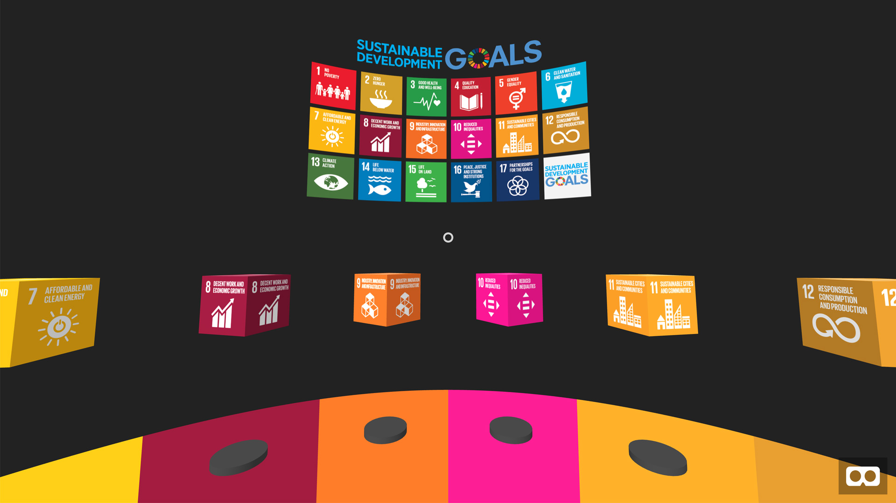

**A-Frame 105 Workshop; Emphasis web-based AR**
[Overview A-Frame 105 & Presentation](https://roland-dubois.github.io/aframe-meetup-nyc/presentations/meetup_aframe105_10-04-2018.pdf)
* Build: [Logo AR](https://roland-dubois.github.io/aframe-meetup-nyc/demos/12_A-Frame_Logo_AR/app/)
* Marker: [AR Marker](https://github.com/roland-dubois/aframe-meetup-nyc/blob/master/demos/12_A-Frame_Logo_AR/ref/Prime8-marker.png)
* Additional Resource: [Creating Augmented Reality with AR.js and A-Frame](https://aframe.io/blog/arjs/)

---

### Friday, October 26, 2018

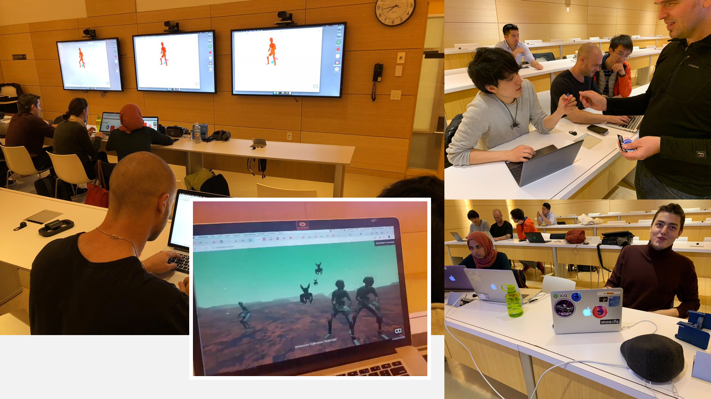

**A-Frame 106 Workshop; Immersive Halloween Challenge**

---

### Thursday, December 13, 2018

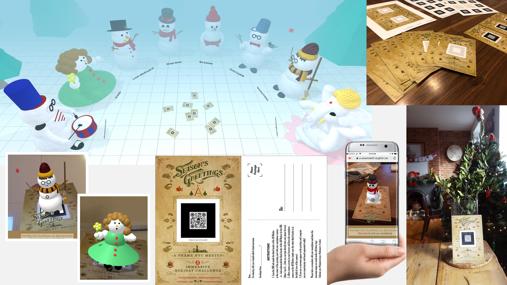

**A-Frame 107: Immersive Holiday Challenge**

* [Challenge Archive](https://roland-dubois.github.io/aframe-meetup-nyc/challenges/)
* [Challenge Gallery](https://qxr.li/snowvr)
* Sample Build VR: [Snowman01 VR](https://snowman01.glitch.me/)
* Sample Build AR: [Snowman01 AR](https://qxr.li/snow01)
* Sample Marker: [Snowman01 AR Marker](https://github.com/roland-dubois/aframe-meetup-nyc/blob/master/challenges/holiday2018/resources/snow01/marker_snow01.png)

---

### Wednesday, February 20, 2019

**A-Frame 108: Kickstart WebXR in 2019 with A-Frame's Release 0.9**

* [Overview A-Frame 108 & Presentation](https://roland-dubois.github.io/aframe-meetup-nyc/presentations/meetup_aframe108_02-20-2019.pdf)
* Animation Component Comparison: [Old Animation Component](https://aframe-nyc-old-ani.glitch.me/) [New Animation Component](
https://aframe-nyc-new-ani.glitch.me/)
* A-Frame NYC - Take Home Project: [A-Robots](https://github.com/roland-dubois/aframe-meetup-nyc/blob/master/meetup_aframe108_02-20-2019.md#take-home-project)

---

### Thursday, March 14, 2019

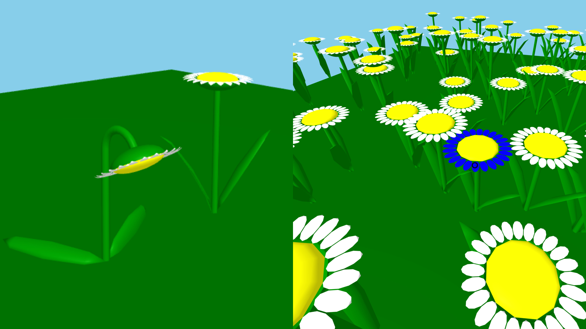

**A-Frame 109: Intro to building components**

* [Overview A-Frame 109 & Presentation](https://roland-dubois.github.io/aframe-meetup-nyc/presentations/meetup_aframe109_03-14-2019.pdf)
* The workshop focusses on building components from a composition of entities with modifiable settings, like flower height and petal color. In the example I created a sunflower entity `class='flower1'` and converted it into a component that can be modified and randomly generated
* Take the sunflower entity `class='flower2'` from this page: [Sunflower in entities](https://a-frame-nyc-109-components1.glitch.me/) and convert it into a component that can be generated into a randomized field with 100 flowers like it is coded on the page: [Sunflower component field](https://a-frame-nyc-109-components2.glitch.me/)
* Feel free to remix the pages and inspect how I built it [Part1 Entities](https://glitch.com/edit/#!/a-frame-nyc-109-components1) and [Part2 Components](https://glitch.com/edit/#!/a-frame-nyc-109-components2)
* Bonus: combine both sunflower components into one and display each of the flowers depending on the string variable `'mood': 'happy' or 'mood': 'sad'` defined in the [schema here](https://glitch.com/edit/#!/a-frame-nyc-109-components2?path=script.js:10:11)

---

### Thursday, April 11, 2019

**A-Frame 110: Creating Ambience: Lights, Materials, and Animation**

* [Overview A-Frame 110 & Presentation](https://roland-dubois.github.io/aframe-meetup-nyc/presentations/meetup_aframe110_04-11-2019.pdf)
* Lights, Materials, and Animation Demo: [A-Train by night demo](https://a-frame-nyc-110-demo.glitch.me/) [A-Train by night edit](https://glitch.com/edit/#!/a-frame-nyc-110-demo)

---

### Thursday, May 07, 2019

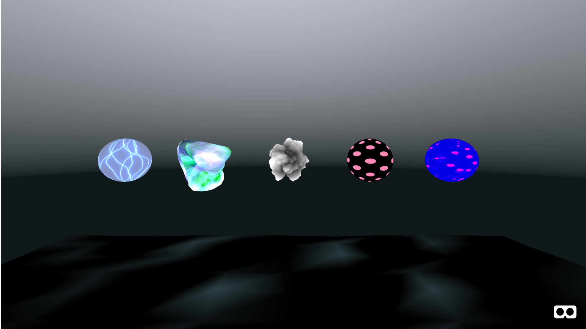

**A-Frame 111: A glance at Shaders: Tinkering with ShaderFrog**

* [Overview A-Frame 111 & Presentation](https://roland-dubois.github.io/aframe-meetup-nyc/presentations/meetup_aframe111_05-07-2019.pdf)
* [Shaders demo](https://aframe111-shaders.glitch.me/) [Shaders edit](https://glitch.com/edit/#!/aframe111-shaders)
* Components: [aframe-import-shaderfrog](https://github.com/chenzlabs/aframe-import-shaderfrog), [aframeFrogShaders](https://github.com/msj121/aframeFrogShaders), [CS1 Game Engine for making 3D multiplayer games in JavaScript](https://cs1.glitch.me/) by [Eric Eisaman](https://www.youtube.com/channel/UC8Iv9MnaiiWjIKY9kCBysLA)
* Resources/Tools/Editors: [https://shaderfrog.com/](https://shaderfrog.com/), [https://shadertoy.com/](https://shadertoy.com/)

---

### Thursday, July 25, 2019

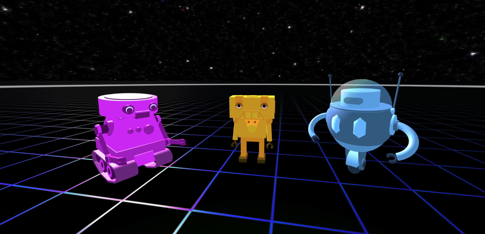

**A-Frame 112: Networked A-Frame - Meet inside the immersive web**

* [Overview A-Frame 112 & Presentation](https://roland-dubois.github.io/aframe-meetup-nyc/presentations/meetup_aframe112_07-25-2019.pdf)
* [NAF - Social VR on the web by Hayden Lee](https://roland-dubois.github.io/aframe-meetup-nyc/presentations/meetup_aframe112_guestprez_Networked-Aframe_in_15_minutes.pdf)

* [Avatar #1 demo](https://a-robot-avatar1.glitch.me) [Avatar #1 edit](https://glitch.com/edit/#!/a-robot-avatar1) 
* [Avatar #2 demo](https://a-robot-avatar2.glitch.me) [Avatar #2 edit](https://glitch.com/edit/#!/a-robot-avatar2) 
* [Avatar #3 demo](https://a-robot-avatar3.glitch.me) [Avatar #3 edit](https://glitch.com/edit/#!/a-robot-avatar3) 

**Remix these Avatar builds and place them in your own Social VR environment!**

* [Social VR demo with Avatar #1](https://demo-networked-aframe.glitch.me/?avatar=avatar1)
* [Social VR demo with Avatar #2](https://demo-networked-aframe.glitch.me/?avatar=avatar2)
* [Social VR demo with Avatar #3](https://demo-networked-aframe.glitch.me/?avatar=avatar3)
* [Social VR edit](https://glitch.com/edit/#!/demo-networked-aframe)

* Resources: [networked-aframe component demos](https://haydenlee.io/networked-aframe/), [networked-aframe component on GitHub](https://github.com/networked-aframe/networked-aframe)

---

### This year 2019 all meetup members are encouraged to take part of a **Take Home Project** we named **"A-Robots"**. [See here for more details](https://roland-dubois.github.io/aframe-meetup-nyc/a-robots/)

---

## Meetup Resources
* Dev Starter Files: [00_A-Frame_starter](https://roland-dubois.github.io/aframe-meetup-nyc/demos/00_A-Frame_starter/)
* Meetup: [A-Frame-NYC](https://www.meetup.com/A-Frame-NYC/)
* Trello: [A-Frame Components that need attention](https://trello.com/aframenycmeetup)

### Support & Contact
Having trouble with links or assets? [contact me](https://rolanddubois.com) and I’ll help you sort it out.
