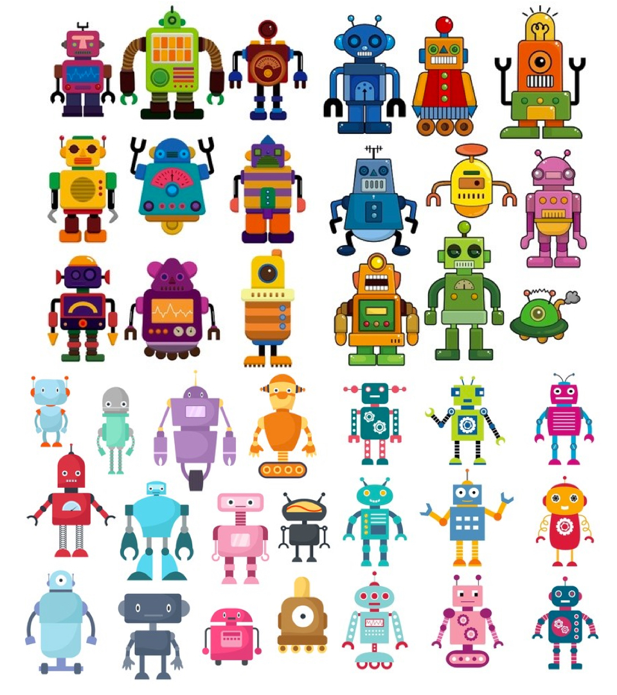
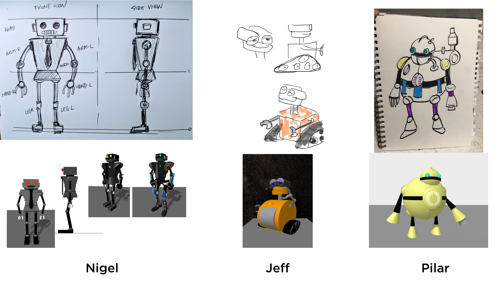
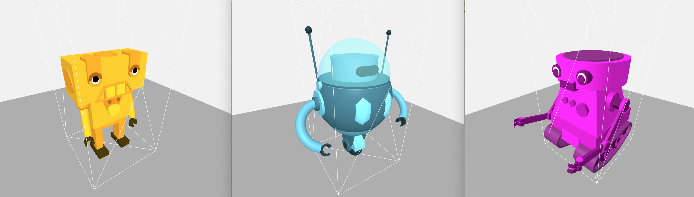
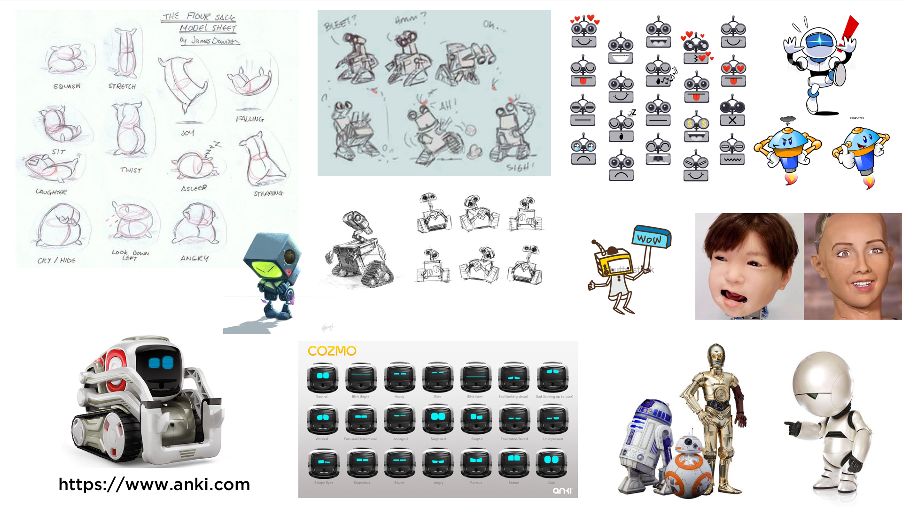
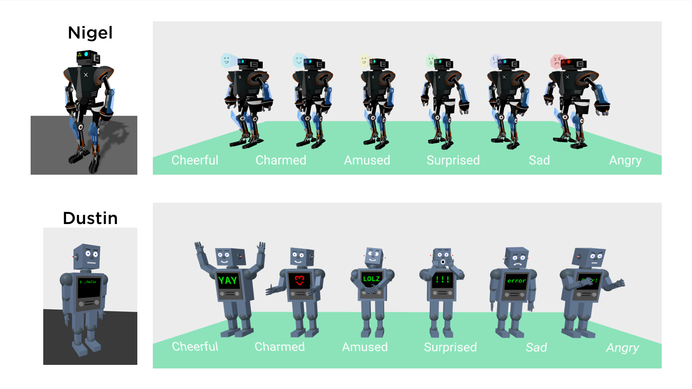
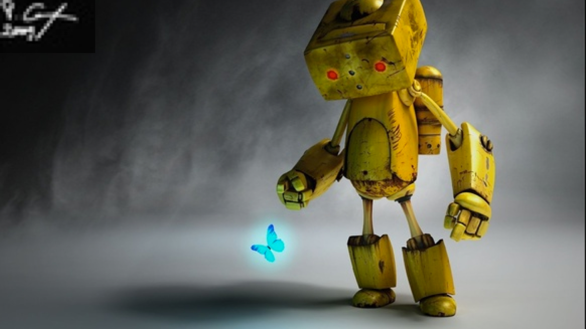
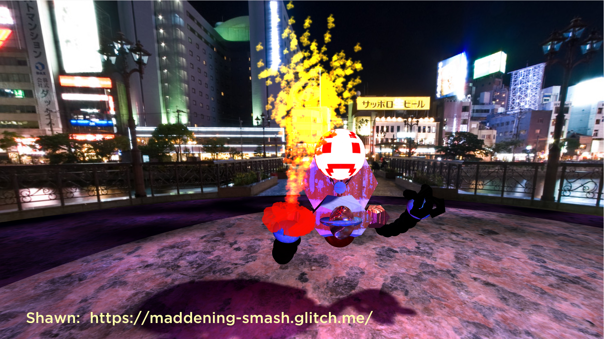
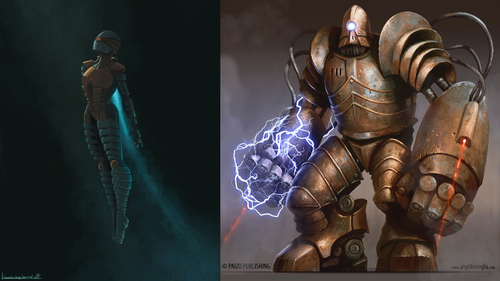
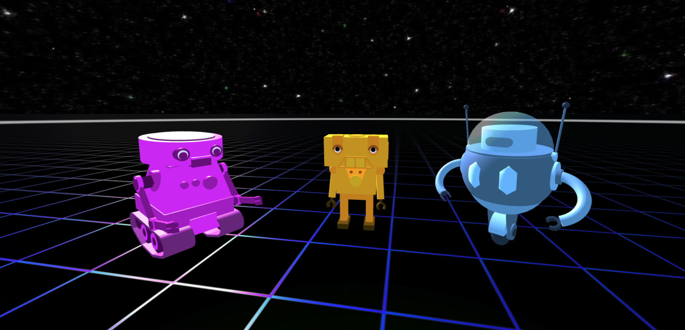

## Welcome to the A-Frame NYC
# A-Robots Club

As a part of a larger project that we are building together over the course of this year, every member is building their own creation. Based on each individuals coding knowledge and comfort with the technology, every member will progressively add and integrate step by step what we are learning in each workshop. 
This is not only designed to help every participant to grow their A-Frame knowledge but also drive active participation and collaboration within the meetup and everyone is following along with the workshop lesson plan.

#### Outlined below is the list of steps for any Meetup members to get up to speed

##### The first step:

* Create your own robot made with A-Frame Primitives ( `<a-box>, <a-cylinder>, <a-sphere>, ...` ), doesn't have to be humanoid but needs to feature at least one "arm"
* Maximum Size: **width:1; height:2; depth:1;**
* No Textures, only HEX colors
* No Animations (*yet*)

Need Inspiration?

---

Examples from the community:

##### The second step:

* Add six basic emotional expressions to your robot 

1. Cheerful / Happy
2. Charmed / In Love
3. Amused / Laughing
4. Surprised / Shocked
5. Sad / Dissapointed
6. Angry / Unhappy

* Create a page that portrays each expression in a line up of your robot (six  individual robots side by side) you can remix [this template](https://glitch.com/edit/#!/a-robots-emotions-template) - [Preview](https://a-robots-emotions-template.glitch.me/)

Tip: You can achieve this expressions by looking into facial impressions, body posture, or other creative ways, maybe even words on a screen, sign or speaking bubble.  
Research how Pixar, Disney, Dreamworks and other creators are applying emotional cues to inanimate objects. Subtle works.

* [Facebook reactions](https://www.wired.com/2016/02/facebook-reactions-totally-redesigned-like-button/) 
* [The Emotion Wheel](https://positivepsychologyprogram.com/emotion-wheel/)

Need Inspiration?

---

Examples from the community:

##### The third step:

* Apply textures to your robot 
* Pick one of your emotional states
* Create a dramatic scene (lights, textures, environment)
* Take a screenshot and create a cover poster for your Robot

Tip: Think about movie posters, it doesn't have to be complicated.

Need Inspiration?

---

Examples from the community:

##### The forth step:

* Create one custom shader
* Apply the shader to one part of your robot 
* Show/hide the shader by triggering a custom key/trigger

Tip: Use the shader to visualize engine thrusters, magic powers or emotional cues

Need Inspiration?

##### The fifth step:

* Add your A-Robot Creation into your own networked VR experience
* Submit a version of your robot for the A-Robots.club website
* DM me for more info @rolandddubois

* [Avatar #1 demo](https://a-robot-avatar1.glitch.me) [Avatar #1 edit](https://glitch.com/edit/#!/a-robot-avatar1) 
* [Avatar #2 demo](https://a-robot-avatar2.glitch.me) [Avatar #2 edit](https://glitch.com/edit/#!/a-robot-avatar2) 
* [Avatar #3 demo](https://a-robot-avatar3.glitch.me) [Avatar #3 edit](https://glitch.com/edit/#!/a-robot-avatar3) 

**Remix these Avatar builds and place them in your own Social VR environment!**

* [Social VR demo with Avatar #1](https://demo-networked-aframe.glitch.me/?avatar=avatar1)
* [Social VR demo with Avatar #2](https://demo-networked-aframe.glitch.me/?avatar=avatar2)
* [Social VR demo with Avatar #3](https://demo-networked-aframe.glitch.me/?avatar=avatar3)
* [Social VR edit](https://glitch.com/edit/#!/demo-networked-aframe)

* Resources: [networked-aframe component demos](https://haydenlee.io/networked-aframe/), [networked-aframe component on GitHub](https://github.com/networked-aframe/networked-aframe)

---

* [github.com/roland-dubois/aframe-meetup-nyc](https://roland-dubois.github.io/aframe-meetup-nyc/)

Didn't finish? Take the challenge home! Got stuck? Reach out!

*@rolanddubois*
[*rolanddubois.com*](https://rolanddubois.com/)