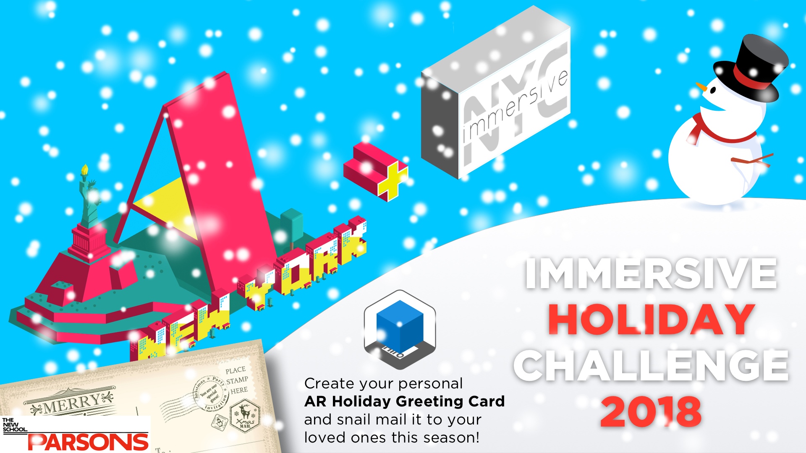
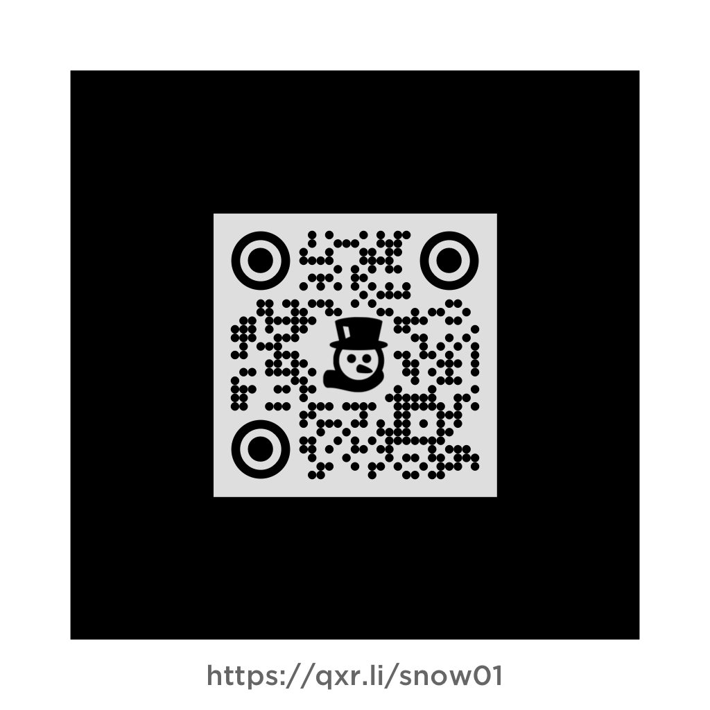
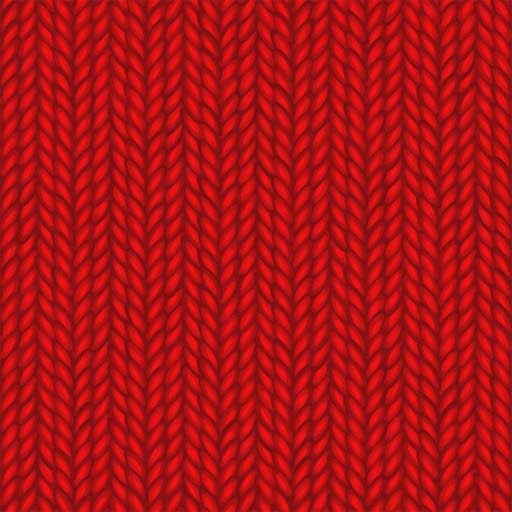
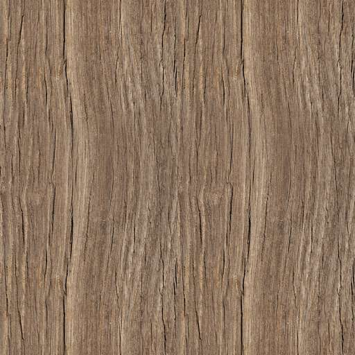

# Welcome to the A-Frame NYC Challenges Archive

---

### Immersive Holiday Challenge - Thursday, December 13, 2018

#### Build a virtual snowman by only using A-Frames primitives.

[Preview - VR Snowfamily](https://aframe-nyc-holiday2018.glitch.me/)
(We will be featuring your creations at this location)

[Preview AR marker](https://a-snowman01-ar.glitch.me/) | [Preview AR marker - Code](https://glitch.com/edit/#!/a-snowman-ar)

Build Examples:

[Sample Snowman01](https://snowman01.glitch.me/) | [Sample Snowman02](https://snowman02.glitch.me/) | [Sample Snowman03](https://snowman03.glitch.me/)

---

### LINKS TO TEMPLATES

[Template to build VR](https://glitch.com/edit/#!/a-snowman-webvr-starter)

[Template to build AR](https://glitch.com/edit/#!/a-snowman-webar-starter)

---

### DOWNLOAD ASSETS

Marker and Pattern file:

<select onchange="window.open(this.options[this.selectedIndex].value, '_blank')">
  <option selected value="">Select your marker set</option>
  <option value="holiday2018/resources/snow01.zip">snow01</option>
  <option value="holiday2018/resources/snow02.zip">snow02</option>
  <option value="holiday2018/resources/snow03.zip">snow03</option>
  <option value="holiday2018/resources/snow04.zip">snow04</option>
  <option value="holiday2018/resources/snow05.zip">snow05</option>
  <option value="holiday2018/resources/snow06.zip">snow06</option>
  <option value="holiday2018/resources/snow07.zip">snow07</option>
  <option value="holiday2018/resources/snow08.zip">snow08</option>
  <option value="holiday2018/resources/snow09.zip">snow09</option>
  <option value="holiday2018/resources/snow10.zip">snow10</option>
  <option value="holiday2018/resources/snow11.zip">snow11</option>
  <option value="holiday2018/resources/snow12.zip">snow12</option>
  <option value="holiday2018/resources/snow13.zip">snow13</option>
  <option value="holiday2018/resources/snow14.zip">snow14</option>
  <option value="holiday2018/resources/snow15.zip">snow15</option>
  <option value="holiday2018/resources/snow16.zip">snow16</option>
  <option value="holiday2018/resources/snow17.zip">snow17</option>
  <option value="holiday2018/resources/snow18.zip">snow18</option>
  <option value="holiday2018/resources/snow19.zip">snow19</option>
  <option value="holiday2018/resources/snow20.zip">snow20</option>
  <option value="holiday2018/resources/snow21.zip">snow21</option>
  <option value="holiday2018/resources/snow22.zip">snow22</option>
  <option value="holiday2018/resources/snow23.zip">snow23</option>
  <option value="holiday2018/resources/snow24.zip">snow24</option>
  <option value="holiday2018/resources/snow25.zip">snow25</option>
  <option value="holiday2018/resources/snow26.zip">snow26</option>
  <option value="holiday2018/resources/snow27.zip">snow27</option>
  <option value="holiday2018/resources/snow28.zip">snow28</option>
  <option value="holiday2018/resources/snow29.zip">snow29</option>
  <option value="holiday2018/resources/snow30.zip">snow30</option>
</select>

[Greeting Card printable PDF](holiday2018/resources/card.pdf)

---

### TEXTURES

<table>
<tr>
 <th scope="col">Snow texture</th>
 <th scope="col">Knit texture</th>
 <th scope="col">Wood texture</th>
 <th scope="col">Metal texture</th>
</tr>
<tr>
 <td></td>
 <td></td>
 <td></td>
 <td></td>
</tr>
</table>

---

### JINGLE Loops 
(Sponsored by [Prime8](http://prime8.io)) [download here](holiday2018/resources/Snowman_Tracks_AFrameMeetup121318.zip)

1. Modern 
<audio controls><source src="holiday2018/resources/P8_Jingle_A.mp3" type="audio/mpeg"></audio>
2. 80s 
<audio controls><source src="holiday2018/resources/P8_Jingle_B.mp3" type="audio/mpeg"></audio>
3. Swing 
<audio controls><source src="holiday2018/resources/P8_Jingle_C.mp3" type="audio/mpeg"></audio>

---

#### When you completed your Snowman design and are setting up the AR app environment submit the URL of your AR app together with the address on your marker (qrx.li/snowXX) to rdub80@gmail.com. Please make sure you do not change your URL path after submission, the short URL will be associated to your AR marker and will redirect to your provided AR App URL.

---

### Additional Resources

* [A-Frame Docs](https://aframe.io/docs/0.8.0/introduction/)

* [AR MARKER TRAINING](https://jeromeetienne.github.io/AR.js/three.js/examples/marker-training/examples/generator.html)

* [Great AR.js Article on Medium](https://medium.com/chialab-open-source/ar-js-the-simpliest-way-to-get-cross-browser-ar-on-the-web-8f670dd45462)

* [Tips on making the most of AR.js Markers in A-Frame](https://medium.com/@aschmelyun/tips-tricks-to-spice-up-your-ar-js-projects-fa89bc2ec296)

---

* [github.com/roland-dubois/aframe-meetup-nyc](https://roland-dubois.github.io/aframe-meetup-nyc/)

Didn't finish? Take the challenge home! Got stuck? Reach out!

*@rolanddubois*
[*rolanddubois.com*](https://rolanddubois.com/)