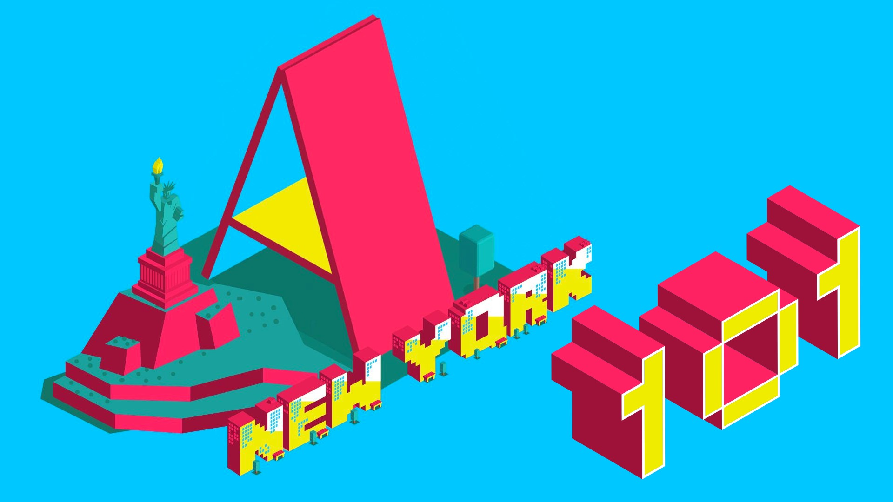
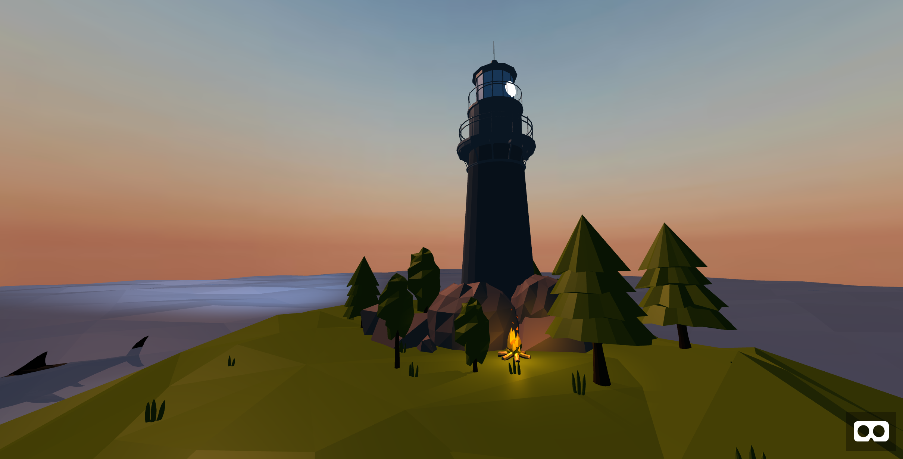

# Welcome to A-Frame NYC
 

---

## Todays Workshop Project: Demo 08 A-Frame Island
 

---

## We will be covering:

* Development Environment Setup with Gulp and Browsersync
* a-sky
* a-ocean / A-Frame Extras Component (@donmccurdy)
* a-obj-model / OBJ files (Google Poly Library)
* a-light
* a-animation
* the Teleportation Controls Component (@fernandojsg)

---

# *It’s code time!* 

* [github.com/roland-dubois/aframe-meetup-nyc](https://roland-dubois.github.io/aframe-meetup-nyc/)
* Setup: [Gulp Tutorial](https://css-tricks.com/gulp-for-beginners/) & [Git Repo](https://github.com/zellwk/gulp-starter-csstricks)
* Build: [Interactive Island](/demos/08_A-Frame_island.html)
* Assets: [Island](https://poly.google.com/view/dQrzT31sLPE), [Trees](https://poly.google.com/view/aAIOBNEaD5M), [Lighthouse](https://poly.google.com/view/3gEvVZoTN7e), [Shark](https://poly.google.com/view/8Ke5qCnWxsZ), [Campfire](https://poly.google.com/view/0vzzmM-t8CP)

Didn't finish? Take the challenge home!
Got stuck? Reach out!

*@rolanddubois*
[*rolanddubois.com*](https://rolanddubois.com/)