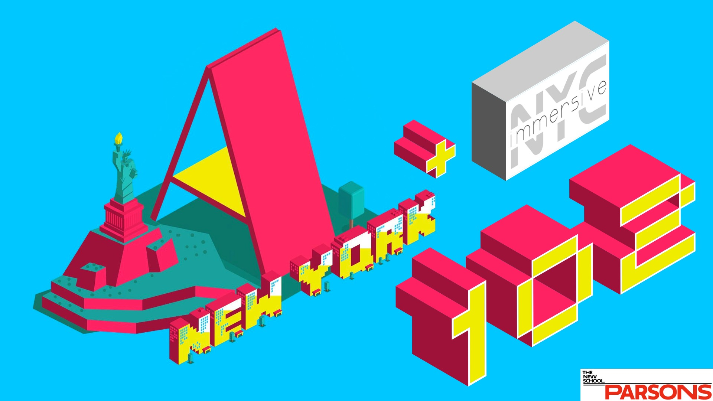

# Welcome to A-Frame NYC
 

---

## Todays Workshop Project: Demo 09 A-Frame NYC Bowling (Physics)
 

---

## We will be covering:

* Recap: Development Environment Setup with Gulp and Browsersync
* A deeper look into geometry and materials for primitives
* a-mixins
* a-obj-model / OBJ files (Google Poly Library)
* Writing a launchpad component
* Physics Component (based on CANNON.js @donmccurdy)

---

## First a look at some data!

* [What's the mass of bowling ball? (Wikipedia)](https://en.wikipedia.org/wiki/Bowling_ball) 
The USBC and FIQ specifies that ... The weight of the ball must not exceed 16.00 pounds (7.26 kg), ...

[Physics System Component](https://github.com/donmccurdy/aframe-physics-system)

* dynamic-body and static-body, shape, mass ...
* debug, system, gravity

---

# *It’s code time!* 

* [github.com/roland-dubois/aframe-meetup-nyc](https://roland-dubois.github.io/aframe-meetup-nyc/)
* Setup: [Gulp Tutorial](https://css-tricks.com/gulp-for-beginners/) & [Git Repo](https://github.com/zellwk/gulp-starter-csstricks)
* Build: [NYC Bowling Game](https://roland-dubois.github.io/aframe-meetup-nyc/demos/09_A-Frame_NYC_Bowling/app/)
* Assets: [Lady Liberty](https://poly.google.com/view/ef9Yd09Doxh)

Didn't finish? Take the challenge home! Got stuck? Reach out!

*@rolanddubois*
[*rolanddubois.com*](https://rolanddubois.com/)