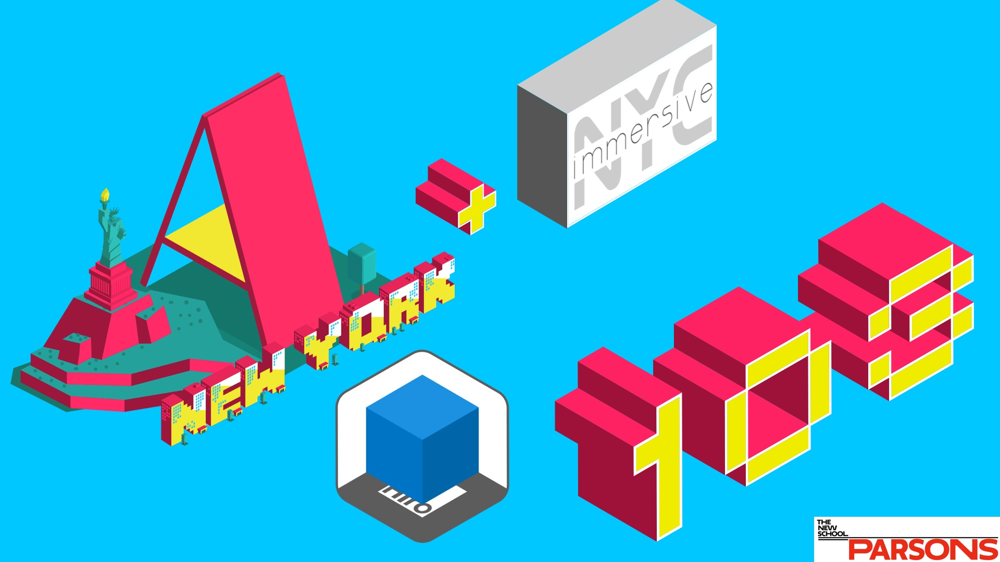
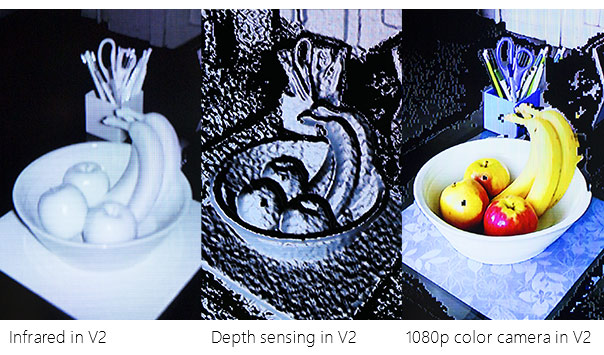
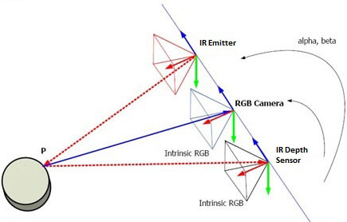
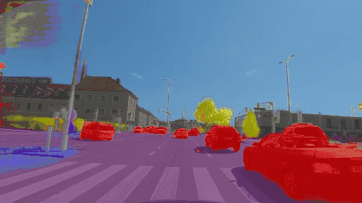
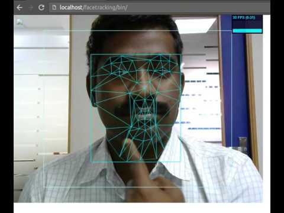
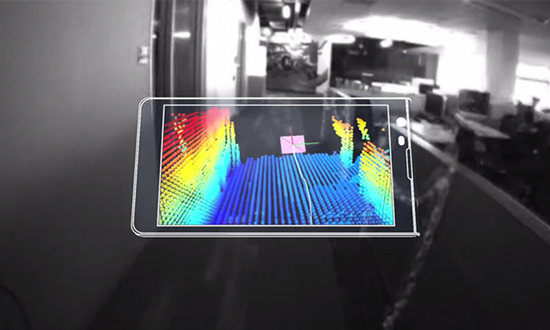
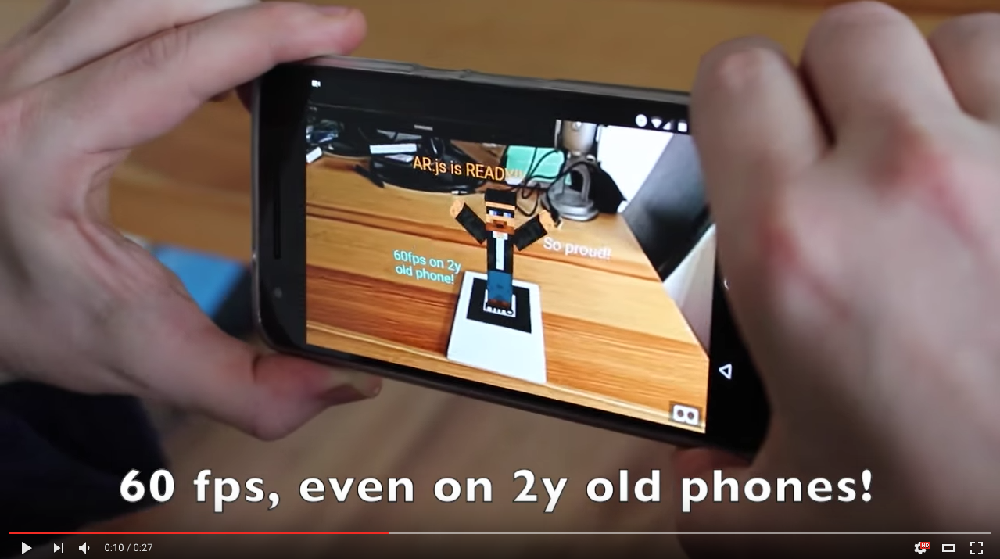
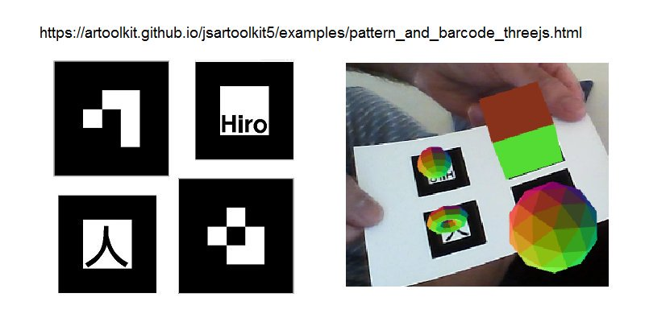
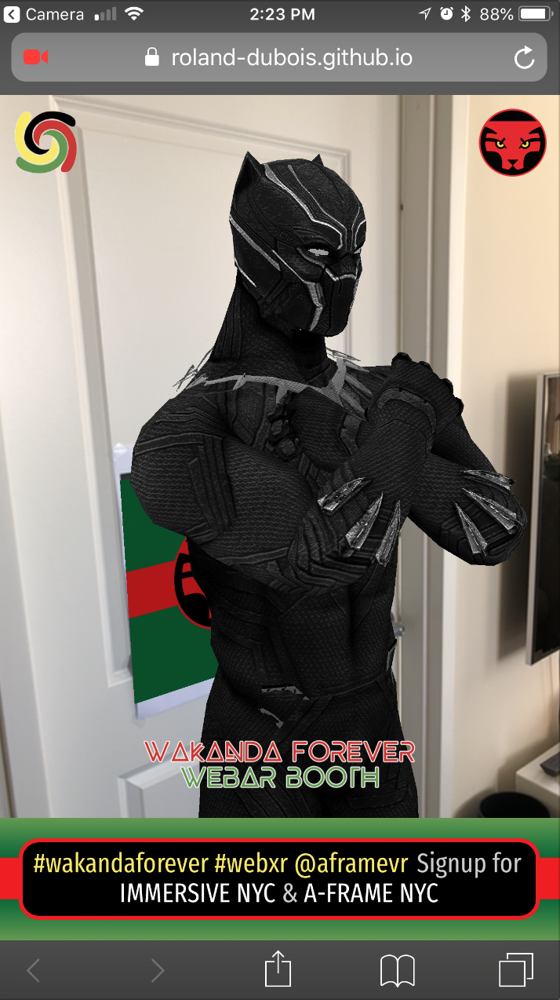

# Welcome to A-Frame NYC
 

---

## Todays Workshop Project: Demo 10 A-Frame Propelify AR (AR.js)
 

---

## We will be covering:

* Overview of the current web-based AR landscape
* A-Frame AR (marker-based AR with AR.js)
* Setup: Dev Environment & Git or Glitch
* AR "Hello World"
* QRCode and custom marker
* Building the Propelify Demo

---

# Overview of the current web-based AR landscape

## Depth Sensors vs Computer Vision (+ DL)

---

## Depth sensors

  

Tango, Kinect, [Leap Motion](http://blog.leapmotion.com/hardware-to-software-how-does-the-leap-motion-controller-work/), or Asus Xtion
IR (Infrared) or Laser point cloud

---

## [Computer Vision](http://safecarnews.com/mapillary-secures-15m-series-b-to-accelerate-global-map-data-collection/) & [Deep Learning](https://www.slideshare.net/AugmentedWorldExpo/gary-brown-movidius-intel-deep-learning-in-ar-the-3-year-horizon)

  

OpenCV (open-source C++ Library from Intel)

* tracking.js
* three.ar.js / jsartoolkit

---

## WebARonTango [shut down to focus on ARCore](https://www.zdnet.com/article/google-shutting-down-project-tango-in-march-2018/)

 

Tango (launched in 2014) and Chromium (extending the WebVR 1.1 API)
Needed a Tango enabled device

* Wide FOV Camera & Infrared Camera
* Features: Marker detection, ADF support (Tango saves these area scans in an Area Description File), motion tracking, rendering of the camera's video feed, and basic understanding of the real world
 
---

## WebARonARCore/WebARonARKit

    

* Install custom app/browser to access device hardware for exposure to browser
* Limited to devices that support ARCore/ARKit (provide marker detection capabilities, plane detection and hit testing)

---

## THREE.AR - WebVR API extension for smartphone AR

* Motion tracking - exact location and orientation in 3D space (6DOF)
* Rendering the pass through camera (rendering on top of camera feed)
* Basic understanding of the real world - identify planes in the real world (or meshes, objects/markers, point clouds)

---

## AR.js (& A-Frame)



* **Fast** - up to 60 fps on two year-old devices 
* **Web-based** - no installation, javascript based on three.js + jsartoolkit5 
* **Open Source** - large community 
* **Using Web Standards** - WebGL and WebRTC (no additional hardware needed)

---

## Anchors 
 
* Estimation of the pose of the device in the real world with the highest accuracy possible. 
* Evolves over time as the system "learns" more about the real world - value is updating.
* Notifying the application about changes in the tracking estimation so the virtual element can correct its pose.

---

## Markers

* Printed tags that the AR system can recognize when they are in the line of sight of the camera so their world scale pose can be calculated. 
* Useful to trigger an experience or to share the same coordinate system between different devices, among others.
* Two types of markers: QRCodes and ARMarkers. Both allow to obtain their world pose but in the case of QRCodes, they can contain a string that is encoded in the marker itself. ARMakers have a unique identifier, a number between 0 and 255.

---



---

## World's biggest WebXR Hackathon - starting May 25 to June 24


**Games from the past:** Reinvent a classic game.

**Education:** Explore a new teaching methodology, presentation of the curriculum, and training environments - teach people in a fun and immersive way.

Submit your WebAR Project!
[**Read more here at Virtuleap**](https://hackathon.virtuleap.com/)

---

## Sneak Peak!
**Our WebAR Demo** for the 2018 ImageNation Outdoors Film & Music Festival

Eight Nights of Soul Cinema and Music Under the Stars

June 1st to September 7th in Harlem!

Visit us! [More Info Here](http://www.imagenation.us/copy-of-imagenation-outdoors-1)



---

# *It’s code time!* 

[QRCode generator](https://www.unitag.io/qrcode)
[Custom Marker](https://jeromeetienne.github.io/AR.js/three.js/examples/marker-training/examples/generator.html)

**Project**
A-Frame AR "Hello World"
Building the UFO & Alien character with primitives
Custom cursor and interaction component
AR portal with 360 image & Shadow component

---

# A-Frame AR "Hello World"

```html 
<!DOCTYPE html>
<html>
  <head>
    <title>Hello World</title>
    <script src="https://aframe.io/releases/0.8.2/aframe.min.js"></script>
    <script src="https://jeromeetienne.github.io/AR.js/aframe/build/aframe-ar.js"> </script>
  </head>
  <body style="margin: 0px; overflow: hidden;">

    <a-scene embedded arjs>
      <a-marker preset="hiro">
        <a-box position="0 0.5 0" material="color: blue;">
        </a-box>
      </a-marker>
      <a-entity camera></a-entity>
    </a-scene>

  </body>
</html>
```

---

* [github.com/roland-dubois/aframe-meetup-nyc](https://roland-dubois.github.io/aframe-meetup-nyc/)
* Setup: [Gulp Tutorial](https://css-tricks.com/gulp-for-beginners/) & [Git Repo](https://github.com/zellwk/gulp-starter-csstricks)
* Build: [Propelify AR](https://roland-dubois.github.io/aframe-meetup-nyc/demos/10_A-Frame_Propelify_AR/app/)

Didn't finish? Take the challenge home! Got stuck? Reach out!

*@rolanddubois*
[*rolanddubois.com*](https://rolanddubois.com/)