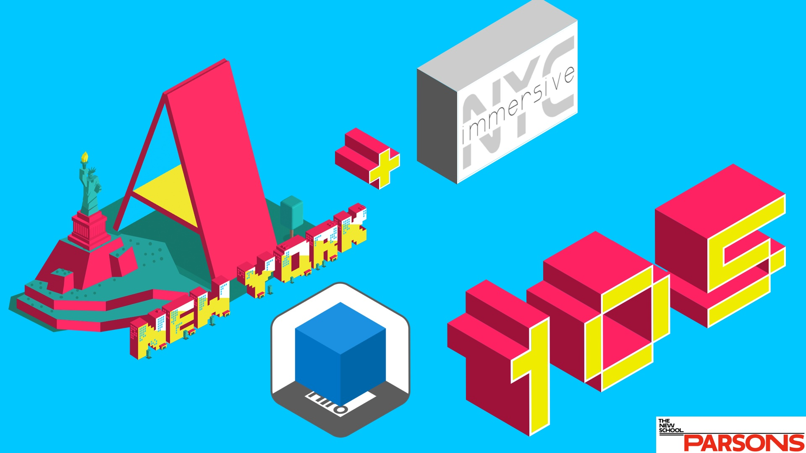
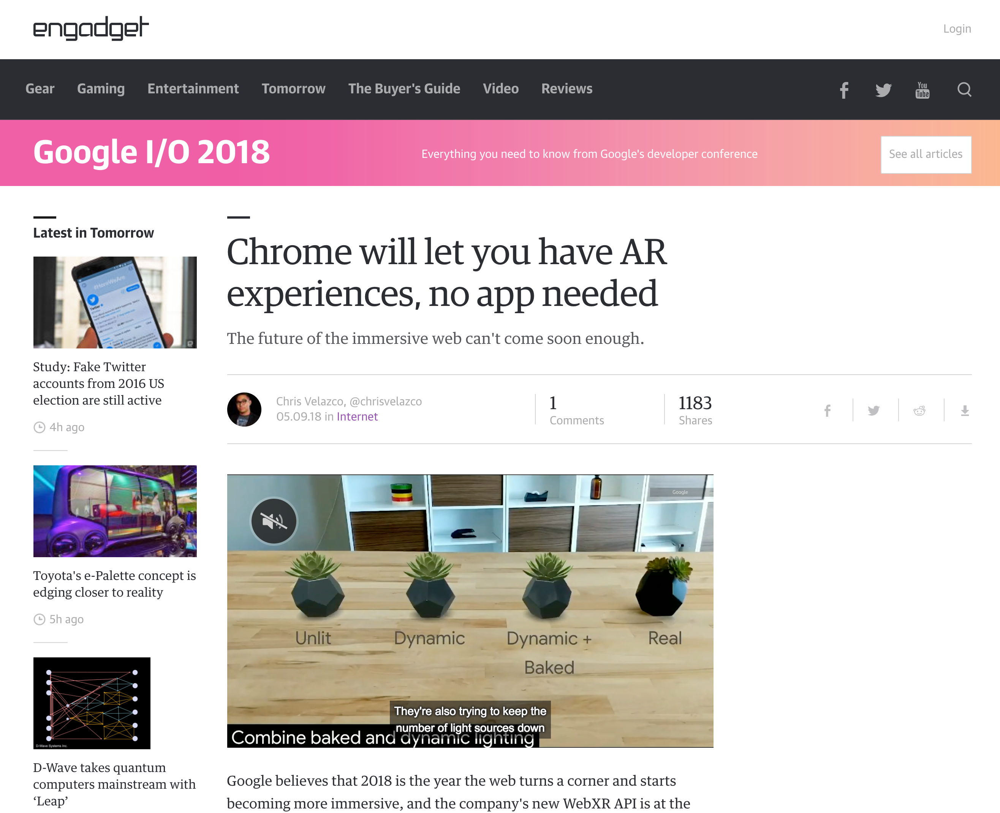
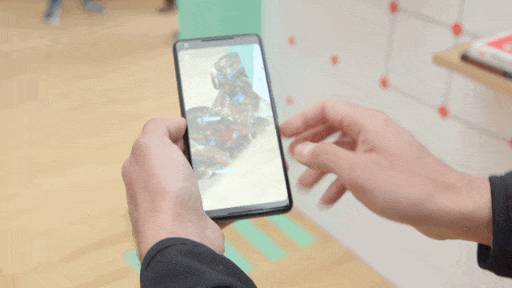
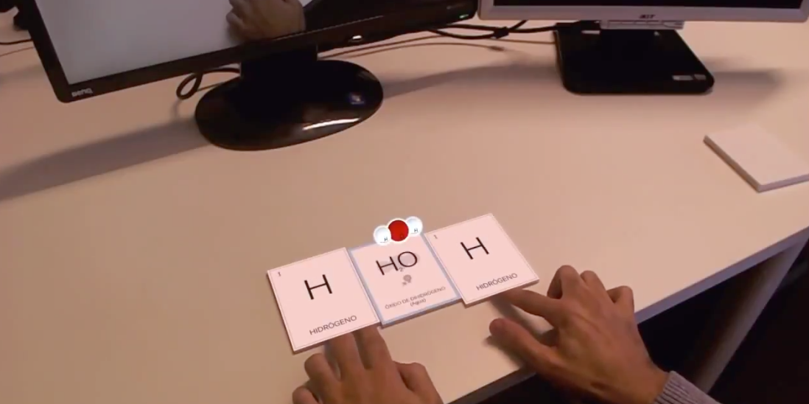
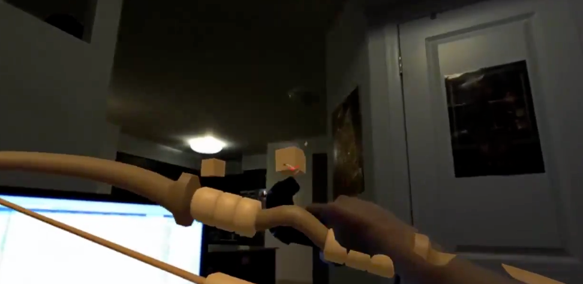

# Welcome to A-Frame NYC



---

## Todays Workshop Project: Demo 12 A-Frame Logo AR (AR.js)
 

---

## AR.js projects we have built in the past

---

 

---

 

---

## We will be covering:

* Overview of the current web-based AR landscape
* A-Frame AR (marker-based AR with AR.js)
* Setup: Dev Environment & Git or Glitch
* AR "Hello World"
* Custom markers and how to do it right
* Building the Logo Demo

---

# Overview of the current web-based AR landscape

## Depth Sensors vs Computer Vision (+ DL)

---

## Depth sensors

  

Tango, Kinect, [Leap Motion](http://blog.leapmotion.com/hardware-to-software-how-does-the-leap-motion-controller-work/), or Asus Xtion
IR (Infrared) or Laser point cloud

---

## [Computer Vision](http://safecarnews.com/mapillary-secures-15m-series-b-to-accelerate-global-map-data-collection/) & [Deep Learning](https://www.slideshare.net/AugmentedWorldExpo/gary-brown-movidius-intel-deep-learning-in-ar-the-3-year-horizon)

  

OpenCV (open-source C++ Library from Intel)

* tracking.js
* three.ar.js / jsartoolkit

---

## WebARonTango [shut down to focus on ARCore](https://www.zdnet.com/article/google-shutting-down-project-tango-in-march-2018/)

 

Tango (launched in 2014) and Chromium (extending the WebVR 1.1 API)
Needed a Tango enabled device

* Wide FOV Camera & Infrared Camera
* Features: Marker detection, ADF support (Tango saves these area scans in an Area Description File), motion tracking, rendering of the camera's video feed, and basic understanding of the real world
 
---

## WebARonARCore/WebARonARKit

    

* Install custom app/browser to access device hardware for exposure to browser
* Limited to devices that support ARCore/ARKit (provide marker detection capabilities, plane detection and hit testing)

---

## THREE.AR - WebVR API extension for smartphone AR

* Motion tracking - exact location and orientation in 3D space (6DOF)
* Rendering the pass through camera (rendering on top of camera feed)
* Basic understanding of the real world - identify planes in the real world (or meshes, objects/markers, point clouds)

---

## AR.js (& A-Frame)


* **Fast** - up to 60 fps on two year-old devices 
* **Web-based** - no installation, javascript based on three.js + jsartoolkit5 
* **Open Source** - large community 
* **Using Web Standards** - WebGL and WebRTC (no additional hardware needed)

---

## Anchors 
 
* Estimation of the pose of the device in the real world with the highest accuracy possible. 
* Evolves over time as the system "learns" more about the real world - value is updating.
* Notifying the application about changes in the tracking estimation so the virtual element can correct its pose.

---

## Markers

* Printed tags that the AR system can recognize when they are in the line of sight of the camera so their world scale pose can be calculated. 
* Useful to trigger an experience or to share the same coordinate system between different devices, among others.
* Two types of markers: QRCodes and ARMarkers. Both allow to obtain their world pose but in the case of QRCodes, they can contain a string that is encoded in the marker itself. ARMakers have a unique identifier, a number between 0 and 255.

---


---

###Global WebXR Hackathon: [2nd Place Winner ARs Attacks](http://arsattacks.azurewebsites.net/) 


#### [**Read more here at Virtuleap**](https://hackathon.virtuleap.com/apps/details/fi/)

---



[Read more](https://www.engadget.com/2018/05/09/google-augmented-reality-chrome/)

---


---

### Creative AR Projects that *could* be built in WebXR (instead of Unity&Vuforia)



[Using Augmented Reality to teach chemistry lessons!](https://twitter.com/DShankar/status/1023984502056443904)



[Controlling Hue lights and shooting them out with a bow and arrow](https://twitter.com/Alientrap/status/967070207377371139)


---

# *It’s code time!* 

[Custom Marker](https://jeromeetienne.github.io/AR.js/three.js/examples/marker-training/examples/generator.html)

**Project**
A-Frame AR "Hello World"
Building the logo with primitives
Animation component and interaction

---

# A-Frame AR "Hello World"

```html 
<!DOCTYPE html>
<html>
  <head>
    <title>Hello World</title>
    <script src="https://aframe.io/releases/0.8.2/aframe.min.js"></script>
    <script src="https://jeromeetienne.github.io/AR.js/aframe/build/aframe-ar.js"> </script>
  </head>
  <body style="margin: 0px; overflow: hidden;">

    <a-scene embedded arjs>
      <a-marker preset="hiro">
        <a-box position="0 0.5 0" material="color: blue;">
        </a-box>
      </a-marker>
      <a-entity camera></a-entity>
    </a-scene>

  </body>
</html>
```

---

* [github.com/roland-dubois/aframe-meetup-nyc](https://roland-dubois.github.io/aframe-meetup-nyc/)
* Setup: [Gulp Tutorial](https://css-tricks.com/gulp-for-beginners/) & [Git Repo](https://github.com/zellwk/gulp-starter-csstricks)
* Marker: [AR Marker](https://github.com/roland-dubois/aframe-meetup-nyc/blob/master/demos/12_A-Frame_Logo_AR/ref/Prime8-marker.png)
* Build: [Logo AR](https://roland-dubois.github.io/aframe-meetup-nyc/demos/12_A-Frame_Logo_AR/app/)

Didn't finish? Take the challenge home! Got stuck? Reach out!

*@rolanddubois*
[*rolanddubois.com*](https://rolanddubois.com/)