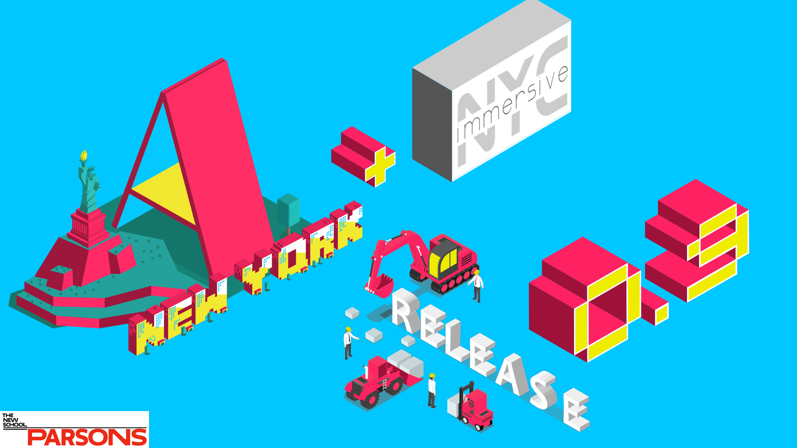
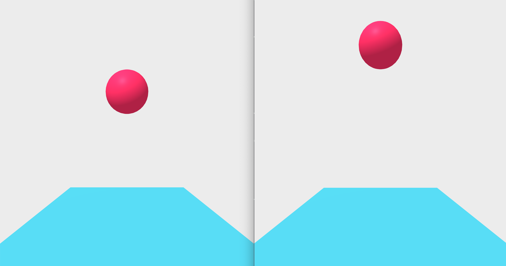
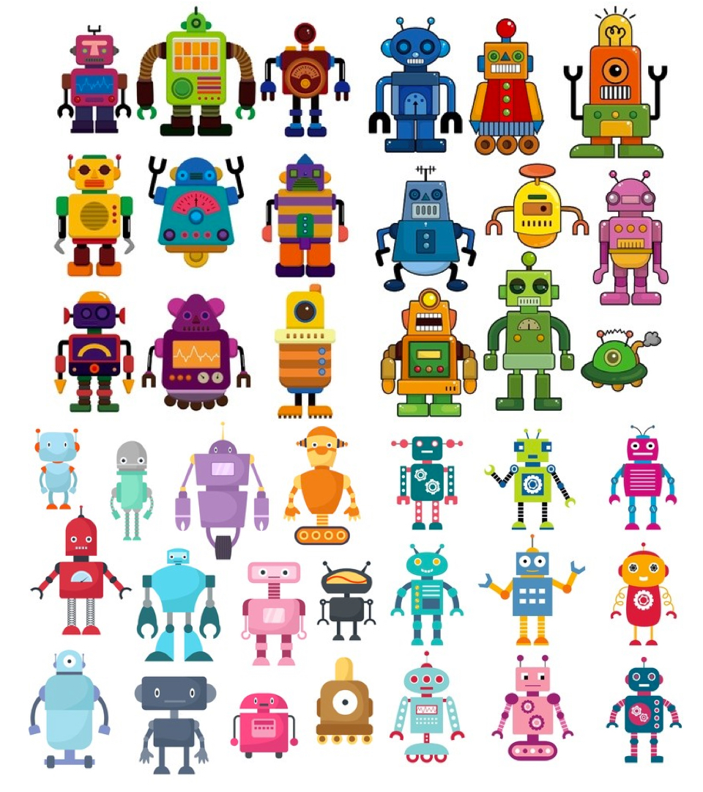

# Welcome to A-Frame NYC


---

# First Thing: https://qxr.li/poll2018

---

## Agenda:

* A-Frame NYC 2018 Retrospective
* New Year - New Meetup Structure
* News in the immersive web space
* Key changes in A-Frame 0.9
* Quick practice: A-Frame animation demo 
* Discussion & Feedback

---


---

## New Meetup Structure - 2 hours will be split in 4 parts:

1. Workshop presentations: 3 - 5 Members will be able to showcase in speed pitches (5 - 10 minutes each) the projects they are currently working on. (30 minutes total)
2. Presentation about the topic of the workshop (20 minutes)
3. Formation of workshop groups: Depending on the workshop attendance, we are going to group people together (2 to 5 people per group) so they can help eachother troubleshoot. (10 minutes)
4. Workshop (60 minutes)


---

## Big News in the immersive web space

* January 28, 2019 [Motion & Orientation Access is disabled by default in iOS 12.2 beta 1](https://medium.com/@firt/pwas-on-ios-12-2-beta-the-good-the-bad-and-the-not-sure-yet-if-good-a37b6fa6afbf). It replaced the old settings **"Ask Websites Not to Track Me"**
* February 06, 2019 W3C Announces First Public [Working Draft](https://www.w3.org/2018/Process-20180201/#first-wd) for the **WebXR Device API** (previously experimental *Editor's Draft*)

---

## Key changes in A-Frame 0.9
 
* Inspector updates `?inspector={elementId}`
* Added `oculus-go-controls` & `vive-focus-controls`
* Added `loading-screen` component
* Removed `<a-animation>` in favor of new animation component
* Removed `collada-model` component
* WebXR support, Raycaster event API changes

---

* `<a-scene vr-mode-ui="enterVRButton: #myButton">`

**Oculus Go**

* `tracked-controls.autoHide`
* Added `renderer.highRefreshRate` to enable 72hz mode on Oculus Browser
* Enable antialias by default on Oculus Go `renderer="antialias:true"`
* Fixed controller reconnecting on Oculus Go and GearVR


---

## Quick practice: A-Frame animation demo  
 


---

## Old Animation Component

https://aframe-nyc-old-ani.glitch.me/

```html 
<html>
  <head>
    <script src="https://aframe.io/releases/0.8.0/aframe.min.js"></script>
  </head>
  <body>
    <a-scene>
      <a-sphere position="0 4 -4" radius="0.5" color="#EF2D5E" shadow>
        <a-animation attribute="position"
               dur="500"
               from="0 4 -4"
               to="0 0.125 -4"
               direction="alternate"
               easing="ease-in-expo"
               repeat="indefinite"></a-animation>
        <a-animation attribute="scale"
               dur="50"
               from="1 1 1"
               to="1.5 0.25 1.5"
               delay="450"
               direction="alternate"
               easing="ease-in-expo"
               repeat="indefinite"></a-animation>
        
      </a-sphere>
      <a-plane position="0 0 -4" rotation="-90 0 0" width="4" height="4" color="#4CC3D9" shadow></a-plane>
      <a-sky color="#ECECEC"></a-sky>
    </a-scene>
  </body>
</html>
```

---

## New Animation Component

https://aframe-nyc-new-ani.glitch.me/

```html 
<html>
  <head>
    <script src="https://aframe.io/releases/0.9.0/aframe.min.js"></script>
  </head>
  <body>
    <a-scene>
      <a-sphere position="0 4 -4" 
                radius="0.5" 
                color="#EF2D5E" 
                shadow
                animation__pos="property: position; from: 0 4 -4; to: 0 0.125 -4; dur: 500; easing:easeInExpo; dir:alternate; loop:true;"
                animation__scale="property: scale; from: 1 1 1; to: 1.5 0.25 1.5; dur: 500; delay: 450; easing:easeInExpo; dir:alternate; loop:true;"         
      >
      </a-sphere>
      <a-plane position="0 0 -4" rotation="-90 0 0" width="4" height="4" color="#4CC3D9" shadow></a-plane>
      <a-sky color="#ECECEC"></a-sky>
    </a-scene>
  </body>
</html>
```

---

## Take Home Project

* Create your own robot made with A-Frame Primitives (`<a-box>, <a-cylinder>, <a-sphere, ... `), doesn't have to be humanoid but needs to feature at least one "arm"

* Maximum Size: width:1; height:2; depth:1;

* No Textures, only HEX colors

* No Animations (yet)

* **This is a part of a larger project we are building together this year!**




---

## Discussion & Feedback

* **Members, bring your friends!** We need to grow our active members.
* **Take projects home** and send them in for feedback, we love to collaborate and help you learn. **Share** your projects and get important feedback.
* Catch up on older lectures: [github.com/roland-dubois/aframe-meetup-nyc](https://roland-dubois.github.io/aframe-meetup-nyc/) & Suggest topics to cover

**Sign up for next meetup: A-Frame 109 March, 14th 6pm-8pm**
*@rolanddubois* *@debraeanderson*