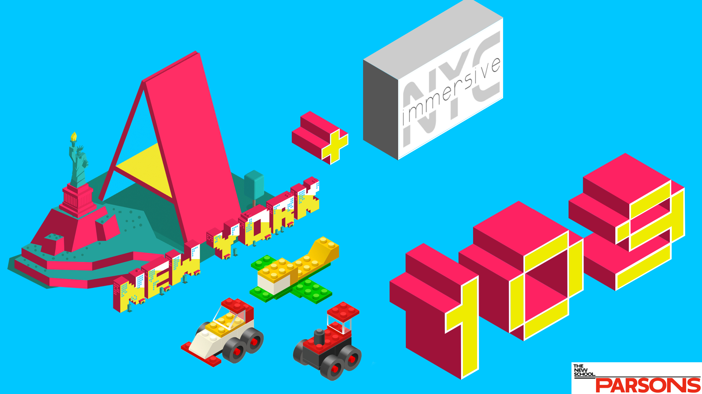
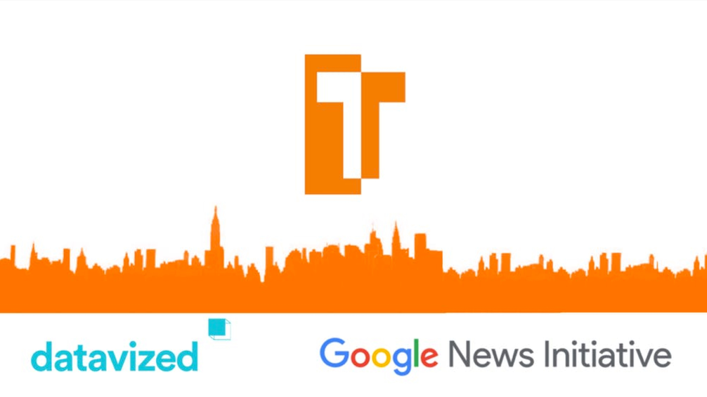
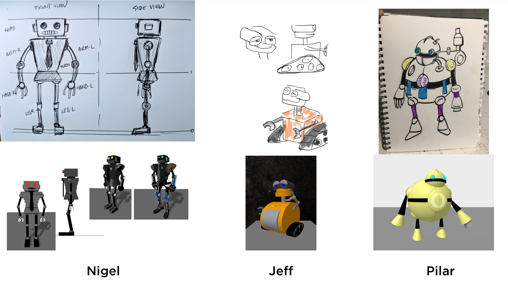
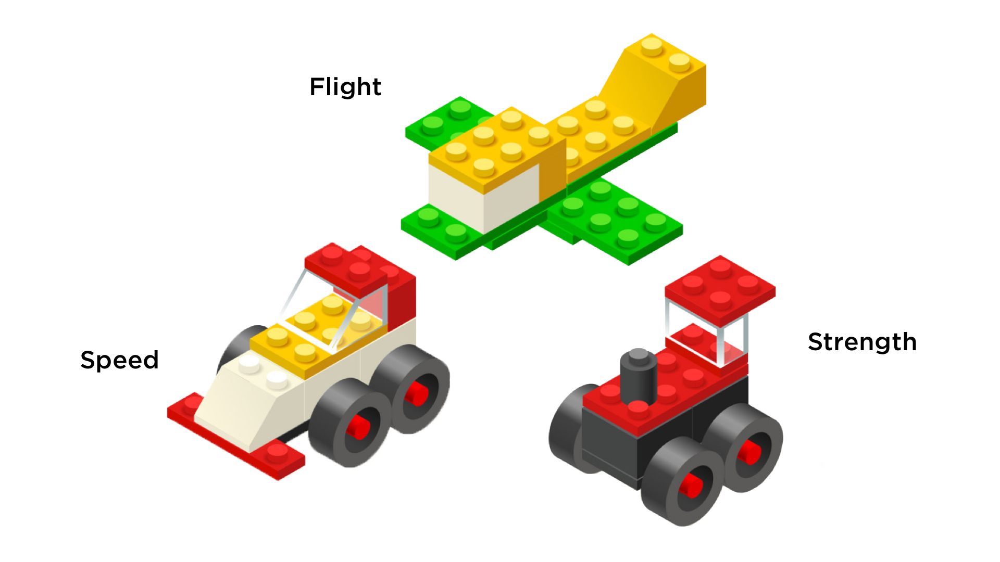
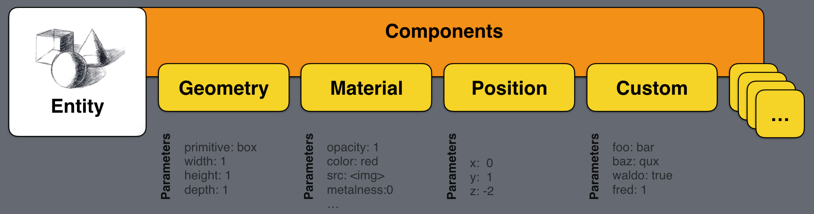
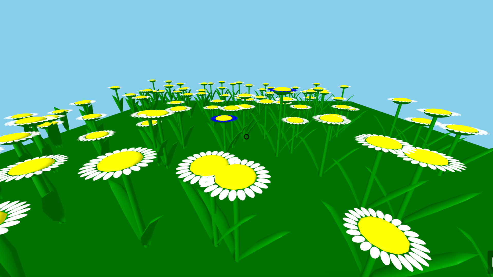
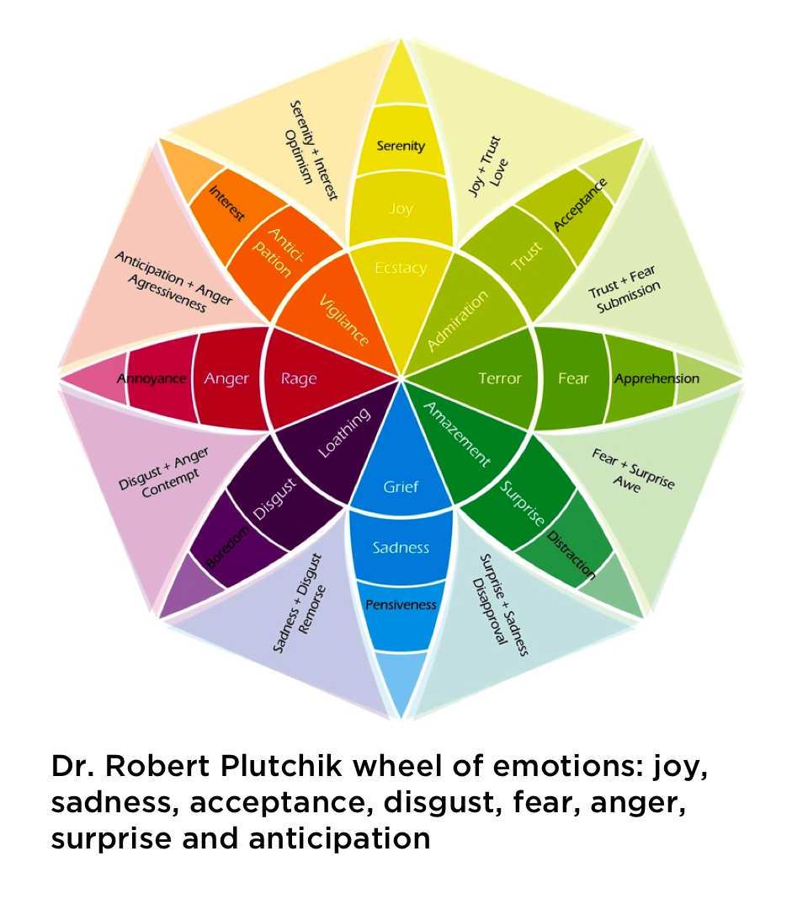
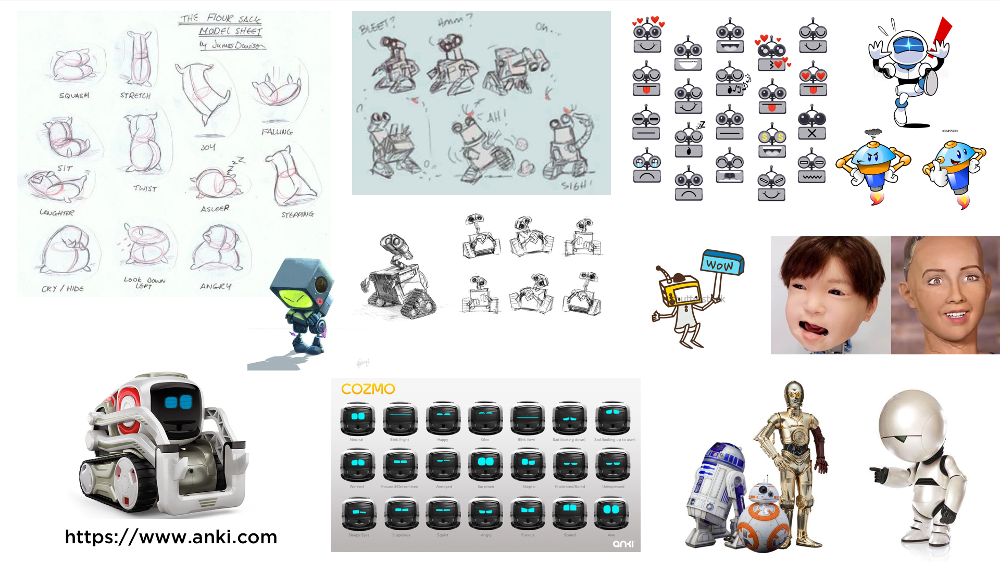

# Welcome to A-Frame NYC


---

## Poll Results! https://qxr.li/poll2018

1a) Components
1b) Multi-user WebVR

2) UI & Input

3a) Audio & Video
3b) GLTF & 3D assets

4a) Animation 
4b) Progressive enhancement

---

## Agenda

* Show & Tell (30 minutes total)
  • TwoTone & link traversing.
  • Members talk about their progress on "A-Robots"

* Presentation (20 minutes)
  • Think Lego: How to get started with components in A-Frame.

* Formation of workshop groups (10 minutes)

* Workshop (60 minutes)


---




---



---

# Think Lego: How to get started with components in A-Frame.

---



---



---

## Syntax

```html
Html5
<button 
  type="button" 
  name="cta" 
  autofocus 
  style="background:red; border-radius: 5px 0 5px 0"
  >Click Me!</button>


A-Frame
<a-plane 
  width="1" 
  height="1" 
  color="red" 
  shadow 
  component="variable:value; othervariable:1 1 1;"
  ></plane>

```

---

The **E**ntity **C**omponent **S**ystem

* **Entities** are represented by the `<a-entity>` element and prototype.
* **Components** are represented by HTML attributes on `<a-entity>`‘s. Underneath, components are objects containing a schema, lifecycle handlers, and methods. 
* **Systems** are represented by `<a-scene>`‘s HTML attributes. System are similar to components in definition.

---

```js
AFRAME.registerComponent('foo', {
  schema: {
    bar: {type: 'number'},
    baz: {type: 'string'}
  },

  init: function () {
    // Do something when component first attached.
  },

  update: function () {
    // Do something when component's data is updated.
  },

  remove: function () {
    // Do something the component or its entity is detached.
  },

  tick: function (time, timeDelta) {
    // Do something on every scene tick or frame.
  }
});
```
---

## Let's look at an A-Frame example: The [scale](https://github.com/aframevr/aframe/blob/master/src/components/scale.js) Component

```js
var registerComponent = require('../core/component').registerComponent;

// Avoids triggering a zero-determinant which makes object3D matrix non-invertible.
var zeroScale = 0.00001;

module.exports.Component = registerComponent('scale', {
  schema: {
    type: 'vec3',
    default: {x: 1, y: 1, z: 1}
  },

  update: function () {
    var data = this.data;
    var object3D = this.el.object3D;
    var x = data.x === 0 ? zeroScale : data.x;
    var y = data.y === 0 ? zeroScale : data.y;
    var z = data.z === 0 ? zeroScale : data.z;
    object3D.scale.set(x, y, z);
  },

  remove: function () {
    // Pretty much for mixins.
    this.el.object3D.scale.set(1, 1, 1);
  }
});

```

---

[Sunflower in entities](https://a-frame-nyc-109-components1.glitch.me/)
[Sunflower component field](https://a-frame-nyc-109-components2.glitch.me/)



---

## Take Home Project - Step 2

* Add six basic emotional expressions to your robot:
  • Cheerful • Charmed • Amused
  • Surprised • Sad • Angry

Tip: You can achieve this expressions by looking into facial impressions, body posture, or other creative ways, maybe even words on a screen, sign or speaking bubble. See [Facebook reactions](https://www.wired.com/2016/02/facebook-reactions-totally-redesigned-like-button/) [The Emotion Wheel](https://positivepsychologyprogram.com/emotion-wheel/)




---



---

## Discussion & Feedback

* **Members, bring your friends!** We need to grow our active members.
* **Take projects home** and send them in for feedback, we love to collaborate and help you learn. **Share** your projects and get important feedback.
* Catch up on older lectures: [github.com/roland-dubois/aframe-meetup-nyc](https://roland-dubois.github.io/aframe-meetup-nyc/) & Suggest topics to cover

**Sign up for next meetup: A-Frame 110 on April 11 7:00 - 9:00 PM**
*@rolanddubois* *@debraeanderson*