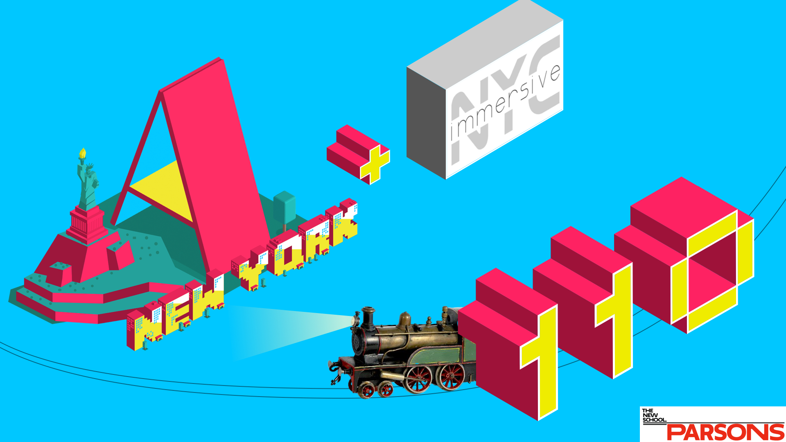
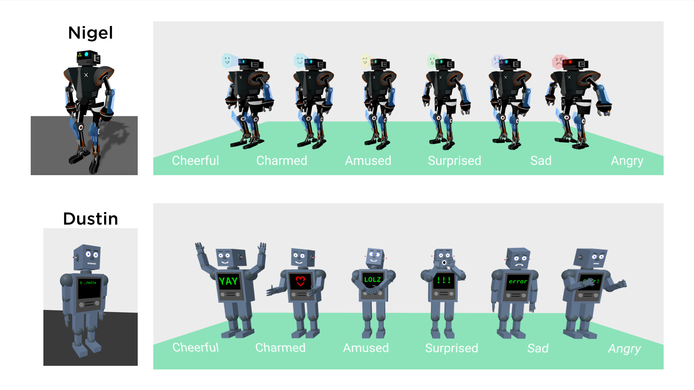
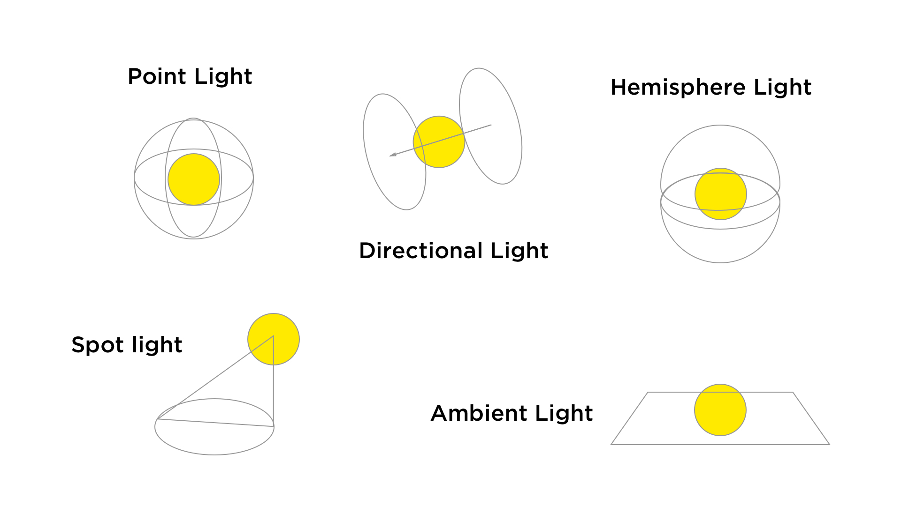
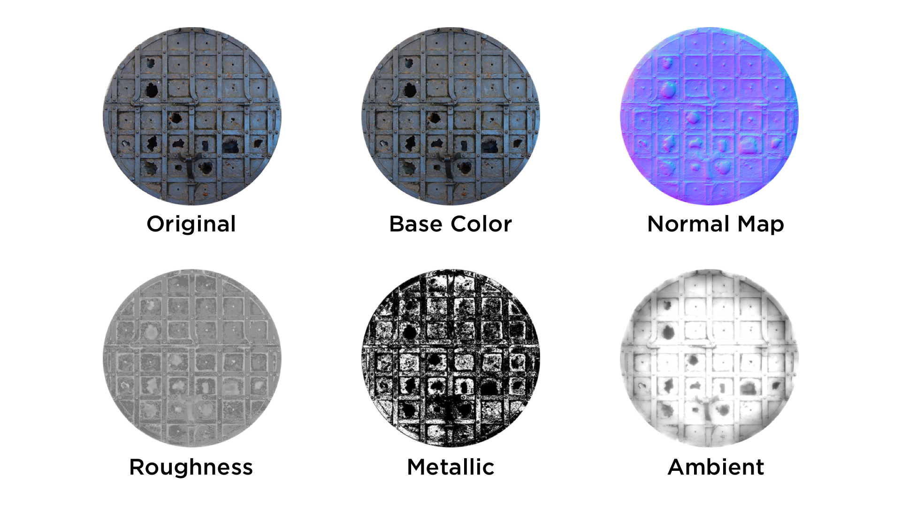
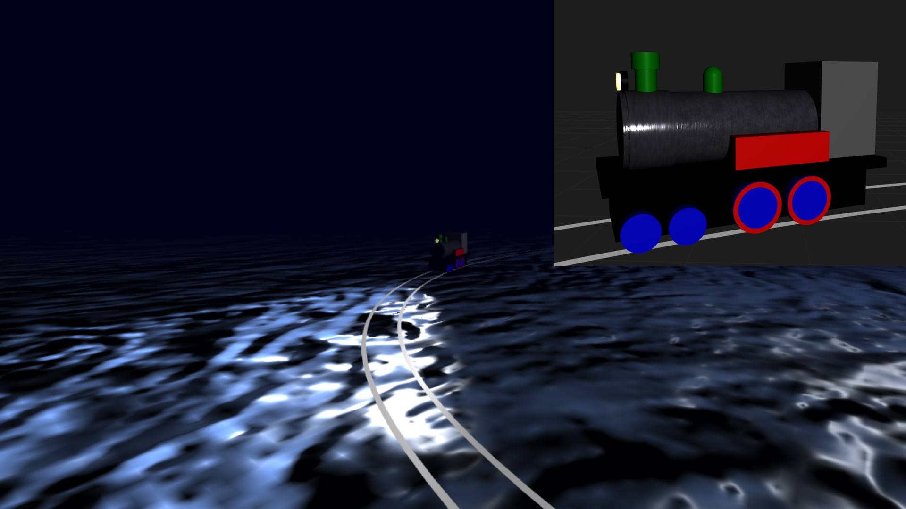
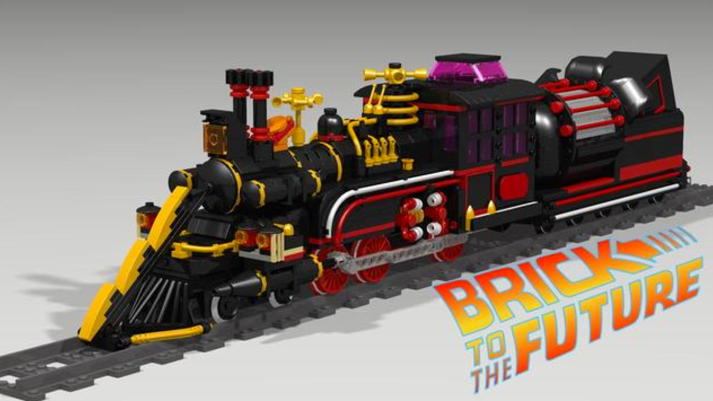
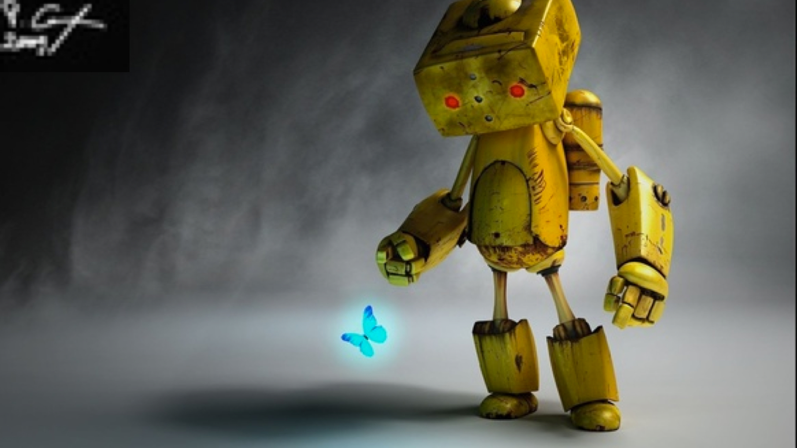

# Welcome to A-Frame NYC


---

## Agenda

* Show & Tell (30 minutes total)
  • We now have a dedicated [Youtube Channel](https://www.youtube.com/channel/UCSrz093Rp4T8pWoj9TdYwTQ)!
  • Members talk about their progress on "A-Robots"

* Presentation (20 minutes)
  • Creating Ambience: Lights, Materials, and Animation

* Formation of workshop groups (10 minutes)

* Workshop (60 minutes)


---



---

# Creating Ambience: Lights, Materials, and Animation

---



---

## Syntax: Directional Light

```html
<a-entity 
  light="type: directional; color: #EEE; intensity: 0.5" 
  position="-1 1 0"
  ></a-entity>

<a-light 
  type="directional" 
  position="0 0 0" 
  rotation="-90 0 0" 
  target="#directionaltarget">

  <a-entity id="directionaltarget" position="0 0 -1"></a-entity>

</a-light>

```
---




---

## Normal Map

A normal map is an image that stores a direction at each pixel. These directions are called normals. The red, green, and blue channels of the image are used to control the direction of each pixel's normal.

---

## Roughness

Roughness controls the rate at which the diffuse component blends into the ambient component.
Increasing roughness makes the material have a flatter, more matte appearance.

---

## Metalness

Metalness is a procedural map to control the reflection of a material.
White pixels in the map increase metalness. Black pixels reduce metalness to 0. Intermediate values adjust metalness accordingly.

---

## Ambient

An ambient occlusion (AO) texture map is a greyscale image, with white indicating areas that should receive full indirect lighting, and black indicating no indirect lighting.

---

## Syntax: Material

```html
<a-scene>

  <a-assets>
    
    
    
  </a-assets>

  <a-entity 
    geometry="primitive: box" 
    material="
      src: #base-color; 
      normalMap: #normal-map; 
      roughnessMap:#roughness;
      color: #fff; 
      roughness: 1; 
      metalness: 0
      "
  ></a-entity>

</a-scene>


```

---

[A-Train by night demo](https://a-frame-nyc-110-demo.glitch.me/)
[A-Train by night edit](https://glitch.com/edit/#!/a-frame-nyc-110-demo)

Resources:

- [https://3dtextures.me/](https://3dtextures.me/)
- [https://www.textures.com/](https://www.textures.com/)
- [https://patternpanda.org/](https://patternpanda.org/)

---



---



---

## Take Home Project - Step 3

* Apply textures to your robot 
* Pick one of your emotional states
* Create a dramatic scene (lights, textures, environment)
* Take a screenshot and create a cover poster for your Robot

Tip: Think about movie posters, it doesn't have to be complicated.

---



---

## Discussion & Feedback

* **Members, bring your friends!** We need to grow our active members.
* **Take projects home** and send them in for feedback, we love to collaborate and help you learn. **Share** your projects and get important feedback.
* Catch up on older lectures: [github.com/roland-dubois/aframe-meetup-nyc](https://roland-dubois.github.io/aframe-meetup-nyc/) & Suggest topics to cover

*@rolanddubois* *@debraeanderson*