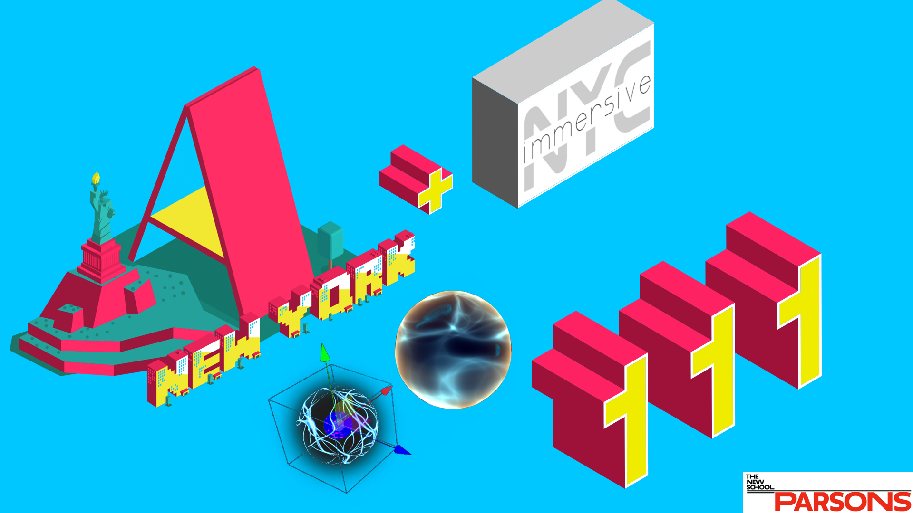
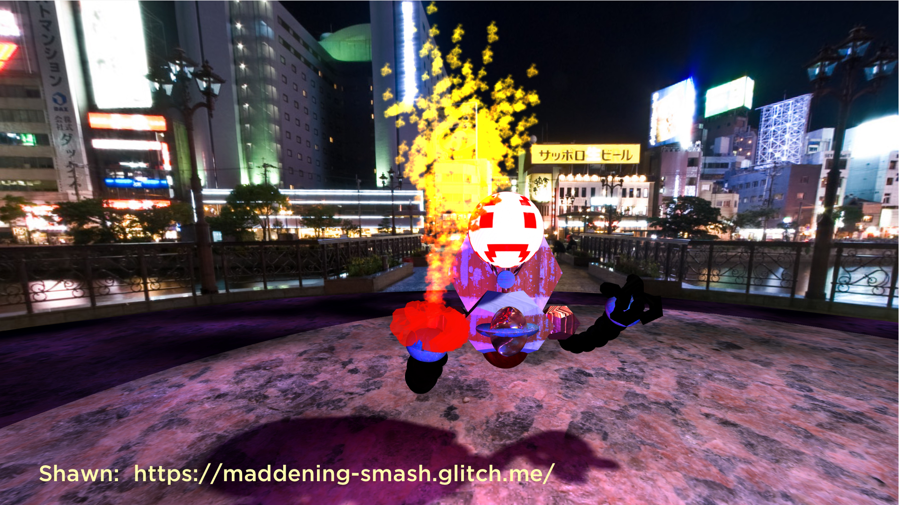
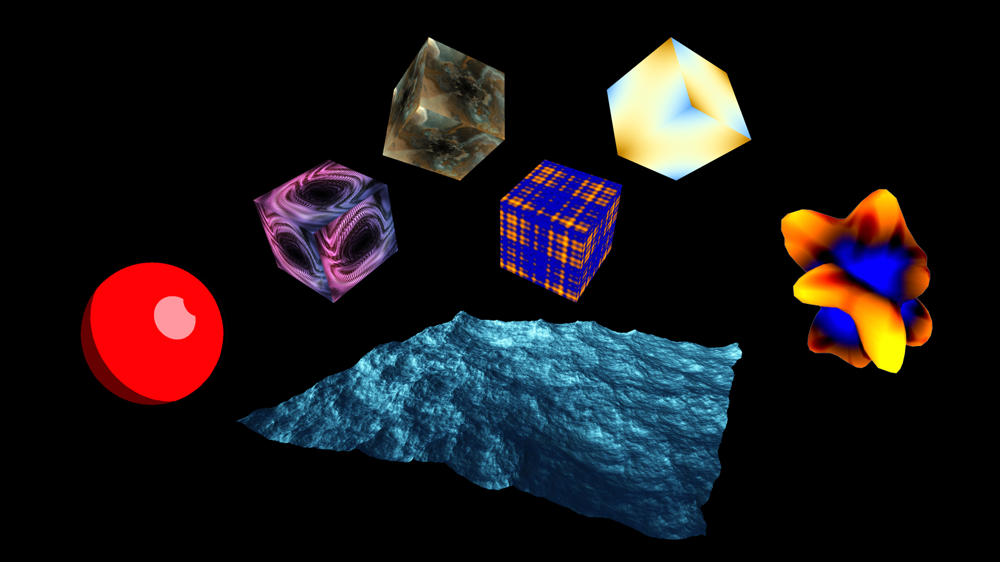
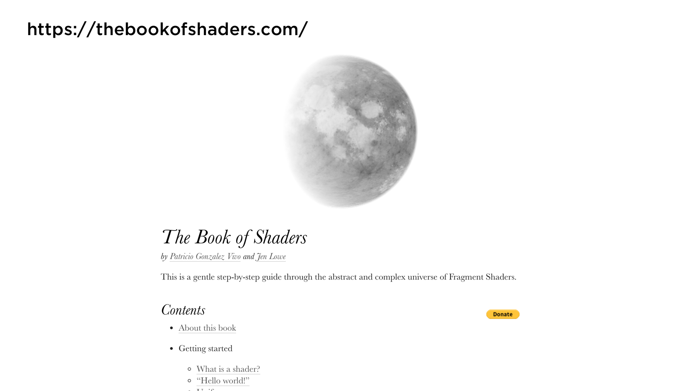
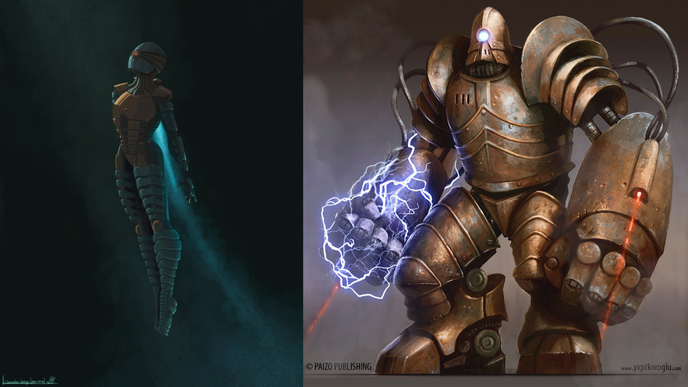

# Welcome to A-Frame NYC


---

## Agenda

* Show & Tell (30 minutes total)
  • Brian Chirls from Datavized presents the 'A-Frame Ambisonic Audio Component' with their Airfield audio editor.
  • Members talk about their progress on "A-Robots"

* Presentation (20 minutes)
  • A glance at Shaders: Tinkering with ShaderFrog

* Formation of workshop groups (10 minutes)

* Workshop (60 minutes)


---



---

# A glance at Shaders
##Tinkering with ShaderFrog

---



---

## Syntax: Shader Component

```js
AFRAME.registerShader('my-custom', {
  schema: {
    // ...
  },
  raw: false,
  vertexShader: vertexShader,
  fragmentShader: fragmentShader
});

```

```html
<a-box material="shader: my-custom;"></a-box>
```

---

## What is a Shader?

A shader is essentially a function required to draw something on the screen. Shaders run on a GPU (graphics processing unit), which is optimized for such operations. Using a GPU to deal with shaders offloads some of the number crunching from the CPU. This allows the CPU to focus its processing power on other tasks, like executing code.

---

With Shaders you are able to write your own lighting model. But that's only one feature of shaders. There are thousands of other really nice possibilities: Shadows, Environment Mapping, Per-Pixel Lighting, Bump Mapping, Parallax Bump Mapping, HDR, and much more!

There are two types of shaders in GLSL: vertex shaders and fragment shaders.
---

## Shader Type: Vertex Shader

Vertex shaders manipulate coordinates in a 3D space and are called once per vertex. The purpose of the vertex shader is to set up the `gl_Position` variable — this is a special, global, and built-in GLSL variable. `gl_Position` is used to store the position of the current vertex. A vertex shader yields a variable containing how to project a vertex's position in 3D space onto a 2D screen.

---

## Shader Type: Vertex Shader

- Vertex Transformation
 
- Normal Transformation, Normalization and Rescaling
 
- Lighting
 
- Texture Coordinate Generation and Transformation

---

## Shader Type: Fragment Shader

Fragment (or texture) shaders define RGBA (red, blue, green, alpha) colors for each pixel being processed — a single fragment shader is called once per pixel. The purpose of the fragment shader is to set up the `gl_FragColor` variable. `gl_FragColor` is a built-in GLSL variable like `gl_Position`.

The calculations result in a variable containing the information about the RGBA color.

---

## Shader Type: Fragment Shader

- Texture access and application (Texture environments)

- Fog

---



---

## AFrame/ThreeJS Shader Tools

[Shaders demo](https://aframe111-shaders.glitch.me/) - [Shaders edit](https://glitch.com/edit/#!/aframe111-shaders)

Components:
[aframe-import-shaderfrog](https://github.com/chenzlabs/aframe-import-shaderfrog)
[aframeFrogShaders](https://github.com/msj121/aframeFrogShaders)
[CS1 Game Engine for making 3D multiplayer games in JavaScript](https://cs1.glitch.me/) by [Eric Eisaman](https://www.youtube.com/channel/UC8Iv9MnaiiWjIKY9kCBysLA)

Resources:
[https://shaderfrog.com/](https://shaderfrog.com/)
[https://shadertoy.com/](https://shadertoy.com/)

---


---

## Take Home Project - Step 4

* Create one custom shader
* Apply the shader to one part of your robot 
* Show/hide the shader by triggering a custom key/trigger

Tip: Use the shader to visualize engine thrusters, magic powers or emotional cues

---



---

## Discussion & Feedback

* **Members, bring your friends!** We need to grow our active members.
* **Take projects home** and send them in for feedback, we love to collaborate and help you learn. **Share** your projects and get important feedback.
* Catch up on older lectures: [github.com/roland-dubois/aframe-meetup-nyc](https://roland-dubois.github.io/aframe-meetup-nyc/) & Suggest topics to cover

*@rolanddubois* *@debraeanderson*