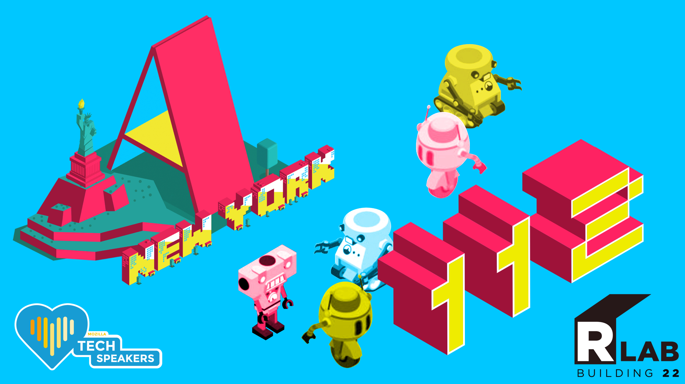
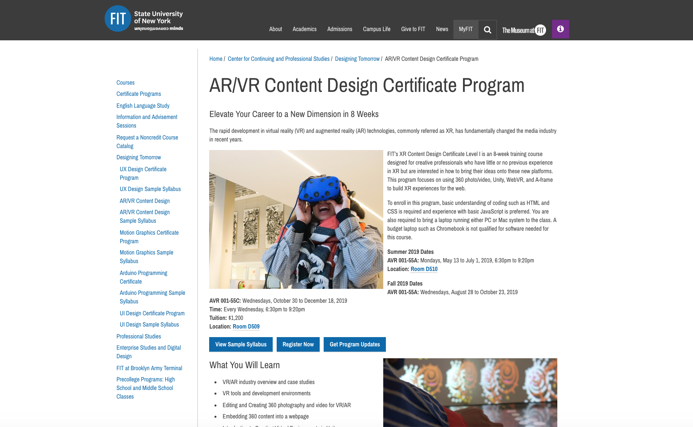
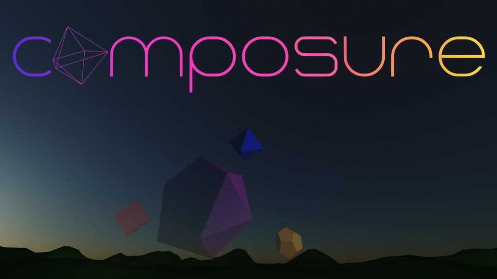
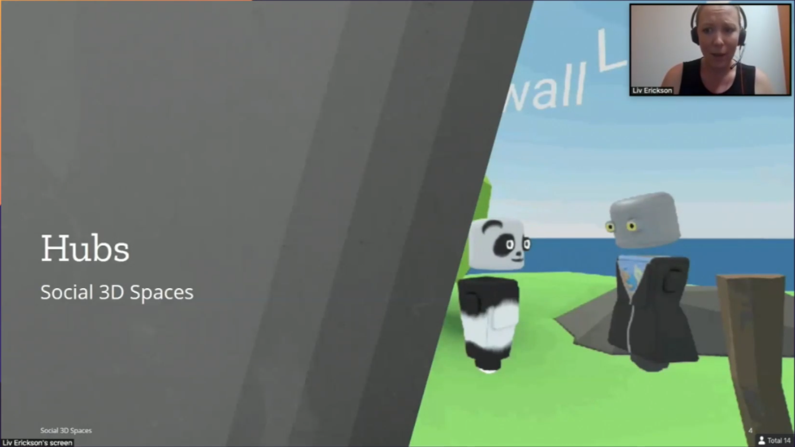
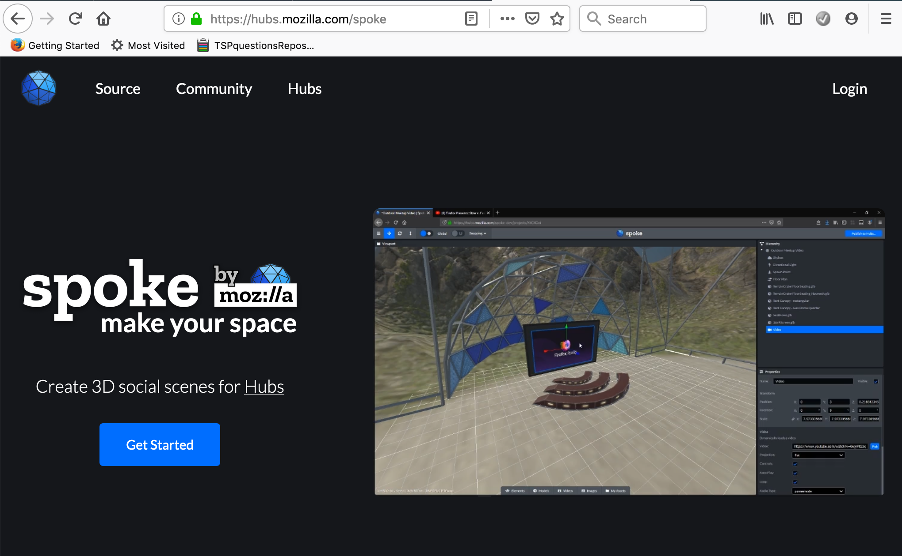
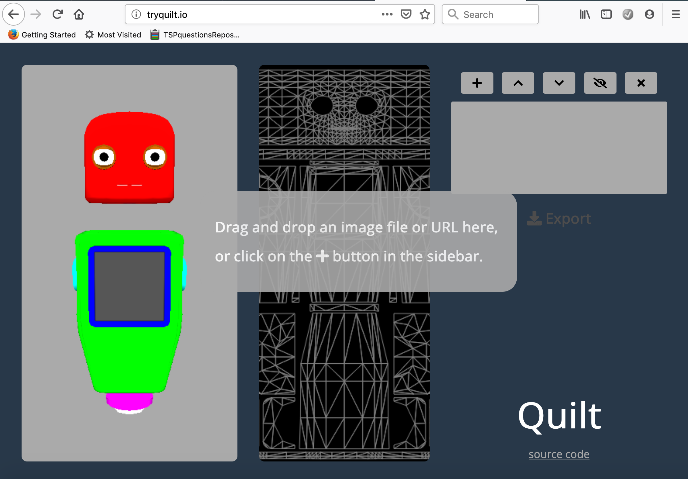
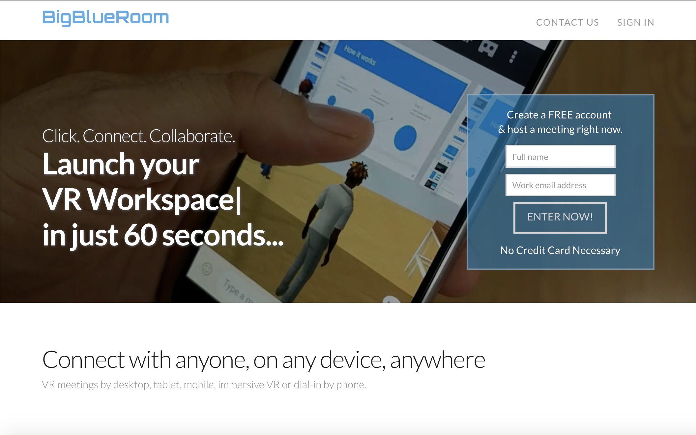
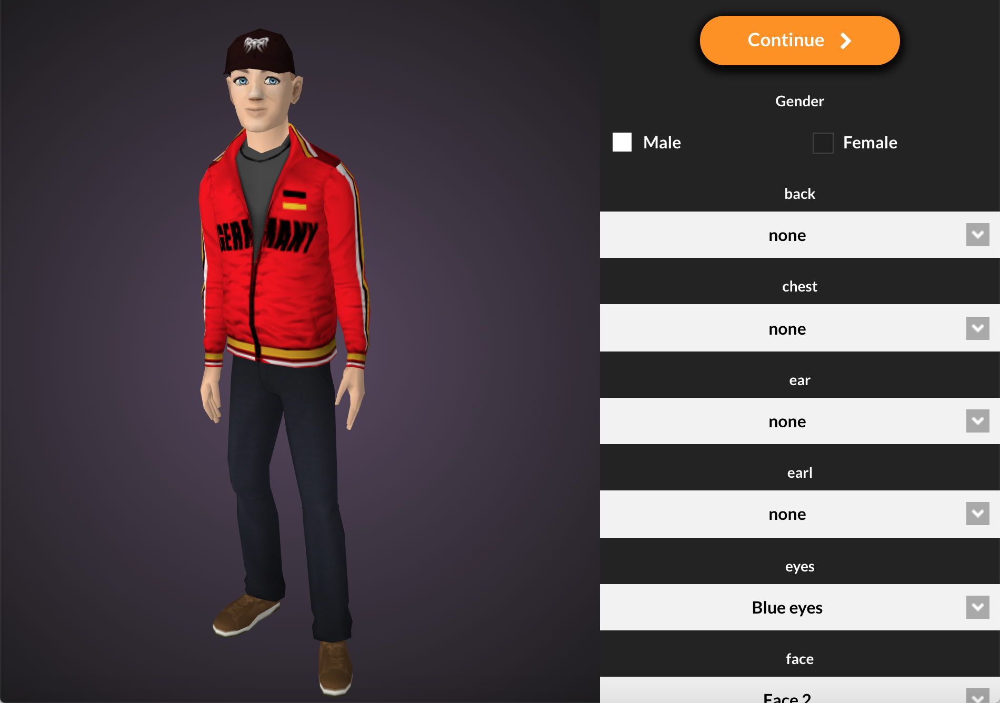
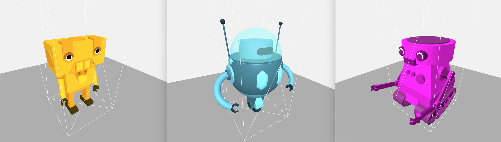

# Welcome to A-Frame NYC

---

## Agenda

* Show & Tell (15 minutes total)
  • Jeff McSpadden is going to present his A-Frame-based product Composure

* Presentation (30 minutes)
  • Networked A-Frame - Meet inside the immersive web.
  • NAF - Social VR on the web by Hayden Lee.

* Formation of workshop groups (15 minutes)

* Workshop (60 minutes)

---

---

Shoutout to Michael Posso @micposso he is teaching A-Frame at his [Latino-Web-Developers-NYC Meetup](https://www.meetup.com/Latino-Web-Developers-NYC/) and teaches and an [Intro to XR class @FIT](https://www.fitnyc.edu/ccps/designing-tomorrow/arvr-content-design.php)

---

# [Composure](https://docs.google.com/presentation/d/1XJk3mCXy3ALFyOKZQmYBwgxvEsJuUNSTjytzQk-gkbY) by Jeff McSpadden

---

# Networked A-Frame
## Meet inside the immersive web

---

# Noteworthy social VR platforms

## [AltspaceVR](https://altvr.com/) - [High Fidelity](https://www.highfidelity.com) - [Rec Room](https://store.steampowered.com/app/471710/Rec_Room/) - [Pluto VR](https://www.plutovr.com) - [VRChat](https://www.vrchat.net) - [vTime](https://vtime.net) - [Sansar](https://www.sansar.com/) - [Bigscreen](http://bigscreenvr.com) - [Facebook Spaces](https://www.facebook.com/spaces)

# Web-based social VR

## [hubs by Mozilla](https://hubs.mozilla.com/) - [BigBlueRoom by Learnbrite](https://bigblueroom.io/)

---

## Hubs - Social 3D spaces for VR, Desktop, and Mobile

Features

- collaborative virtual rooms with voice + text/chat
- Avatars
- Import media from the web (Images, videos, live streams, 3D models, PDFs, links)
- Share camera feed, desktop, or specific windows for presentations

---

## Hubs - Social 3D spaces for VR, Desktop, and Mobile

Use Cases

- Remote meetings, creative brainstorming sessions
- Co-watching videos and live streams
- Presentations
- Hanging out with robot friends

---

---

---

---

## BigBlueRoom - VR meetings by Desktop, Mobile, or dial-in by Phone.

Features

- [Universal customizable Avatars](https://universalavatars.com)
- Media Boards - Add YouTube, Google Docs, Sharepoint, Office...
- Lockable Rooms - Control room permissions: public/private/invite only.
- Instant Messaging - Built-in XMPP compliant messaging.
- Social Integration - Share screenshots of your meetings on social

---

## BigBlueRoom - VR meetings by Desktop, Mobile, or dial-in by Phone.

Use Cases

- Remote meetings
- Remote Classes
- Remote Workspaces
- Remote Events
- Virtual Playgrounds

---

---

---

## Important considerations when you build your own VR space - How to make your space save & inclusive 1/2

- Be clear about the role of your space add a code of conduct
- Make sure that you’re actively moderating
- Private by design and default - You decide who has access
- Give users time to acclimate & get used to the space (lobby)

---

## Important considerations when you build your own VR space - How to make your space save & inclusive 2/2

- Give the user control over self representation and identity, do not assume! (non-human Avatars / robots)
- Access to the platform (at low cost, low-end hardware)
- Respect social norms, provide tools for boundaries (safe spaces)	
- To avoid cyberbullying make sure you give users control over knowing who is in the space, how people interact with each other (cultural norms)

---

# [NAF - Social VR on the web](https://docs.google.com/presentation/d/1YVTyAvcmscNM73qT88cexhggZUZWb6f4hH7mnePnCWU)
## by Hayden Lee

---

---

---

## Take Home Project - Step 5

* Add your A-Robot Creation into your own networked VR experience
* Submit a version of your robot for the A-Robots.club website
* DM me for more info @rolandddubois

---

---

Remix these Avatar builds and place them in your own Social VR environment!
[Avatar 1](https://glitch.com/edit/#!/a-robot-avatar1) - [Avatar 2](https://glitch.com/edit/#!/a-robot-avatar2) - [Avatar 3](https://glitch.com/edit/#!/a-robot-avatar3) 

Remix the Social VR [Demo]((https://glitch.com/edit/#!/demo-networked-aframe)
Try:
- [https://demo-networked-aframe.glitch.me/?avatar=avatar1](https://demo-networked-aframe.glitch.me/?avatar=avatar1)
- [https://demo-networked-aframe.glitch.me/?avatar=avatar2](https://demo-networked-aframe.glitch.me/?avatar=avatar2)
- [https://demo-networked-aframe.glitch.me/?avatar=avatar3](https://demo-networked-aframe.glitch.me/?avatar=avatar3)

---

## Discussion & Feedback

* **Members, bring your friends!** We need to grow our active members.
* **Take projects home** and send them in for feedback, we love to collaborate and help you learn. **Share** your projects and get important feedback.
* Catch up on older lectures: [github.com/roland-dubois/aframe-meetup-nyc](https://roland-dubois.github.io/aframe-meetup-nyc/) & Suggest topics to cover

*@rolanddubois* *@HaydenLee37* *@micposso*