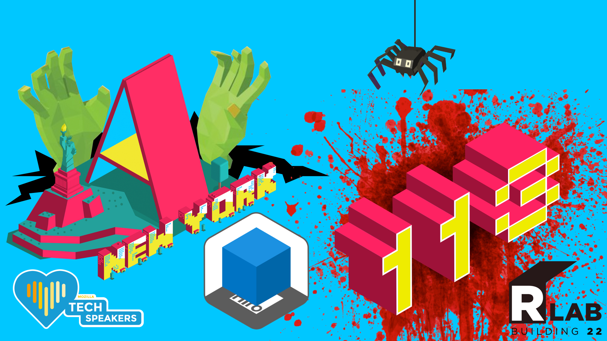

# Welcome to A-Frame NYC


---

## Agenda

* Presentation (30 minutes)
  • AR.js what's new in 2.0 (Events, Smoothing, GeoAR)
  • Interesting WebAR Projects & Experiments
  • What are we building 

* Formation of workshop groups (15 minutes)

* Workshop (60 minutes)

---

## New AR.js Logo


---

## AR.js Version 2.0.5
  • Now maintained by Nicolò Carpignoli [@nicolocarp](https://twitter.com/nicolocarp)
  • Removing tango support
  • A-Frame 1.0 release December 10th with WebXR integration 
  • Removing polyfill
  • Integrating NFT (artoolkit) and other markerless features

---

### Marker Events

```js
AFRAME.registerComponent('markerhandler', {
    init: function() {
        const myMarker = document.querySelector("#my-marker");
        const aEntity = document.querySelector("#my-model");

        myMarker.addEventListener('click', function(ev, target){
            const intersectedElement = ev && ev.detail && ev.detail.intersectedEl;
            if (aEntity && intersectedElement === aEntity) {
                const scale = aEntity.getAttribute('scale');
                Object.keys(scale).forEach((key) => scale[key] = scale[key] + 1);
                aEntity.setAttribute('scale', scale);
            }
        });
	}
});
```
```html
<a-marker id="my-marker" markerhandler emitevents="true" cursor="rayOrigin: mouse">
    <a-box id="my-model" scale="1 1 1"></a-box>
</a-marker>

```

---

### Marker smoothing

```html
<a-marker 
	smooth="true"
    smooth-count="5"
    smooth-tolerance="0.01"
    smooth-threshold="2"
	>
</a-marker>
```

---

 

---

###  GeoAR

```html
    <a-scene 
    	embedded 
    	gps-camera-debug 
    	arjs="sourceType: webcam; debugUIEnabled: false;" 
    	vr-mode-ui="enabled: false"
    >

      <a-entity gps-entity-place="latitude: 42.330600; longitude: -71.374430">
        <a-box position="0 1 0" color="blue"></a-box>
      </a-entity>
      
      <a-camera gps-camera rotation-reader></a-camera>
      
    </a-scene>
```

---

# Interesting WebAR Projects & Experiments

---

### [ARCube](https://github.com/rvdleun/aframe-arcube) by @rvdleun 


---

### [IOT](http://fab.cba.mit.edu/classes/865.18/people/Allan/project2/index.html) hackathon project


---

### Art installations by [Jandig.art](https://www.instagram.com/jandig.art/) & [Mozilla Interview](https://medium.com/read-write-participate/create-art-with-augmented-reality-e26572524021)


---

### Augmented Reality Fashion


---

### [LEGO Manual](https://www.youtube.com/watch?v=ogeIszG5ogQ) With ARToolKit


---

### Riley Paik [BIG MARKER](https://drive.google.com/file/d/1jSbVsUI4d6alk5LGdm-ieGYvAPA6v3iY/view)


---

## What are we building 

  

---

## What are we building 

  • [WebAR Ghosts Panel - Marker Test](https://glitch.com/edit/#!/webar-ghosts-panel)

  • [WebAR Spider ARCube](https://glitch.com/edit/#!/webar-spider)
  
  • [WebAR Zombie AR Marker](https://glitch.com/edit/#!/webar-zombie)
  
  • [WebAR Ghosts GeoAR](https://glitch.com/edit/#!/webar-ghosts)

---

### ARCube by @rvdleun

```html
<!doctype HTML>
<html>
  <head>
	<script src="https://aframe.io/releases/0.9.2/aframe.min.js"></script>
	<script src="https://raw.githack.com/jeromeetienne/AR.js/2.0.5/aframe/build/aframe-ar.js"></script>
    <script src="https://rvdleun.github.io/aframe-arcube/dist/aframe-arcube.min.js"></script>
    <script>
      THREEx.ArToolkitContext.baseURL = 'https://rawgit.com/jeromeetienne/ar.js/master/three.js/'
    </script>
  </head>
  <body>
    <a-scene embedded arjs='debugUIEnabled: false; sourceType: webcam; detectionMode: mono;' vr-mode-ui="enabled: false">
        <a-arcube>
            <a-box color="red"></a-box>
        </a-arcube>
        <a-entity camera></a-entity>
    </a-scene>
  </body>
</html>
```
---

## Discussion & Feedback

* **Members, bring your friends!** We need to grow our active members.
* **Take projects home** and send them in for feedback, we love to collaborate and help you learn. **Share** your projects and get important feedback.
* Catch up on older lectures: [github.com/roland-dubois/aframe-meetup-nyc](https://roland-dubois.github.io/aframe-meetup-nyc/) & Suggest topics to cover

*@rolanddubois* 