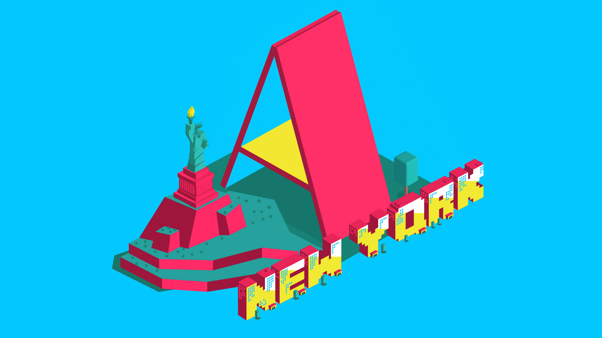
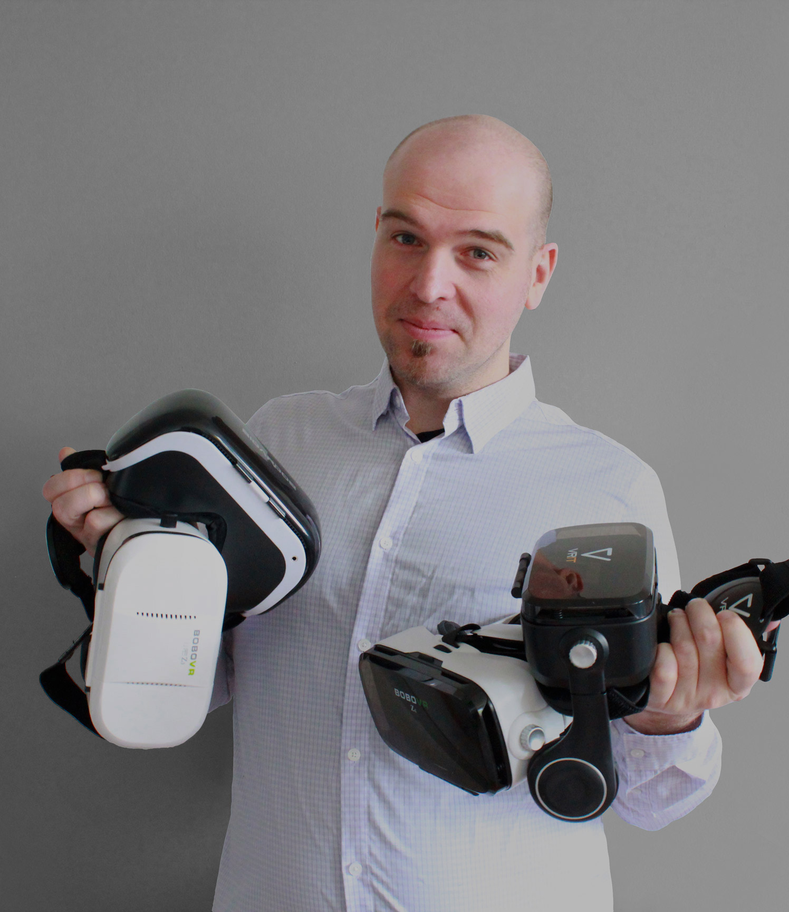

# Welcome to A-Frame NYC
 

---

# Building VR experiences for the Web

This group is for creatives, artists, developers, designers, and WebVR fans of all types that want to learn how to build and prototype in VR for the web, learn the code, and create/visualize immersive content. 
The event format will consist in short presentations with hands-on workshops and group discussions.

The A-Frame NYC Meetup is dedicated to diversity and inclusion!

---

## Hi! I’m Roland Dubois

 

* UI/UX designer and web developer 
* [A-Frame contributor](https://aframe.io) & [W3C Immersive Web Community Group](https://www.w3.org/community/webvr/participants) member
* Co-host of the [WebXR NYC Meetup](https://www.meetup.com/WebXR-New-York/)
* Design Director of [studio.zeldman](https://studio.zeldman.com/)
* Creator of [GRAVR](https://www.gravr.io/) - a globally recognized avatar for VR on the web

*@rolanddubois*
[*rolanddubois.com*](https://rolanddubois.com/)