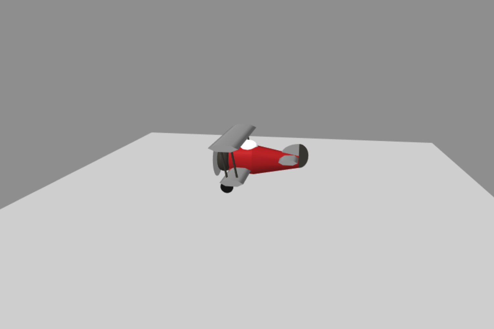

## Welcome to the A-Frame NYC
# Merry WebXR Holiday Workshop


##### For this years holiday season Roland Dubois (#AFrame_NYC) and Chris Lowery (@Fasility_VR) are presenting an interactive XR snowglobe experience.

Press the button to change views: from snowglobe outside-in, to the center of the village inside-out or catching a ride on the train, you pick your immersive perspective. 

Looks complicated? Not at all, the entire project is built with simple A-Frame primitives. See below all the pieces , dissect, recreate, mix, and match to create your own snowed-in winter village. 

Share this snowglobe or even better, share your creations under the hashtag *#MerryWebXR* and celebrate with us the release of A-Frame 1.0, the support of the WebXR API in major browsers, and the bright future of the immersive web. 

Happy holidays and a Happy New Year 2020!

##### Roland Dubois & Chris Lowery

---

#### Listed below are the A-Frame models that are being used in the project


##### Sound Effects
Sponsored by [Prime8](http://prime8.io)

1. Sleigh Bells 
<audio controls><source src="assets/sleighbells.mp3" type="audio/mpeg"></audio>
2. Propeller Air Plane 
<audio controls><source src="assets/planesound.mp3" type="audio/mpeg"></audio>
2. Steam Train 
<audio controls><source src="assets/trainsound.mp3" type="audio/mpeg"></audio>
3. Train Whistle 
<audio controls><source src="assets/trainwhistle.mp3" type="audio/mpeg"></audio>


##### The Village


* [View on Glitch](https://merrywebxr.glitch.me/village.html)

```html 
<html>
  <head>
    <script src="https://aframe.io/releases/1.0.0/aframe.min.js"></script>    
    <script src="https://unpkg.com/aframe-orbit-controls@1.2.0/dist/aframe-orbit-controls.min.js"></script>

  </head>
  <body>
    <a-scene>
        <a-entity id="church" position="0 0 0">
          <!-- Tower -->
          <a-entity geometry="primitive: cylinder; segmentsHeight: 1; segmentsRadial: 6; radius: 0.25; height: 1.78" material="color: #888; flatShading: true" position="1 0.89 0"></a-entity>
          <a-entity geometry="primitive: cylinder; segmentsHeight: 1; segmentsRadial: 6; radius: 0.25; height: 0.03" material="color: #aaa; flatShading: true" position="1 1.795 0"></a-entity>
          <a-entity geometry="primitive: cylinder; segmentsHeight: 1; segmentsRadial: 6; radius: 0.25; height: 0.05" material="color: #888; flatShading: true" position="1 2.335 0"></a-entity>
          <a-entity geometry="primitive: cylinder; segmentsHeight: 1; segmentsRadial: 6; radius: 0.22; height: 0.12" material="color: #aaa; flatShading: true" position="1 2.253 0"></a-entity>
          <a-entity geometry="primitive: cylinder; segmentsHeight: 1; segmentsRadial: 6; radius: 0.05; height: 0.5" material="color: #aaa; flatShading: true" position="1 2.06 0.2"></a-entity>
          <a-entity geometry="primitive: cylinder; segmentsHeight: 1; segmentsRadial: 6; radius: 0.05; height: 0.5" material="color: #aaa; flatShading: true" position="1 2.06 -0.2"></a-entity>
          <a-entity geometry="primitive: cylinder; segmentsHeight: 1; segmentsRadial: 6; radius: 0.05; height: 0.5" material="color: #aaa; flatShading: true" position="1.175 2.06 0.1"></a-entity>        
          <a-entity geometry="primitive: cylinder; segmentsHeight: 1; segmentsRadial: 6; radius: 0.05; height: 0.5" material="color: #aaa; flatShading: true" position="1.175 2.06 -0.1"></a-entity>
          <a-entity geometry="primitive: cylinder; segmentsHeight: 1; segmentsRadial: 6; radius: 0.05; height: 0.5" material="color: #aaa; flatShading: true" position="0.8275 2.06 0.1"></a-entity>
          <a-entity geometry="primitive: cylinder; segmentsHeight: 1; segmentsRadial: 6; radius: 0.05; height: 0.5" material="color: #aaa; flatShading: true" position="0.8275 2.06 -0.1"></a-entity>
          <a-entity geometry="primitive: cylinder; segmentsHeight: 1; segmentsRadial: 6; radius: 0.2; height: 0.38" material="color: #37342F; flatShading: true" position="1 2 0"></a-entity>
          <a-entity geometry="primitive: cone; radiusTop: 0.23; radiusBottom: 0.25; height: 0.05; segmentsHeight: 1" material="color: #961B1E" position="1 2.385 0"></a-entity>
          <a-entity geometry="primitive: cone; radiusTop: 0.23; radiusBottom: 0.25; height: 0.05; segmentsHeight: 1" material="color: #961B1E" position="1 2.385 0"></a-entity>
          <a-entity geometry="primitive: cone; radiusTop: 0.04; radiusBottom: 0.21; height: 0.42; segmentsHeight: 1" material="color: #961B1E" position="1 2.62 0"></a-entity>
          <a-entity geometry="primitive: cone; radiusTop: 0.02; radiusBottom: 0.05; height: 0.05; segmentsHeight: 1" material="color: #961B1E" position="1 2.855 0"></a-entity>
          <a-entity geometry="primitive: cone; radiusTop: 0.005; radiusBottom: 0.01; height: 0.15; segmentsHeight: 1" material="color: #d6cf00" position="1 2.955 0"></a-entity>
          <a-entity geometry="primitive: sphere; radius: 0.02;" material="color: #d6cf00" position="1 3.04 0"></a-entity>
          <a-entity geometry="primitive: circle; radius: 0.11" rotation="0 90 0" material="color: #eee" position="1.22 1.6 0"></a-entity>
          <!-- End Tower -->
          <a-entity geometry="primitive: box; width: 1.6; depth: 1.4" position="0.2 0.5 0" material="color: #37342F"></a-entity>
          <a-entity geometry="primitive: cylinder; segmentsHeight: 1; segmentsRadial: 3; radius: 0.87; height: 1.6" rotation="-90 90 0" scale="1 1 0.4" material="color: #961B1E; flatShading: true" position="0.2 1.1725 0"></a-entity>
          <a-entity geometry="primitive: box; width: 0.5; depth: 1.6" position="0.6 0.5 0" material="color: #444"></a-entity>
          <a-entity geometry="primitive: cylinder; segmentsHeight: 1; segmentsRadial: 3; radius: 0.31; height: 1.6" rotation="-90 0 0" scale="1 1 0.5" material="color: #961B1E; flatShading: true" position="0.6 1.075 0"></a-entity>
          <a-entity geometry="primitive: box; width: 0.25; depth: 1.65; height: 0.5" position="0.6 0.5 0" material="color: #fff"></a-entity>
          <a-entity geometry="primitive: cylinder; segmentsHeight: 1; segmentsRadial: 3; radius: 0.17; height: 1.7" rotation="-90 0 0" scale="1 1 0.5" material="color: #37342F; flatShading: true" position="0.6 0.795 0"></a-entity>
          <a-entity geometry="primitive: box; width: 0.5; depth: 1.6" position="-0.2 0.5 0" material="color: #444"></a-entity>
          <a-entity geometry="primitive: cylinder; segmentsHeight: 1; segmentsRadial: 3; radius: 0.31; height: 1.6" rotation="-90 0 0" scale="1 1 0.5" material="color: #961B1E; flatShading: true" position="-0.2 1.075 0"></a-entity>      
          <a-entity geometry="primitive: box; width: 0.25; depth: 1.65; height: 0.5" position="-0.2 0.5 0" material="color: #fff"></a-entity>
          <a-entity geometry="primitive: cylinder; segmentsHeight: 1; segmentsRadial: 3; radius: 0.17; height: 1.7" rotation="-90 0 0" scale="1 1 0.5" material="color: #37342F; flatShading: true" position="-0.2 0.795 0"></a-entity>
          <a-entity geometry="primitive: box; height: 0.75; width: 0.4; depth: 0.5" position="1.2 0.375 0" material="color: #37342F"></a-entity>
          <a-entity geometry="primitive: cylinder; segmentsHeight: 1; segmentsRadial: 3; radius: 0.31; height: 0.72" rotation="-90 90 0" scale="1 1 0.6" material="color: #961B1E; flatShading: true" position="1.365 0.84 0"></a-entity>
          <a-entity geometry="primitive: box; height: 0.1; width: 0.4; depth: 0.5" position="1.6 0.05 0" material="color: #37342F"></a-entity>      
          <a-entity geometry="primitive: cylinder; segmentsHeight: 1; segmentsRadial: 6; radius: 0.03; height: 0.65" material="color: #888; flatShading: true" position="1.685 0.425 0.2"></a-entity>
          <a-entity geometry="primitive: cylinder; segmentsHeight: 1; segmentsRadial: 6; radius: 0.03; height: 0.65" material="color: #888; flatShading: true" position="1.685 0.425 -0.2"></a-entity>
        </a-entity>

        <a-entity id="house1" position="-4 0 3">
          <a-entity geometry="primitive: cylinder; segmentsHeight: 1; segmentsRadial: 3; radius: 0.5; height: 0.82" rotation="-90 90 0" scale="1 1 0.4" material="color: #961B1E; flatShading: true" position="0 0.9 0"></a-entity>          
          <a-entity geometry="height: 0.4; width: 0.83; depth: 0.83" position="0 0.6 0" material="color: #333"></a-entity>
          <a-entity geometry="primitive: cylinder; segmentsHeight: 1; segmentsRadial: 3; radius: 0.18; height: 0.85" rotation="-90 0 0" scale="1 1 0.8" material="color: #961B1E; flatShading: true" position="-0.13 0.87 0"></a-entity>
          <a-entity geometry="primitive: cylinder; segmentsHeight: 1; segmentsRadial: 3; radius: 0.18; height: 0.85" rotation="-90 0 0" scale="1 1 0.8" material="color: #961B1E; flatShading: true" position="0.13 0.87 0"></a-entity>          <a-entity geometry="height: 0.8; width: 0.8; depth: 0.8" position="0 0.4 0" material="color: #444"></a-entity>
          <a-entity geometry="height: 0.22; width: 0.14; depth: 0.83" position="-0.18 0.24 0" material="color: #fff"></a-entity>
          <a-entity geometry="height: 0.22; width: 0.14; depth: 0.83" position="0 0.24 0" material="color: #fff"></a-entity>
          <a-entity geometry="height: 0.22; width: 0.14; depth: 0.83" position="0.18 0.24 0" material="color: #fff"></a-entity>
          <a-entity geometry="height: 0.23; width: 0.12; depth: 0.88" position="-0.13 0.75 0" material="color: #fff"></a-entity>
          <a-entity geometry="height: 0.23; width: 0.12; depth: 0.88" position="0.13 0.75 0" material="color: #fff"></a-entity>
          <a-entity geometry="height: 0.14; width: 0.55" position="0 0.6 0" material="color: #444"></a-entity>
        </a-entity>
        <a-entity id="house2" position="-3 0 3">
          <a-entity geometry="primitive: cylinder; segmentsHeight: 1; segmentsRadial: 3; radius: 0.39; height: 0.64" rotation="-90 90 0" scale="1 1 0.4" material="color: #961B1E; flatShading: true" position="0 0.68 0"></a-entity>
          <a-entity geometry="height: 0.23; width: 0.15; depth: 0.62" position="-0.13 0.3 0" material="color: #fff"></a-entity>
          <a-entity geometry="height: 0.23; width: 0.15; depth: 0.62" position="0.13 0.3 0" material="color: #fff"></a-entity>
          <a-entity geometry="height: 0.6; width: 0.6; depth: 0.6" position="0 0.3 0" material="color: #444"></a-entity>
        </a-entity>
        <a-entity id="house3" position="-2 0 3">
          <a-entity geometry="primitive: cylinder; segmentsHeight: 1; segmentsRadial: 3; radius: 0.5; height: 0.82" rotation="-90 90 0" scale="1 1 0.4" material="color: #961B1E; flatShading: true" position="0 0.9 0"></a-entity>
          <a-entity geometry="height: 0.8; width: 0.8; depth: 0.8" position="0 0.4 0" rotation="0 0 0" material="color: #444"></a-entity>
          <a-entity geometry="primitive: cylinder; segmentsHeight: 1; segmentsRadial: 3; radius: 0.48; height: 0.85" rotation="-90 0 0" scale="1 1 0.5" material="color: #961B1E; flatShading: true" position="0 0.92 0"></a-entity>
          <a-entity geometry="primitive: cylinder; segmentsHeight: 1; segmentsRadial: 3; radius: 0.23; height: 0.88" rotation="-90 0 0" scale="1 1 0.5" material="color: #961B1E; flatShading: true" position="0 0.43 0"></a-entity>
          <a-entity geometry="height: 0.4; width: 0.31; depth: 0.86" position="0 0.2 0" rotation="" material="color: #333"></a-entity>
          <a-entity geometry="height: 0.2; width: 0.16; depth: 0.83" position="0.2 0.66 0" material="color: #fff"></a-entity>
          <a-entity geometry="height: 0.2; width: 0.16; depth: 0.83" position="0 0.66 0" material="color: #fff"></a-entity>
          <a-entity geometry="height: 0.2; width: 0.16; depth: 0.83" position="-0.2 0.66 0" material="color: #fff"></a-entity>
          <a-entity geometry="height: 0.18; width: 0.12; depth: 0.83" position="-0.26 0.25 0" material="color: #fff"></a-entity>
          <a-entity geometry="height: 0.18; width: 0.12; depth: 0.83" position="0.26 0.25 0" material="color: #fff"></a-entity>
        </a-entity>
        <a-entity id="house4" position="-1 0 3">
          <a-entity geometry="primitive: cylinder; segmentsHeight: 1; segmentsRadial: 3; radius: 0.4; height: 0.7" rotation="-90 90 0" scale="1 1 0.4" material="color: #961B1E; flatShading: true" position="0 0.77 0"></a-entity>
          <a-entity geometry="height: 0.2; width: 0.7; depth: 0.8" position="0.08 0.475 0" material="color: #333"></a-entity>
          <a-entity geometry="height: 0.18; width: 0.12; depth: 0.75" position="-0.15 0.25 0" material="color: #fff"></a-entity>
          <a-entity geometry="height: 0.18; width: 0.12; depth: 0.75" position="0.15 0.25 0" material="color: #fff"></a-entity>
          <a-entity geometry="height: 0.18; width: 0.12; depth: 0.75" position="-0.15 0.6 0" material="color: #fff"></a-entity>
          <a-entity geometry="height: 0.18; width: 0.12; depth: 0.75" position="0.15 0.6 0" material="color: #fff"></a-entity>
          <a-entity geometry="height: 0.7; width: 0.7; depth: 0.7" position="0 0.35 0" material="color: #444"></a-entity>
        </a-entity>
        <a-entity id="house5" position="0 0 3">
          <a-entity geometry="primitive: cylinder; segmentsHeight: 1; segmentsRadial: 3; radius: 0.32; height: 0.52" rotation="-90 90 0" scale="1 1 0.4" material="color: #961B1E; flatShading: true" position="0 0.81 0"></a-entity>
          <a-entity geometry="height: 0.75; width: 0.5; depth: 0.5" position="0 0.375 0" material="color: #444"></a-entity>
          <a-entity geometry="height: 0.22; width: 0.14; depth: 0.52" position="0 0.3 0" material="color: #fff"></a-entity>
          <a-entity geometry="height: 0.52; primitive: cylinder; radius: 0.07" position="0 0.6 0" material="color: #fff" rotation="90 0 0"></a-entity>
       </a-entity>
        <a-entity id="house6" position="1 0 3">
          <a-entity geometry="primitive: cylinder; segmentsHeight: 1; segmentsRadial: 3; radius: 0.32; height: 0.52" rotation="-90 90 0" scale="1 1 0.4" material="color: #961B1E; flatShading: true" position="0 0.81 0"></a-entity>
          <a-entity geometry="height: 0.75; width: 0.5; depth: 0.5" position="0 0.375 0" material="color: #444"></a-entity>
          <a-entity geometry="primitive: cylinder; segmentsHeight: 1; segmentsRadial: 3; radius: 0.16; height: 0.55" rotation="-90 0 0" scale="1 1 0.8" material="color: #961B1E; flatShading: true" position="0 0.81 0"></a-entity>
          <a-entity geometry="height: 0.75; width: 0.28; depth: 0.53" position="0 0.375 0" material="color: #333"></a-entity>
          <a-entity geometry="height: 0.19; width: 0.07; depth: 0.55" position="-0.045 0.6 0" material="color: #fff"></a-entity>
          <a-entity geometry="height: 0.19; width: 0.07; depth: 0.55" position="0.045 0.6 0" material="color: #fff"></a-entity>
          <a-entity geometry="height: 0.19; width: 0.07; depth: 0.55" position="-0.045 0.3 0" material="color: #fff"></a-entity>
          <a-entity geometry="height: 0.19; width: 0.07; depth: 0.55" position="0.045 0.3 0" material="color: #fff"></a-entity>
      </a-entity>
        <a-entity id="house7" position="2 0 3">
          <a-entity geometry="primitive: cylinder; segmentsHeight: 1; segmentsRadial: 3; radius: 0.5; height: 0.82" rotation="-90 90 0" scale="1 1 0.4" material="color: #961B1E; flatShading: true" position="0 0.9 0"></a-entity>
          <a-entity geometry="height: 0.8; width: 0.8; depth: 0.8" position="0 0.4 0" rotation="0 0 0" material="color: #444"></a-entity>
          <a-entity geometry="height: 0.9; primitive: cylinder; radius: 0.07" position="0 0.8 0" material="color: #fff" rotation="90 0 0"></a-entity>
          <a-entity geometry="height: 0.88; primitive: cylinder; radius: 0.19; thetaLength: 180; thetaStart: 90" position="0 0.8 0" material="color: #333" rotation="90 0 0"></a-entity>
          <a-entity geometry="height: 0.8; width: 0.38; depth: 0.88" position="0 0.4 0" rotation="" material="color: #333"></a-entity>
          <a-entity geometry="height: 0.19; width: 0.1; depth: 0.83" position="-0.28 0.6 0" material="color: #fff"></a-entity>
          <a-entity geometry="height: 0.19; width: 0.1; depth: 0.83" position="0.28 0.6 0" material="color: #fff"></a-entity>
          <a-entity geometry="height: 0.19; width: 0.1; depth: 0.83" position="-0.28 0.3 0" material="color: #fff"></a-entity>
          <a-entity geometry="height: 0.19; width: 0.1; depth: 0.83" position="0.28 0.3 0" material="color: #fff"></a-entity>
          <a-entity geometry="height: 0.19; width: 0.2; depth: 0.9" position="0 0.55 0" material="color: #fff"></a-entity>
          <a-entity geometry="height: 0.19; width: 0.2; depth: 0.9" position="0 0.25 0" material="color: #fff"></a-entity>
      </a-entity>
        <a-entity id="house8" position="3 0 3">
          <a-entity geometry="primitive: cylinder; segmentsHeight: 1; segmentsRadial: 3; radius: 0.42; height: 0.73" rotation="-90 90 0" scale="1 1 0.4" material="color: #961B1E; flatShading: true" position="0 0.78 0"></a-entity>
          <a-entity geometry="height: 0.7; width: 0.7; depth: 0.7" position="0 0.35 0" rotation="0 0 0" material="color: #444"></a-entity>
          <a-entity geometry="height: 0.4; primitive: cylinder; radius: 0.12" position="0.3 0.5 0.3" material="color: #333" rotation=""></a-entity>
          <a-entity geometry="height: 0.4; primitive: cone; radiusTop:0; radiusBottom: 0.13" position="0.3 0.9 0.3" material="color: #961B1E" rotation=""></a-entity>
          <a-entity geometry="height: 0.19; width: 0.1; depth: 0.72" position="0.1 0.5 0" material="color: #fff"></a-entity>
          <a-entity geometry="height: 0.19; width: 0.1; depth: 0.72" position="-0.05 0.5 0" material="color: #fff"></a-entity>
          <a-entity geometry="height: 0.19; width: 0.1; depth: 0.72" position="-0.2 0.5 0" material="color: #fff"></a-entity>
          <a-entity geometry="height: 0.13; width: 0.1; depth: 0.16" position="0.3 0.55 0.35" material="color: #fff"></a-entity>
        </a-entity>
        <a-entity id="house9" position="4 0 3">
          <a-entity geometry="primitive: cylinder; segmentsHeight: 1; segmentsRadial: 3; radius: 0.42; height: 0.73" rotation="-90 90 0" scale="1 1 0.4" material="color: #961B1E; flatShading: true" position="0 0.78 0"></a-entity>
          <a-entity geometry="height: 0.7; width: 0.7; depth: 0.7" position="0 0.35 0" rotation="0 0 0" material="color: #444"></a-entity>
          <a-entity geometry="primitive: cylinder; segmentsHeight: 1; segmentsRadial: 3; radius: 0.29; height: 0.85" rotation="-90 0 0" scale="1 1 0.7" material="color: #961B1E; flatShading: true" position="0 0.78 0"></a-entity>
          <a-entity geometry="height: 0.69; width: 0.48; depth: 0.85" position="0 0.34 0" rotation="" material="color: #333"></a-entity>
          <a-entity geometry="height: 0.04; width: 0.48; depth: 1.1" position="0 0.34 0" rotation="" material="color: #444"></a-entity>
          <a-entity geometry="height: 0.34; primitive: cylinder; radius: 0.03" position="-0.2 0.152 0.52" material="color: #444" rotation=""></a-entity>
          <a-entity geometry="height: 0.34; primitive: cylinder; radius: 0.03" position="0.2 0.152 0.52" material="color: #444" rotation=""></a-entity>
          <a-entity geometry="height: 0.34; primitive: cylinder; radius: 0.03" position="-0.2 0.152 -0.52" material="color: #444" rotation=""></a-entity>
          <a-entity geometry="height: 0.34; primitive: cylinder; radius: 0.03" position="0.2 0.152 -0.52" material="color: #444" rotation=""></a-entity>
          <a-entity geometry="height: 0.2; width: 0.12; depth: 0.87" position="0.15 0.56 0" material="color: #fff"></a-entity>
          <a-entity geometry="height: 0.2; width: 0.12; depth: 0.87" position="0 0.56 0" material="color: #fff"></a-entity>
          <a-entity geometry="height: 0.2; width: 0.12; depth: 0.87" position="-0.15 0.56 0" material="color: #fff"></a-entity>
        </a-entity>
        <a-entity id="house10" position="5 0 3">
          <a-entity geometry="primitive: cylinder; segmentsHeight: 1; segmentsRadial: 3; radius: 0.38; height: 0.62" rotation="-90 90 0" scale="1 1 0.4" material="color: #961B1E; flatShading: true" position="0 0.67 0"></a-entity>
          <a-entity geometry="height: 0.6; width: 0.6; depth: 0.6" position="0 0.3 0" material="color: #444"></a-entity>
          <a-entity geometry="primitive: cylinder; segmentsHeight: 1; segmentsRadial: 3; radius: 0.37; height: 0.38" rotation="-90 90 0" scale="1 1 0.22" material="color: #961B1E; flatShading: true" position="0.275 0.54 0.07"></a-entity>
          <a-entity geometry="height: 0.5; width: 0.36; depth: 0.63" position="0.27 0.25 0.07" material="color: #333"></a-entity>
          <a-entity geometry="height: 0.23; width: 0.15; depth: 0.62" position="-0.1 0.3 0" material="color: #fff"></a-entity>
          <a-entity geometry="height: 0.23; width: 0.15; depth: 0.64" position="0.27 0.3 0.07" material="color: #fff"></a-entity>
        </a-entity>
        <a-entity id="house11" position="-2 0 0">
          <a-entity geometry="primitive: cylinder; segmentsHeight: 1; segmentsRadial: 3; radius: 0.29; height: 0.5" rotation="-90 90 0" scale="1 1 0.4" material="color: #961B1E; flatShading: true" position="0 0.56 0"></a-entity>      
          <a-entity geometry="primitive: cylinder; segmentsHeight: 1; segmentsRadial: 3; radius: 0.24; height: 0.5" rotation="-90 0 0" scale="0.7 1 0.4" material="color: #961B1E; flatShading: true" position="0 0.55 0"></a-entity>
          <a-entity geometry="primitive: box; width: 0.46; depth: 0.44; height: 0.25" position="0 0.375 0" material="color: #37342F"></a-entity>
          <a-entity geometry="primitive: box; width: 0.27; depth: 0.5; height: 0.25" position="0 0.375 0" material="color: #444"></a-entity>      
          <a-entity geometry="primitive: box; width: 0.5; depth: 0.5; height: 0.25" position="0 0.125 0" material="color: #444"></a-entity>      
          <a-entity geometry="primitive: cylinder; segmentsHeight: 1; segmentsRadial: 3; radius: 0.11; height: 0.1" rotation="-90 0 0" scale="1 1 0.3" material="color: #961B1E; flatShading: true" position="0 0.265 0.24"></a-entity>      
          <a-entity geometry="primitive: box; width: 0.18; depth: 0.02; height: 0.25" position="0 0.125 0.26" material="color: #37342F"></a-entity>
          <a-entity geometry="primitive: cylinder; height: 0.52; radius: 0.06" position="0 0.4 0" material="color: #fff" rotation="90 0 0"></a-entity>
          <a-entity geometry="primitive: box; width: 0.47; depth: 0.09; height: 0.11" position="0 0.375 0.1" material="color: #fff"></a-entity>
          <a-entity geometry="primitive: box; width: 0.47; depth: 0.09; height: 0.11" position="0 0.375 -0.1" material="color: #fff"></a-entity>

          <a-entity geometry="primitive: box; width: 0.51; depth: 0.07; height: 0.1" position="0 0.135 -0.15" material="color: #fff"></a-entity>
          <a-entity geometry="primitive: box; width: 0.51; depth: 0.07; height: 0.1" position="0 0.135 0" material="color: #fff"></a-entity>
          <a-entity geometry="primitive: box; width: 0.51; depth: 0.07; height: 0.1" position="0 0.135 0.15" material="color: #fff"></a-entity>      
        </a-entity>      
      
      <a-plane position="0 0 0" rotation="-90 0 0" width="10" height="10" color="#bbb"></a-plane>
      <a-sky color="#999"></a-sky>
      
      <a-entity camera look-controls orbit-controls="target: 0 0 0; minDistance: 4; maxDistance: 180; initialPosition: 0 6 10"></a-entity>
    </a-scene>
  </body>
</html>
```

##### The Train


* [View on Glitch](https://merrywebxr.glitch.me/train.html)

```html 
<html>
  <head>
    <script src="https://aframe.io/releases/1.0.0/aframe.min.js"></script>    
    <script src="https://unpkg.com/aframe-orbit-controls@1.2.0/dist/aframe-orbit-controls.min.js"></script>

  </head>
  <body>
    <a-scene>
      
      <a-entity id="engine" rotation="0 -90 0" position="-1.3 0 0">
        <a-entity position="0 0.5 0">
          <a-entity id="kettle" geometry="primitive: cylinder; radius: 0.2; height: 0.7" rotation="90 0 0" position="0 -0.1 0.03" material="color: #888">
            <a-entity geometry="primitive: cone; radiusTop: 0.06; radiusBottom: 0.11; height: 0.05" material="color: #37342F" position="0 0.67 0"></a-entity>
          </a-entity>
          <a-entity id="kettle-1" geometry="primitive: cylinder; radius: 0.2; height: 0.3" rotation="90 0 0" position="0 -0.1 0.53" material="color: #37342F"></a-entity>
          <a-entity id="kettle-2" geometry="primitive: cylinder; radius: 0.04; height: 0.35" rotation="90 0 0" position="0.25 -0.18 0.24" material="color: #37342F"></a-entity>
          <a-entity id="kettle-3" geometry="primitive: cylinder; radius: 0.04; height: 0.35" rotation="90 0 0" position="-0.25 -0.18 0.24" material="color: #37342F"></a-entity>
          <a-entity id="kettle-4" geometry="primitive: cylinder; radius: 0.05; height: 0.19" rotation="90 0 0" position="0.25 -0.32 0.49" material="color: #37342F"></a-entity>
          <a-entity id="kettle-5" geometry="primitive: cylinder; radius: 0.05; height: 0.19" rotation="90 0 0" position="-0.25 -0.32 0.49" material="color: #37342F"></a-entity>
          <a-entity id="base" geometry="primitive:box; height: 0.2; width: 0.4; depth: 1.2" material="color: #37342F" position="0 -0.325 0"></a-entity>
          <a-entity id="base-2" geometry="primitive:box; height: 0.12; width: 0.6; depth: 0.16" material="color: #961B1E" position="0 -0.29 0.49"></a-entity>
          <a-entity id="base-3" geometry="primitive:box; height: 0.05; width: 0.3; depth: 0.16" material="color: #37342F" position="0 -0.33 0.68"></a-entity>
          <a-entity id="front" geometry="primitive: cone; radiusTop: 0.08; radiusBottom: 0.25; height: 0.13; segmentsRadial: 3" rotation="" position="0 -0.36 0.79" material="color: #961B1E" scale="1 1 0.8"></a-entity>
          <a-entity id="cabin" geometry="primitive:box; height: 0.5; width: 0.5; depth: 0.45" material="color: #961B1E" position="0 0.02 -0.45"></a-entity>
          <a-entity id="cabin-2" geometry="height: 0.18; width: 0.55; depth: 0.38" material="color: #0B5F48" position="0 -0.1 -0.45"></a-entity>
          <a-entity id="roof" geometry="primitive: cylinder; radius: 0.28; height: 0.56; thetaLength: 180; thetaStart: 90" rotation="90 0 0" position="0 0.26 -0.48" material="color: #0B5F48" scale="1 1 0.3"></a-entity>
          <a-entity id="wheels1l" geometry="primitive: cylinder; radius: 0.06; height: 0.05" rotation="90 90 0" position="-0.2 -0.435 0.6" material="color: #111"></a-entity>
          <a-entity id="wheels1r" geometry="primitive: cylinder; radius: 0.06; height: 0.05" rotation="90 90 0" position="0.2 -0.435 0.6" material="color: #111"></a-entity>
          <a-entity id="wheels2l" geometry="primitive: cylinder; radius: 0.06; height: 0.05" rotation="90 90 0" position="-0.2 -0.435 0.365" material="color: #111"></a-entity>
          <a-entity id="wheels2r" geometry="primitive: cylinder; radius: 0.06; height: 0.05" rotation="90 90 0" position="0.2 -0.435 0.365" material="color: #111"></a-entity>
          <a-entity id="wheels3l" geometry="primitive: cylinder; radius: 0.1; height: 0.05" rotation="90 90 0" position="-0.2 -0.4 0.180" material="color: #111"></a-entity>
          <a-entity id="wheels3r" geometry="primitive: cylinder; radius: 0.1; height: 0.05" rotation="90 90 0" position="0.2 -0.4 0.180" material="color: #111"></a-entity>
          <a-entity id="wheels4l" geometry="primitive: cylinder; radius: 0.1; height: 0.05" rotation="90 90 0" position="-0.2 -0.4 -0.03" material="color: #111"></a-entity>
          <a-entity id="wheels4r" geometry="primitive: cylinder; radius: 0.1; height: 0.05" rotation="90 90 0" position="0.2 -0.4 -0.03" material="color: #111"></a-entity>
          <a-entity id="wheels5l" geometry="primitive: cylinder; radius: 0.1; height: 0.05" rotation="90 90 0" position="-0.2 -0.4 -0.240" material="color: #111"></a-entity>
          <a-entity id="wheels5r" geometry="primitive: cylinder; radius: 0.1; height: 0.05" rotation="90 90 0" position="0.2 -0.4 -0.240" material="color: #111"></a-entity>
          <a-entity id="cheminee1" geometry="primitive: cylinder; radius: 0.06; height: 0.25" rotation="" position="0 0.195 0.45" material="color: #0B5F48"></a-entity>
          <a-entity id="cheminee2" geometry="primitive: cone; radiusTop: 0.18; radiusBottom: 0.06; height: 0.16" rotation="" position="0 0.27 0.45" material="color: #0B5F48"></a-entity>
          <a-entity id="cheminee3" geometry="primitive: cylinder; radius: 0.175; height: 0.06" rotation="" position="0 0.375 0.45" material="color: #0B5F48"></a-entity>
          <a-entity id="cheminee4" geometry="primitive: cone; radiusTop: 0.1; radiusBottom: 0.18; height: 0.08" rotation="" position="0 0.45 0.45" material="color: #961B1E"></a-entity>
          <a-entity id="cheminee1-1" geometry="primitive: cylinder; radius: 0.08; height: 0.16" rotation="" position="0 0.15 0.2" material="color: #961B1E">
            <a-entity geometry="primitive: sphere; radius: 0.08" position="0 0.08 0" material="color: #961B1E" scale="1 0.5 1"></a-entity>
          </a-entity>
          <a-entity id="cheminee1-2" geometry="primitive: cylinder; radius: 0.1; height: 0.16" rotation="" position="0 0.15 -0.06" material="color: #961B1E">
            <a-entity geometry="primitive: sphere; radius: 0.1" position="0 0.08 0" material="color: #961B1E" scale="1 0.7 1"></a-entity>
          </a-entity>
          <a-entity id="light" geometry="primitive: cylinder; radius: 0.05; height: 0.08" rotation="90 0 0" position="0 0.15 0.63" material="color: #961B1E"></a-entity>
        </a-entity>
      </a-entity>
      <a-entity id="cloaltinder" rotation="0 -90 0" position="0 0 0">        
        <a-entity id="coal" geometry="primitive:box; height: 0.05; width: 0.45; depth: 0.65" material="color: #000" position="0 0.475 0">
          <a-entity geometry="primitive: sphere; radius: 0.22; segmentsHeight: 5; segmentsWidth: 14" position="0 0.025 0" material="color: #000" scale="1 0.4 1.46"></a-entity>
        </a-entity>
        <a-entity id="container" geometry="primitive:box; height: 0.3; width: 0.5; depth: 0.7" material="color: #961B1E" position="0 0.33 0"></a-entity>
        <a-entity id="container-2" geometry="primitive:box; height: 0.22; width: 0.55; depth: 0.62" material="color: #0B5F48" position="0 0.33 0"></a-entity>
        <a-entity geometry="primitive:box; height: 0.04; width: 0.6; depth: 0.75" material="color: #37342F" position="0 0.16 0"></a-entity>
        <a-entity geometry="primitive:box; height: 0.1; width: 0.4; depth: 0.2" material="color: #37342F" position="0 0.1 0.22"></a-entity>
        <a-entity id="wheels_1l" geometry="primitive: cylinder; radius: 0.07; height: 0.05" rotation="90 90 0" position="-0.2 0.07 0.3" material="color: #111"></a-entity>
        <a-entity id="wheels_1r" geometry="primitive: cylinder; radius: 0.07; height: 0.05" rotation="90 90 0" position="0.2 0.07 0.3" material="color: #111"></a-entity>
        <a-entity id="wheels_2l" geometry="primitive: cylinder; radius: 0.07; height: 0.05" rotation="90 90 0" position="-0.2 0.07 0.14" material="color: #111"></a-entity> 
        <a-entity id="wheels_2r" geometry="primitive: cylinder; radius: 0.07; height: 0.05" rotation="90 90 0" position="0.2 0.07 0.14" material="color: #111"></a-entity>
        <a-entity geometry="primitive:box; height: 0.1; width: 0.4; depth: 0.2" material="color: #37342F" position="0 0.1 -0.22"></a-entity>
        <a-entity id="wheels_3l" geometry="primitive: cylinder; radius: 0.07; height: 0.05" rotation="90 90 0" position="-0.2 0.07 -0.3" material="color: #111"></a-entity>
        <a-entity id="wheels_3r" geometry="primitive: cylinder; radius: 0.07; height: 0.05" rotation="90 90 0" position="0.2 0.07 -0.3" material="color: #111"></a-entity>
        <a-entity id="wheels_4l" geometry="primitive: cylinder; radius: 0.07; height: 0.05" rotation="90 90 0" position="-0.2 0.07 -0.14" material="color: #111"></a-entity> 
        <a-entity id="wheels_4r" geometry="primitive: cylinder; radius: 0.07; height: 0.05" rotation="90 90 0" position="0.2 0.07 -0.14" material="color: #111"></a-entity>
      </a-entity>
      <a-entity id="wagon" rotation="0 -90 0" position="1.5 0 0">
        <a-entity geometry="primitive: cylinder; radius: 0.2; height: 1.6; thetaLength: 180; thetaStart: 90" rotation="90 0 0" position="0 0.94988 0" material="color: #0B5F48" scale="1 1 0.25"></a-entity>
        <a-entity geometry="height: 0.1; width: 0.4; depth: 1.6" material="color: #961B1E" position="0 0.9 0"></a-entity>
        <a-entity geometry="primitive: cylinder; radius: 0.28; height: 1.74; thetaLength: 180; thetaStart: 90" rotation="90 0 0" position="0 0.79 0" material="color: #0B5F48" scale="1 1 0.4"></a-entity>
        <a-entity geometry="primitive:box; height: 0.3; width: 0.5; depth: 0.1" material="color: #961B1E" position="0 0.64 0.77"></a-entity>
        <a-entity geometry="primitive:box; height: 0.3; width: 0.5; depth: 0.41" material="color: #fff" position="0 0.64 0.515"></a-entity>
        <a-entity geometry="primitive:box; height: 0.3; width: 0.5; depth: 0.1" material="color: #961B1E" position="0 0.64 0.26"></a-entity>
        <a-entity geometry="primitive:box; height: 0.3; width: 0.5; depth: 0.42" material="color: #fff" position="0 0.64 0"></a-entity>
        <a-entity geometry="primitive:box; height: 0.3; width: 0.5; depth: 0.1" material="color: #961B1E" position="0 0.64 -0.26"></a-entity>
        <a-entity geometry="primitive:box; height: 0.3; width: 0.5; depth: 0.41" material="color: #fff" position="0 0.64 -0.515"></a-entity>
        <a-entity geometry="primitive:box; height: 0.3; width: 0.5; depth: 0.1" material="color: #961B1E" position="0 0.64 -0.77"></a-entity>        
        <a-entity geometry="primitive:box; height: 0.24; width: 0.5; depth: 1.64" material="color: #961B1E" position="0 0.37 0"></a-entity>
        <a-entity geometry="primitive:box; height: 0.14; width: 0.4; depth: 1.6" material="color: #37342F" position="0 0.25 0"></a-entity>        
        <a-entity geometry="primitive:box; height: 0.04; width: 0.4; depth: 0.8" material="color: #37342F" position="0 0.16 0.5"></a-entity>
        <a-entity geometry="primitive:box; height: 0.1; width: 0.4; depth: 0.2" material="color: #37342F" position="0 0.1 0.72"></a-entity>
        <a-entity id="wheels__1l" geometry="primitive: cylinder; radius: 0.07; height: 0.05" rotation="90 90 0" position="-0.2 0.07 0.8" material="color: #111"></a-entity>
        <a-entity id="wheels__1r" geometry="primitive: cylinder; radius: 0.07; height: 0.05" rotation="90 90 0" position="0.2 0.07 0.8" material="color: #111"></a-entity>
        <a-entity id="wheels__2l" geometry="primitive: cylinder; radius: 0.07; height: 0.05" rotation="90 90 0" position="-0.2 0.07 0.64" material="color: #111"></a-entity> 
        <a-entity id="wheels__2r" geometry="primitive: cylinder; radius: 0.07; height: 0.05" rotation="90 90 0" position="0.2 0.07 0.64" material="color: #111"></a-entity>
        <a-entity geometry="primitive:box; height: 0.1; width: 0.4; depth: 0.2" material="color: #37342F" position="0 0.1 0.28"></a-entity>
        <a-entity id="wheels__3l" geometry="primitive: cylinder; radius: 0.07; height: 0.05" rotation="90 90 0" position="-0.2 0.07 0.2" material="color: #111"></a-entity>
        <a-entity id="wheels__3r" geometry="primitive: cylinder; radius: 0.07; height: 0.05" rotation="90 90 0" position="0.2 0.07 0.2" material="color: #111"></a-entity>
        <a-entity id="wheels__4l" geometry="primitive: cylinder; radius: 0.07; height: 0.05" rotation="90 90 0" position="-0.2 0.07 0.36" material="color: #111"></a-entity> 
        <a-entity id="wheels__4r" geometry="primitive: cylinder; radius: 0.07; height: 0.05" rotation="90 90 0" position="0.2 0.07 0.36" material="color: #111"></a-entity>
        <a-entity geometry="primitive:box; height: 0.04; width: 0.4; depth: 0.8" material="color: #37342F" position="0 0.16 -0.5"></a-entity>        
        <a-entity geometry="primitive:box; height: 0.1; width: 0.4; depth: 0.2" material="color: #37342F" position="0 0.1 -0.28"></a-entity>
        <a-entity id="wheels___1l" geometry="primitive: cylinder; radius: 0.07; height: 0.05" rotation="90 90 0" position="-0.2 0.07 -0.2" material="color: #111"></a-entity>
        <a-entity id="wheels___1r" geometry="primitive: cylinder; radius: 0.07; height: 0.05" rotation="90 90 0" position="0.2 0.07 -0.2" material="color: #111"></a-entity>
        <a-entity id="wheels___2l" geometry="primitive: cylinder; radius: 0.07; height: 0.05" rotation="90 90 0" position="-0.2 0.07 -0.36" material="color: #111"></a-entity> 
        <a-entity id="wheels___2r" geometry="primitive: cylinder; radius: 0.07; height: 0.05" rotation="90 90 0" position="0.2 0.07 -0.36" material="color: #111"></a-entity>
        <a-entity geometry="primitive:box; height: 0.1; width: 0.4; depth: 0.2" material="color: #37342F" position="0 0.1 -0.72"></a-entity>
        <a-entity id="wheels___3l" geometry="primitive: cylinder; radius: 0.07; height: 0.05" rotation="90 90 0" position="-0.2 0.07 -0.8" material="color: #111"></a-entity>
        <a-entity id="wheels___3r" geometry="primitive: cylinder; radius: 0.07; height: 0.05" rotation="90 90 0" position="0.2 0.07 -0.8" material="color: #111"></a-entity>
        <a-entity id="wheels___4l" geometry="primitive: cylinder; radius: 0.07; height: 0.05" rotation="90 90 0" position="-0.2 0.07 -0.64" material="color: #111"></a-entity> 
        <a-entity id="wheels___4r" geometry="primitive: cylinder; radius: 0.07; height: 0.05" rotation="90 90 0" position="0.2 0.07 -0.64" material="color: #111"></a-entity>        
      </a-entity> 
      
      <a-plane position="0 0 0" rotation="-90 0 0" width="5" height="5" color="#bbb"></a-plane>
      <a-sky color="#999"></a-sky>
      
      <a-entity camera look-controls orbit-controls="target: 0 0 0; minDistance: 4; maxDistance: 180; initialPosition: 0 6 10"></a-entity>
    </a-scene>
  </body>
</html>
```

##### The Propeller Airplane


* [View on Glitch](https://merrywebxr.glitch.me/plane.html)

```html 
<html>
  <head>
    <script src="https://aframe.io/releases/1.0.0/aframe.min.js"></script>    
    <script src="https://unpkg.com/aframe-orbit-controls@1.2.0/dist/aframe-orbit-controls.min.js"></script>

  </head>
  <body>
    <a-scene>
      
      <a-entity id="plane" position="0 0 0" rotation="0 0 0">
        <a-entity geometry="primitive: circle; radius: 0.2" rotation="0 -90 0" material="opacity: 0.4; side: double; color: #000" position="-0.5 0.35 0"></a-entity>
        <a-entity geometry="primitive: circle; radius: 0.1" rotation="0 -90 0" material="color: #000" position="-0.425 0.35 0"></a-entity>
        <a-entity geometry="primitive: sphere; segmentsHeight: 12; radius: 0.07; segmentsWidth: 12" scale="1.5 1 1" position="-0.15 0.5 0" material="color:#fff"></a-entity>
        <a-entity geometry="primitive: cylinder; segmentsHeight: 1; segmentsRadial: 6; radius: 0.15" rotation="0 90 90" scale="0.25 1 1" material="color: #888" position="-0.3 0.6 0"></a-entity>
        <a-entity geometry="primitive: cylinder; segmentsHeight: 1; segmentsRadial: 6; radius: 0.12" rotation="0 90 90" scale="0.3 1 1" material="color: #888" position="-0.23 0.25 0"></a-entity>
        <a-entity geometry="primitive: cylinder; segmentsHeight: 1; segmentsRadial: 6; radius: 0.1; height: 0.44" rotation="0 90 90" scale="0.3 1 1" material="color: #888" position="0.3 0.4 0"></a-entity>
        <a-entity geometry="primitive: cylinder; height: 0.32; radius: 0.01" position="-0.325 0.425 0.4" rotation="0 0 10" material="color: #37342F"></a-entity>
        <a-entity geometry="primitive: cylinder; height: 0.32; radius: 0.01" position="-0.22 0.425 0.4" rotation="0 0 10" material="color: #37342F"></a-entity>
        <a-entity geometry="primitive: cylinder; height: 0.32; radius: 0.01" position="-0.325 0.425 -0.4" rotation="0 0 10" material="color: #37342F"></a-entity>
        <a-entity geometry="primitive: cylinder; height: 0.32; radius: 0.01" position="-0.22 0.425 -0.4" rotation="0 0 10" material="color: #37342F"></a-entity>
        <a-entity geometry="primitive: cylinder; height: 0.02; thetaLength: 180; radius: 0.1" rotation="90 0 0" position="0.4 0.413 0" scale="1 1 1.3" material="color: #37342F"></a-entity>
        <a-entity geometry="primitive: cylinder; height: 0.02; radius: 0.13; thetaLength: 90; thetaStart: 180" rotation="90 0 0" position="0.4 0.413 0" scale="1.5 1 1" material="color: #888"></a-entity>
        <a-entity geometry="primitive: torus; radius: 0.1; radiusTubular: 0.02; segmentsTubular: 36" rotation="0 90 0" scale="1 1 1.5" material="color: #37342F" position="-0.42 0.35 0"></a-entity>
        <a-entity geometry="primitive: cone; radiusTop: 0.15; radiusBottom: 0.17; height: 0.26; segmentsHeight: 1; segmentsRadial: 9" rotation="90 0 90" material="color: #961B1E" scale="0.7 1 1" position="-0.225 0.35 0"></a-entity>
        <a-entity geometry="primitive: cone; radiusTop: 0.17; radiusBottom: 0.07; height: 0.5;segmentsHeight: 1; segmentsRadial: 9" rotation="90 0 90" material="color: #961B1E" scale="0.7 1 1" position="0.15 0.35 0"></a-entity>
        <a-entity geometry="primitive: cone; radiusTop: 0.03; radiusBottom: 0.01; height: 0.2; segmentsHeight: 1; segmentsRadial: 9" rotation="20 0 -10" material="color: #961B1E" position="-0.35 0.16 -0.1"></a-entity>
        <a-entity geometry="primitive: cone; radiusTop: 0.03; radiusBottom: 0.01; height: 0.2; segmentsHeight: 1; segmentsRadial: 9" rotation="-20 0 -10" material="color: #961B1E" position="-0.35 0.16 0.1"></a-entity>
        <a-entity geometry="primitive: cylinder; height: 0.02; radius: 0.07" rotation="90 0 0" position="-0.37 0.07 -0.15" material="color: #111"></a-entity>
        <a-entity geometry="primitive: cylinder; height: 0.02; radius: 0.07" rotation="90 0 0" position="-0.37 0.07 0.15" material="color: #111"></a-entity>
        <a-entity geometry="primitive: cylinder; height: 0.28; radius: 0.01" rotation="90 0 0" position="-0.37 0.07 0" material="color: #111"></a-entity>
      </a-entity>      
      
      <a-plane position="0 0 0" rotation="-90 0 0" width="5" height="5" color="#bbb"></a-plane>
      <a-sky color="#999"></a-sky>
      
      <a-entity camera look-controls orbit-controls="target: 0 0 0; minDistance: 4; maxDistance: 180; initialPosition: 0 6 10"></a-entity>
    </a-scene>
  </body>
</html>
```

##### The Snowman


* [View on Glitch](https://merrywebxr.glitch.me/snowman.html)

```html 
<html>
  <head>
    <script src="https://aframe.io/releases/1.0.0/aframe.min.js"></script>    
    <script src="https://unpkg.com/aframe-orbit-controls@1.2.0/dist/aframe-orbit-controls.min.js"></script>

  </head>
  <body>
    <a-scene>
      <a-entity id="snowman" position="">
        <a-entity geometry="primitive: sphere; radius: 0.06" position="0 0.06 0" material="color: #fff"></a-entity>
        <a-entity geometry="primitive: sphere; radius: 0.045" position="0 0.12 0" material="color: #fff"></a-entity>
        <a-entity geometry="primitive: sphere; radius: 0.037" position="0 0.18 0" material="color: #fff"></a-entity>
        <a-entity geometry="primitive: cylinder; height: 0.036; radius: 0.021" position="0 0.23 0" material="color: #888"></a-entity>
        <a-entity geometry="primitive: cylinder; height: 0.036; radius: 0.003" position="0 0.14 -0.054" material="color: #333" rotation="-60 0 0"></a-entity>
        <a-entity geometry="primitive: cylinder; height: 0.036; radius: 0.003" position="0 0.14 0.054" material="color: #333" rotation="60 0 0"></a-entity>
        <a-entity geometry="primitive: circle; radius: 0.036" position="0 0.213 0" material="color: #888; side: double" rotation="90 0 0"></a-entity>
        <a-entity geometry="primitive: cone; radiusTop: 0.006; radiusBottom: 0; height: 0.03" rotation="90 0 90" material="color: #961B1E" position="0.0515 0.18 0"></a-entity>
      </a-entity>
            
      <a-plane position="0 0 0" rotation="-90 0 0" width="5" height="5" color="#bbb"></a-plane>
      <a-sky color="#999"></a-sky>
      
      <a-entity camera look-controls orbit-controls="target: 0 0 0; minDistance: 4; maxDistance: 180; initialPosition: 0 6 10"></a-entity>
    </a-scene>
  </body>
</html>
```

---


For more inspiration on creating your own immersive experiences please visit:

#### the 2018 [A-Frame NYC Holiday challenge page](https://roland-dubois.github.io/aframe-meetup-nyc/challenges/)


<blockquote class="twitter-tweet"><p lang="en" dir="ltr">Season&#39;s Greetings! Made my own WebAR snowman holiday greeting card with <a href="https://twitter.com/aframevr?ref_src=twsrc%5Etfw">@aframevr</a>! Thanks <a href="https://twitter.com/rolanddubois?ref_src=twsrc%5Etfw">@rolanddubois</a> for the tutorial at the <a href="https://twitter.com/hashtag/aframe_nyc?src=hash&amp;ref_src=twsrc%5Etfw">#aframe_nyc</a> x <a href="https://twitter.com/immersivenyc?ref_src=twsrc%5Etfw">@immersivenyc</a> immersive holiday challenge and <a href="https://twitter.com/macspaddy?ref_src=twsrc%5Etfw">@macspaddy</a> for the custom holiday jingles! <a href="https://twitter.com/hashtag/WebVR?src=hash&amp;ref_src=twsrc%5Etfw">#WebVR</a> <a href="https://twitter.com/hashtag/WebAR?src=hash&amp;ref_src=twsrc%5Etfw">#WebAR</a> <a href="https://twitter.com/hashtag/WebXR?src=hash&amp;ref_src=twsrc%5Etfw">#WebXR</a> <a href="https://t.co/C2FviS5kBf">pic.twitter.com/C2FviS5kBf</a></p>&mdash; Debra (Anderson) McGrory (@debra_mcgrory) <a href="https://twitter.com/debra_mcgrory/status/1075066760825618435?ref_src=twsrc%5Etfw">December 18, 2018</a></blockquote> <script async src="https://platform.twitter.com/widgets.js" charset="utf-8"></script>


---

* [github.com/roland-dubois/aframe-meetup-nyc](https://roland-dubois.github.io/aframe-meetup-nyc/)

Didn't finish? Take the challenge home! Got stuck? Reach out!

*@rolanddubois*
[*rolanddubois.com*](https://rolanddubois.com/)