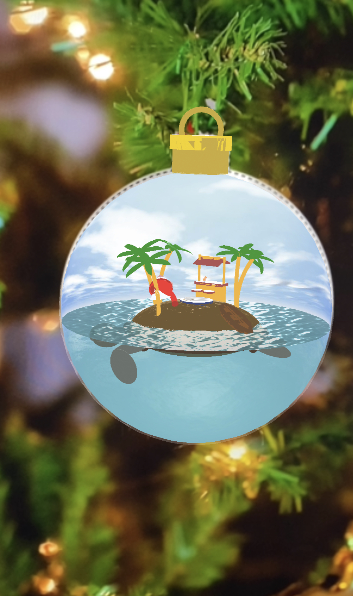

## Welcome to the A-Frame NYC
# Merry WebXR Holiday Workshop 2020 #ARnament NFT tracking




https://carnaux.github.io/NFT-Marker-Creator/


https://roland-dubois.github.io/aframe-meetup-nyc/merrywebxr2020/marker.html


https://roland-dubois.github.io/aframe-meetup-nyc/merrywebxr2020/nft.html


#### Listed below are the A-Frame models that are being used in the project


##### Ambient Sound Effects
Sponsored by [Composure](http://composure.site)


1. Beach Drums 
<audio controls><source src="assets/Holiday_eCard_2020.mp3" type="audio/mpeg"></audio>

1. Glockenspiel 
<audio controls><source src="assets/Holiday_eCard_2020_01.mp3" type="audio/mpeg"></audio>


##### The Turtle


* [View on Glitch](https://merrywebxr2020.glitch.me/turtle.html)

```html 
  <a-entity id="turtle" 
            >
      <a-entity 
                geometry="primitive: sphere; radius: 0.65; thetaStart: -90" 
                material="
                          color: #8a5000;
                          metalness: 0.4;
                          roughness: 0.65;
                          normalMap: #island-normal;
                          normalTextureRepeat: 1 1;
                          normalTextureOffset: 0 0;
                          normalScale: 1 1;
                          " 
                scale="1 0.5 0.8" 
                position="0 0 0"
                >
      </a-entity>


      <a-entity 
                geometry="primitive: torus; radius: 0.62; radiusTubular: 0.02" 
                material="color: #3f2603" 
                scale="1 0.83 1" 
                position="0 0 0" 
                rotation="90 0 0"
                >
      </a-entity>
      <a-entity 
                geometry="primitive: torus; radius: 0.58; radiusTubular: 0.02" 
                material="color: #291000" 
                scale="1 0.83 1" 
                position="0 -0.04 0" 
                rotation="90 0 0"
                >
      </a-entity>
      <a-entity 
                geometry="primitive: sphere; radius: 0.63" 
                material="color: #291000" 
                scale="1 0.1 0.94" 
                position="0 -0.04467 0" 
                rotation="0 0 0"
                >
      </a-entity>
      <a-entity 
                geometry="primitive: sphere; radius: 0.65; thetaStart: 90" 
                material="color: #2f3c25" 
                scale="0.9 0.3 0.76" 
                position="0 0 0"
                >
      </a-entity>      

      <a-entity 
                geometry="primitive: torus; radius: 0.12; radiusTubular: 0.02" 
                material="color: #291000" 
                scale="1 0.75 1" 
                position="-0.595 -0.015 0" 
                rotation="-35 90 0"
                >
      </a-entity>
      <a-entity 
                geometry="primitive: torus; radius: 0.09; radiusTubular: 0.02" 
                material="color: #291000" 
                scale="1 0.75 1" 
                position="0.615 -0.015 0" 
                rotation="35 90 0"
                >
      </a-entity>    
      <a-entity 
                geometry="primitive: torus; radius: 0.1; radiusTubular: 0.02" 
                material="color: #291000" 
                scale="1 0.75 1" 
                position="-0.525 -0.045 0.19" 
                rotation="-35 120 0"
                >
      </a-entity>
      <a-entity 
                geometry="primitive: torus; radius: 0.1; radiusTubular: 0.02" 
                material="color: #291000" 
                scale="1 0.75 1" 
                position="-0.525 -0.045 -0.19" 
                rotation="35 -120 0"
                >
      </a-entity>
      <a-entity 
                geometry="primitive: torus; radius: 0.08; radiusTubular: 0.02" 
                material="color: #291000" 
                scale="1 0.75 1" 
                position="0.57 -0.06 -0.125" 
                rotation="-35 -70 0">
      </a-entity>
      <a-entity 
                geometry="primitive: torus; radius: 0.08; radiusTubular: 0.02" 
                material="color: #291000" 
                scale="1 0.75 1" 
                position="0.57 -0.06 0.125" 
                rotation="35 70 0">
      </a-entity>

      <a-entity 
                geometry="primitive: sphere; radius: 0.09; phiLength: 180" 
                material="color: #485148" 
                scale="0.7 0.5 1.4" 
                position="0.625 -0.015 0" 
                rotation="20 90 0"
                >
      </a-entity>
      <a-entity 
                geometry="primitive: sphere; radius: 0.16; phiLength: 180; phiStart: 180" 
                material="color: #485148" 
                scale="0.74 0.5 2" 
                position="-0.55 -0.025 0" 
                rotation="0 90 0"
                >
      </a-entity>
      <a-entity 
                geometry="primitive: sphere; radius: 0.15; thetaLength: 110; thetaStart: 70" 
                material="color: #485148; side: double" 
                scale="1 0.8 0.7" 
                position="-0.85 -0.04 0" 
                rotation="180 0 0"
                >
      </a-entity>
      <a-entity 
                geometry="primitive: sphere; radius: 0.13; thetaLength: 110; thetaStart: 70" 
                material="color: #3b443b; side: double" 
                scale="1 0.65 0.7" 
                position="-0.84 -0.0675 0" 
                rotation="0 0 0"
                >
      </a-entity>

      <a-entity 
                geometry="primitive: sphere; radius: 0.025" 
                material="color: #000; side: double" 
                position="-0.95 0 0.06" 
                >
      </a-entity>
      <a-entity 
                geometry="primitive: sphere; radius: 0.03; phiLength: 320" 
                material="color: #22331a; side: double" 
                position="-0.95 0 0.06" rotation="30 90 0">
      </a-entity>

      <a-entity 
                geometry="primitive: sphere; radius: 0.025" 
                material="color: #000; side: double" 
                position="-0.95 0 -0.06" 
                >
      </a-entity>
      <a-entity 
                geometry="primitive: sphere; radius: 0.03; phiLength: 320" 
                material="color: #22331a; side: double" 
                position="-0.95 0 -0.06" rotation="-30 -45 0">
      </a-entity>

      <a-entity
          position="-0.5 -0.07 0.18" 
          animation="property: rotation; to: 0 10 0; from: 0 -10 0; dur: 2000; dir: alternate; easing: easeInOutQuad; loop: true"
          >
          <a-entity 
                    geometry="primitive: sphere; radius: 0.12; phiLength: 180; phiStart: 180" 
                    material="color: #485148" 
                    scale="0.74 0.5 2.5" 
                    position="0 0 0"
                    rotation="-15 120 0">
          </a-entity>
          <a-entity 
                    position="-0.225 -0.065 0.14" 
                    animation="property: rotation; to: 0 10 0; from: 0 -10 0; dur: 2000; dir: alternate; easing: easeInOutQuad; loop: true"
                    >        
              <a-entity 
                        geometry="primitive: sphere; radius: 0.03" 
                        material="color: #485148" 
                        scale="3.5 0.63 12" 
                        position="0.165 -0.05 0.265" 
                        rotation="10 30 30"
                        >
              </a-entity>
          </a-entity>
      </a-entity>    

      <a-entity
          position="-0.5 -0.07 -0.18" 
          animation="property: rotation; to: 0 -10 0; from: 0 10 0; dur: 2000; dir: alternate; easing: easeInOutQuad; loop: true"
          >
          <a-entity 
                    geometry="primitive: sphere; radius: 0.12; phiLength: 180; phiStart: 180" 
                    material="color: #485148" 
                    scale="0.74 0.5 2.5" 
                    position="0 0 0" 
                    rotation="-15 70 0">
          </a-entity>
          <a-entity 
                    position="-0.242 -0.065 -0.074" 
                    animation="property: rotation; to: 0 -10 0; from: 0 10 0; dur: 2000; dir: alternate; easing: easeInOutQuad; loop: true"
                    >        
              <a-entity 
                        geometry="primitive: sphere; radius: 0.03" 
                        material="color: #485148" 
                        scale="3.5 0.63 12" 
                        position="0.165 -0.05 -0.285" 
                        rotation="-10 -30 30"
                        >
              </a-entity>
          </a-entity>           
      </a-entity>    

      <a-entity 
                geometry="primitive: sphere; radius: 0.2" 
                material="color: #485148" 
                scale="1 0.12 0.4" 
                position="0.7 -0.09 -0.15" 
                rotation="-40 25 -10"
                >
      </a-entity>            
      <a-entity 
                geometry="primitive: sphere; radius: 0.2" 
                material="color: #485148" 
                scale="1 0.12 0.4" 
                position="0.7 -0.09 0.15" 
                rotation="40 -25 -20"
                >
      </a-entity>
  </a-entity>
```

##### The Tiki Bar


* [View on Glitch](https://merrywebxr2020.glitch.me/tiki.html)

```html 
  <a-entity id="tikibar"
            >
    <a-entity geometry="depth: 0.2; height: 0.4; width: 0.5" material="color: orange" position="0 0.2 0">        
    </a-entity>
    <a-entity geometry="depth: 0.24; height: 0.05; width: 0.56" material="color: brown" position="0 0.4 0">        
    </a-entity>

    <a-entity geometry="depth: 0.25; height: 0.02; width: 0.5" material="color: brown" position="0 0.8 0.12" rotation="20 0 0">        
    </a-entity>        
    <a-entity geometry="depth: 0.25; height: 0.02; width: 0.5" material="color: brown" position="0 0.8 -0.12" rotation="-20 0 0">        
    </a-entity>       
    <a-entity geometry="depth: 0.04; height: 0.05; width: 0.5" material="color: orange" position="0 0.86 0">        
    </a-entity>        

    <a-entity geometry="depth: 0.03; height: 0.9; width: 0.03" material="color: orange" position="0.25 0.45 0">        
    </a-entity>      
    <a-entity geometry="depth: 0.03; height: 0.9; width: 0.03" material="color: orange" position="-0.25 0.45 0">        
    </a-entity>      

    <a-entity geometry="height: 0.03; primitive: cylinder; radius: 0.1" material="color: brown" position="-0.12 0.3 0.3">        
    </a-entity>
    <a-entity geometry="height: 0.29; primitive: cylinder; radius: 0.02" material="color: orange" position="-0.12 0.145 0.3">        
    </a-entity>


    <a-entity geometry="height: 0.03; primitive: cylinder; radius: 0.1" material="color: brown" position="0.12 0.3 0.3">        
    </a-entity>
    <a-entity geometry="height: 0.29; primitive: cylinder; radius: 0.02" material="color: orange" position="0.12 0.145 0.3">        
    </a-entity>


    <a-entity geometry="height: 0.01; primitive: cylinder; radius: 0.02" material="color: #0037ff; opacity: 0.6" position="-0.125 0.43 0.03"></a-entity>
    <a-entity geometry="height: 0.04; primitive: cylinder; radius: 0.022" material="color: #ff6f00; opacity: 0.6" position="-0.125 0.455 0.03"></a-entity>
    <a-entity geometry="height: 0.02; primitive: cylinder; radius: 0.022" material="color: #ff6f00; opacity: 0.6" position="-0.125 0.465 0.03"></a-entity>
    <a-entity geometry="height: 0.01; primitive: cylinder; radius: 0.024" material="color: #fff700; opacity: 0.6" position="-0.125 0.48 0.03"></a-entity>
    <a-entity geometry="height: 0.01; primitive: cylinder; radius: 0.026" material="color: #ff0000; opacity: 0.6" position="-0.125 0.49 0.03"></a-entity>
    <a-entity geometry="height: 0.01; primitive: cylinder; radius: 0.028" material="color: #ffffff; opacity: 0.6" position="-0.125 0.5 0.03"></a-entity>
    <a-entity geometry="height: 0.005; primitive: cylinder; radius: 0.02" material="color: #ff6f00" position="-0.1 0.5 0.03" rotation="90 0 0"></a-entity>

  </a-entity>
```

##### The Santa On A Hammock


* [View on Glitch](https://merrywebxr2020.glitch.me/hammock.html)

```html 
  <a-entity id="hammock"
            position="0 0.15 0"
            animation__swing="property: rotation; from: 0 0 -10; to: 0 0 10; loop:true; dir:alternate; dur:5000"
            >

      <a-entity
            geometry="primitive: sphere; radius: 0.14; phiLength: 50; phiStart: 70" 
            material="color: white; side: double" 
            position="0 0 0" 
            rotation="93 -4.35 0" 
            scale="1 1 0.65"
            >     
      </a-entity>        

      <a-entity geometry="primitive: sphere; radius: 0.06" material="color: red" position="0.00875 -0.04166 0" rotation="" scale="1 0.8 1"></a-entity>
    <a-entity geometry="primitive: torus; radius: 0.09; radiusTubular: 0.01" material="color: #bc0101" position="0.00875 -0.0391 -0.01821" rotation="10 0 0" scale="0.54 0.45 0.99"></a-entity>
    <a-entity geometry="primitive: sphere; radius: 0.05" material="color: #e8a1a1" position="0.00837 -0.03912 -0.03896" rotation="" scale="1 0.8 1"></a-entity>
    <a-entity geometry="primitive: sphere; radius: 0.03" material="color: #e8a1a1" position="0.00971 -0.01969 -0.09798" rotation="" scale=""></a-entity>
    <a-entity geometry="primitive: sphere; radius: 0.03" material="color: #ffffff" position="0.01076 -0.01434 -0.0782" rotation="" scale="1 0.8 1"></a-entity>
    <a-entity geometry="primitive: sphere; radius: 0.015" material="color: #ffffff" position="0.01076 -0.0005 -0.06255" rotation="" scale="1.25 0.8 1.15"></a-entity>
    <a-entity geometry="primitive: sphere; radius: 0.008" material="color: #e28d8d" position="0.01009 0.00938 -0.08587" rotation="" scale=""></a-entity>
    <a-entity geometry="primitive: sphere; radius: 0.005" material="color: #e28d8d" position="0.00169 0.00643 -0.09442" rotation="" scale="1.25 1 1"></a-entity>
    <a-entity geometry="primitive: sphere; radius: 0.005" material="color: #e28d8d" position="0.01937 0.00643 -0.09442" rotation="" scale="1.25 1 1"></a-entity>
    <a-entity geometry="primitive: torus; radius: 0.045; radiusTubular: 0.005" material="color: #e8a1a1" position="0.01054 -0.03736 -0.08841" rotation="-68.4 -1.24 -8.71" scale="1.12 0.78 1"></a-entity>
    <a-entity geometry="primitive: torus; radius: 0.06; arc: 90; radiusTubular: 0.007" material="color: red" position="0.03053 -0.10723 0.03081" rotation="0 -45 0" scale=""></a-entity>
    <a-entity geometry="primitive: sphere; radius: 0.02" material="color: #bc0101" position="0.07407 -0.10898 0.08326" rotation="10 0 0" scale="0.86 0.61 1.35"></a-entity>
    <a-entity geometry="primitive: torus; radius: 0.06; arc: 90; radiusTubular: 0.007" material="color: red" position="-0.0013 -0.07788 0.0825" rotation="-20 90 30" scale=""></a-entity>
    <a-entity geometry="primitive: sphere; radius: 0.02" material="color: #bc0101" position="-0.02099 -0.02221 0.1188" rotation="120 0 0" scale="0.86 0.61 1.35"></a-entity>
  </a-entity>
```

##### Palm Trees


* [View on Glitch](https://merrywebxr2020.glitch.me/palmtree.html)

```html 
  <a-entity id="trees"
            >
    <a-entity 
              geometry="primitive: torus; arc: 45; radius: 8; radiusTubular: 0.1" 
              material="color: orange" 
              position="0.2 0 8.5" 
              rotation="0 90 0"
              >        
    </a-entity>
    <a-entity 
              geometry="primitive: cone; radiusBottom: 0.17; radiusTop: 0.39; height: 0.43" 
              material="color: green" 
              position="0.2 5.5 2.7" 
              rotation="0 -90 -45"
              >     
        <a-entity geometry="primitive: sphere; radius: 1.25; phiLength: 30; phiStart: 75" material="color: green; side: double" position="0 0 1.3" rotation="-90 0 0" scale="1 1 0.3">     
        </a-entity>          
        <a-entity geometry="primitive: sphere; radius: 1.25; phiLength: 30; phiStart: 75" material="color: green; side: double" position="0 0 -1.3" rotation="-90 0 0" scale="1 1 0.3">     
        </a-entity>
        <a-entity geometry="primitive: sphere; radius: 1.25; phiLength: 30; phiStart: 75" material="color: green; side: double" position="-0.9 -0.17 -0.87" rotation="-100 45 0" scale="1 1 0.3">     
        </a-entity>
        <a-entity geometry="primitive: sphere; radius: 1.25; phiLength: 30; phiStart: 75" material="color: green; side: double" position="0.96 -0.16 0.9" rotation="-80 45 0" scale="1 1 0.3">     
        </a-entity>
        <a-entity geometry="primitive: sphere; radius: 1.25; phiLength: 30; phiStart: 75" material="color: green; side: double" position="-0.74 -0.025 0.9" rotation="-90 -40 0" scale="1 1 0.3">     
        </a-entity>
        <a-entity geometry="primitive: sphere; radius: 1.25; phiLength: 30; phiStart: 75" material="color: green; side: double" position="0.88 0.15 -0.67" rotation="-75 -50 0" scale="1 1 0.3">     
        </a-entity>
    </a-entity>                        
  </a-entity>
```

##### Row Boat


* [View on Glitch](https://merrywebxr2020.glitch.me/boat.html)

```html 
  <a-entity id="boat" 
            >
    <a-entity geometry="primitive: torus; radius: 0.4; segmentsRadial: 3; radiusTubular: 0.02; segmentsTubular: 10" material="color: #502402; flatShading: true" position="0 0.06115 0" rotation="-90 0 0" scale="0.4 1 2"></a-entity>
    <a-entity geometry="height: 0.03; primitive: cylinder; radius: 0.39; segmentsHeight: 10; segmentsRadial: 10" material="color: #753300" position="0 0.01135 0" rotation="0 90 0" scale="1 1 0.4"></a-entity>
    <a-entity geometry="height: 0.02; depth: 0.07; width: 0.26" material="color: #522300" position="0 0.10605 -0.11491" rotation="" scale=""></a-entity>
    <a-entity geometry="height: 0.02; depth: 0.07; width: 0.26" material="color: #522300" position="0 0.10605 0.11672" rotation="" scale=""></a-entity>
    <a-entity geometry="height: 0.6; primitive: cylinder; radius: 0.01" material="color: #753300" position="0.03951 0.12352 -0.00443" rotation="84.61 10 5" scale=""></a-entity>
    <a-entity geometry="height: 0.6; primitive: cylinder; radius: 0.01" material="color: #753300" position="-0.00743 0.12477 -0.0103" rotation="90 0 0" scale=""></a-entity>
  </a-entity>
```


For more inspiration on creating your own immersive experiences please visit:

- the 2019 [A-Frame NYC Holiday challenge page](https://roland-dubois.github.io/aframe-meetup-nyc/merrywebxr2019/)
- the 2018 [A-Frame NYC Holiday challenge page](https://roland-dubois.github.io/aframe-meetup-nyc/challenges/)


---

* [github.com/roland-dubois/aframe-meetup-nyc](https://roland-dubois.github.io/aframe-meetup-nyc/)

Didn't finish? Take the challenge home! Got stuck? Reach out!

*@rolanddubois*
[*rolanddubois.com*](https://rolanddubois.com/)